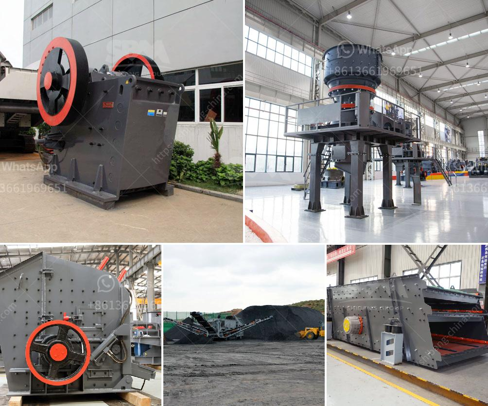

<h3>تكلفة حزام الناقل للتعدين</h3>
يعتبر حزام الناقل أحد الأدوات الأساسية في صناعة التعدين، حيث يستخدم لنقل المواد والمواد الخام عبر مسافات طويلة. يتميز حزام الناقل بقدرته على نقل الحمولات بفعالية وكفاءة عالية، مما يقلل من تكاليف النقل ويساعد في زيادة إنتاجية المنجم.

تتأثر تكلفة حزام الناقل للتعدين بعدة عوامل، من أبرزها طول الحزام والقدرة التحميلية اللازمة ومناولة المواد المحمولة.  يعتبر الطول من أهم العوامل التي تؤثر في تكلفة حزام الناقل، حيث يزيد طول الحزام يزيد من تكلفته بشكل مباشر. بالإضافة إلى ذلك، تتأثر التكاليف أيضاً بقدرته على التحمل، حيث تتزايد التكلفة مع زيادة الحمولة التي يتم نقلها. وأما بالنسبة للمواد المحمولة، فإن طبيعتها وخصائصها قد تؤثر على التكلفة، حيث يمكن أن تكون بعض المواد الخام ثقيلة أو ذات تأثير كيميائي يزيد من تكلفة حزام الناقل.

بالإضافة إلى ذلك، يؤثر اختيار المواد المستخدمة في تصنيع حزام الناقل على تكلفته أيضاً. يعتمد نوع المواد على المناطق الجغرافية وطبيعة المواد المحمولة. عادةً ما يتم استخدام مواد متينة ومقاومة للتآكل والتآكل، مما يتطلب تكلفة إضافية للحفاظ على تأثير المواد الضارة على حزام الناقل.

بصفة عامة، تتنوع تكلفة حزام الناقل للتعدين بين 200 و400 دولار لكل متر من الحزام. يعتمد السعر على العوامل المذكورة سابقًا بالإضافة إلى عوامل أخرى مثل التركيب والصيانة والتشغيل. يمكن أن يؤدي الاستثمار في تكنولوجيا حديثة وتحسين عمليات التصنيع إلى تقليص تكلفة حزام الناقل وزيادة كفاءته.

وباختصار، يعتبر حزام الناقل أداة أساسية في صناعة التعدين وتكلفته تتأثر بعدة عوامل بما في ذلك طول الحزام، الحمولة المحمولة، طبيعة المواد المحمولة، ونوع المواد المستخدمة في تصنيعه. تتراوح تكلفته عادةً بين 200 و400 دولار لكل متر، ويمكن تقليص التكلفة عن طريق تحسين عمليات التصنيع والاستثمار في التكنولوجيا الحديثة.
<h3>Contact us</h3><ul><li><strong>Whatsapp:&nbsp;<a href="https://wa.me/8613661969651">+8613661969651</a></strong></li><li><a href="https://swt.shibang-china.com/?git&amp;zhl&amp;تكلفة حزام الناقل للتعدين"><strong>Online Service(chat now)</strong></a></li></ul><h3>Related</h3><ul><li><a href='بيع مطحنة في كاليفورنيا.md'>بيع مطحنة في كاليفورنيا</a></li><li><a href='مصانع معالجة الخام الصينية.md'>مصانع معالجة الخام الصينية</a></li><li><a href='مطحنة طحن دقيقة للبيع.md'>مطحنة طحن دقيقة للبيع</a></li><li><a href='معدات تعدين الرمال والحصى للبيع.md'>معدات تعدين الرمال والحصى للبيع</a></li><li><a href='تقرير مشروع كسارة الحجر في كارناتاكا.md'>تقرير مشروع كسارة الحجر في كارناتاكا</a></li></ul>