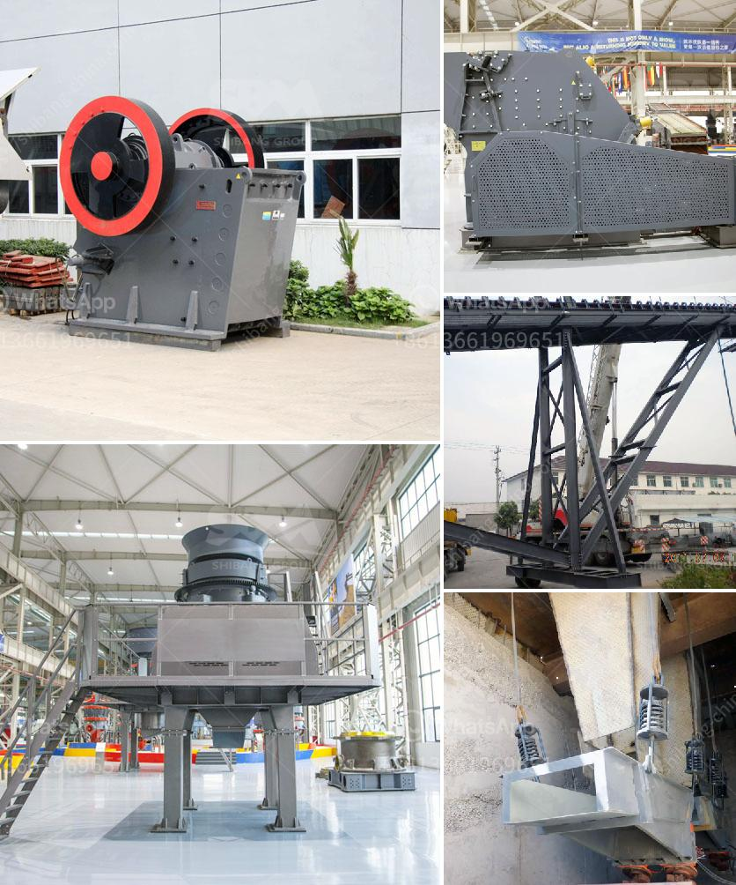

<h3>تكلفة سيور النقل</h3>
تُعَدُّ سيور النقل جزءًا أساسيًا من عملية نقل وتوزيع البضائع في جميع أنحاء العالم. فهي تعتبر وسيلة فعالة وموثوقة لنقل البضائع بين المصانع والمستودعات والأماكن الأخرى. ومن أهم العوامل التي تؤثر على تكلفة سيور النقل هي المسافة التي يتم نقل البضائع عبرها.

توجد عدة عوامل يجب مراعاتها عند حساب تكلفة سيور النقل. أحد هذه العوامل هو المسافة التي يجب القطعها. عندما تكون المسافة طويلة، من الواضح أن التكاليف ستكون أكبر. فعلى سبيل المثال، قد تحتاج شركة لنقل البضائع عبر بلدان مختلفة أو حتى قارات متعددة، وهذا يتطلب تكاليف إضافية لشحن البضائع جوًا أو بحرًا. علاوة على ذلك، يجب أيضًا أن يُراعَى تكلفة النقل البري لنقل البضائع من المصانع إلى مراكز التوزيع ومن ثم إلى وجهتها النهائية.

بالإضافة إلى ذلك، يتوجب النظر في كمية البضائع التي يتم نقلها. فمعظم شركات النقل تستخدم نموذج تكلفة النقل الوزنية، حيث يتم تحديد التكلفة بناءً على وزن البضائع ونوعها. وبالتالي، كلما زادت كمية البضائع، زادت التكلفة. فقد يؤدي نقل كميات كبيرة من البضائع إلى زيادة التكاليف نظرًا للحاجة إلى استخدام وسائل نقل أكبر أو إضافية، مثل الشاحنات الكبيرة أو الحاويات، واستهلاك المزيد من الوقود.

بعد الاهتمام بعوامل المسافة والكمية، يجب أيضًا أن يتم أخذ التكاليف العامة في الاعتبار. فالشركات التي تدير سيور النقل تحتاج إلى تكاليف للعملية اليومية، مثل أجور العمال وصيانة المعدات والمصروفات العامة. هذه التكاليف يجب توزيعها على البضائع المنقولة لتغطية هذه النفقات. لذلك، قد تؤثر هذه التكاليف العامة على تكلفة سيور النقل.

بشكل عام، يمكن اعتبار سيور النقل تكلفة ضرورية ولا غنى عنها في عملية نقل البضائع. فهي توفر طريقة سهلة وفعالة لنقل البضائع ، وتقلل من التأخيرات وتعزز الكفاءة في عمليات النقل والتوزيع. والتكلفة النهائية لسيور النقل تعتمد على العديد من العوامل المذكورة أعلاه. لذلك، يجب أن يُراعَى تلك العوامل عند حساب تكلفة سيور النقل واختيار أفضل الخيارات المتاحة لتلبية الاحتياجات المحددة للشركة.
<h3>Contact us</h3><ul><li><strong>Whatsapp:&nbsp;<a href="https://wa.me/8613661969651">+8613661969651</a></strong></li><li><a href="https://swt.shibang-china.com/?git&amp;zhl&amp;تكلفة سيور النقل"><strong>Online Service(chat now)</strong></a></li></ul><h3>Related</h3><ul><li><a href='سعر كسارة مخروطية هيدروليكية بتغذية 20 مم.md'>سعر كسارة مخروطية هيدروليكية بتغذية 20 مم</a></li><li><a href='آلة غربلة الرمل للبيع في الفلبين.md'>آلة غربلة الرمل للبيع في الفلبين</a></li><li><a href='مطاحن الكرة للبيع في كندا.md'>مطاحن الكرة للبيع في كندا</a></li><li><a href='كيفية إنشاء مصنع لتكسير الحجر.md'>كيفية إنشاء مصنع لتكسير الحجر</a></li><li><a href='شاشة اهتزاز في إندونيسيا.md'>شاشة اهتزاز في إندونيسيا</a></li></ul>