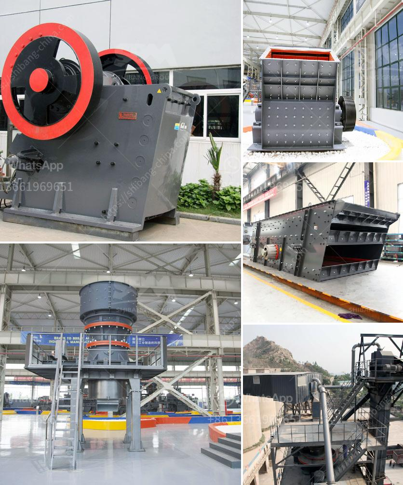

<h3>تكلفة طاحونة الكوارتز</h3>
تعتبر طاحونة الكوارتز أحد الأدوات الأساسية في عمليات التصنيع الصناعي والحرفي، حيث تستخدم لطحن وتحويل الكوارتز إلى مسحوق ناعم يمكن استخدامه في العديد من الصناعات المختلفة. ومن المعروف أن تكلفة طاحونة الكوارتز تتفاوت بشكل كبير، وتتأثر بعوامل متعددة.

أحد العوامل الرئيسية التي تؤثر في تكلفة طاحونة الكوارتز هي جودة المواد والتقنيات المستخدمة في تصنيعها. يتم استخدام مواد عالية الجودة مثل الفولاذ المقاوم للصدأ والألومنيوم المقاوم للتآكل في صناعة الطواحين، وهذا يؤثر بشكل كبير في سعر الطاحونة.

بالإضافة إلى ذلك، تتفاوت تكلفة الطواحين بناءً على السعة والقوة. هناك طواحين صغيرة الحجم تستخدم للاستخدام المنزلي وتكلفتها أقل من الطواحين الصناعية الكبيرة التي تستخدم في الإنتاج الصناعي الكبير. كما أن طاحونة الكوارتز التي تكون بالقوة العالية والسعة الكبيرة ستكلف أكثر من الطواحين ذات القوة الأقل والسعة المحدودة.

بالإضافة إلى ذلك، هناك عوامل أخرى قد تؤثر في تكلفة الطواحين مثل العلامة التجارية والسمعة والضمان وملحقات الطاحونة. قد تجد أن هناك بعض العلامات التجارية الشهيرة والموثوقة قد تكلف أكثر بقليل من العلامات التجارية الأخرى. كما أن وجود ضمان للطاحونة قد يؤثر في سعرها، حيث تكلف الطواحين ذات الضمان الطويل أكثر من التي ليس لها ضمان.

بصورة عامة، يمكن أن تتراوح تكلفة طواحين الكوارتز بين 200 و 400 دولار، ولكن يتوجب على المستهلك أن يأخذ في الاعتبار عوامل أخرى مثل الجودة والأداء والضمان عند اختيار الطاحونة المناسبة لاحتياجاته.

وفي الختام، تعتمد تكلفة طاحونة الكوارتز على عدة عوامل مثل جودة المواد والتقنيات المستخدمة، القوة والسعة، العلامة التجارية والضمان، وملحقات الطاحونة. يعتمد الاختيار النهائي على احتياجات المستخدم والميزانية المتاحة.
<h3>Contact us</h3><ul><li><strong>Whatsapp:&nbsp;<a href="https://wa.me/8613661969651">+8613661969651</a></strong></li><li><a href="https://swt.shibang-china.com/?git&amp;zhl&amp;تكلفة طاحونة الكوارتز"><strong>Online Service(chat now)</strong></a></li></ul><h3>Related</h3><ul><li><a href='مصنع غسيل الرمل المستخدم للبيع في تكساس.md'>مصنع غسيل الرمل المستخدم للبيع في تكساس</a></li><li><a href='أسعار وحدات طحن الكلنكر.md'>أسعار وحدات طحن الكلنكر</a></li><li><a href='آلة تكسير الحجر صنعت في باكستان.md'>آلة تكسير الحجر صنعت في باكستان</a></li><li><a href='آلة طحن الكرة في الهند.md'>آلة طحن الكرة في الهند</a></li><li><a href='آخر مطحنة هامر.md'>آخر مطحنة هامر</a></li></ul>