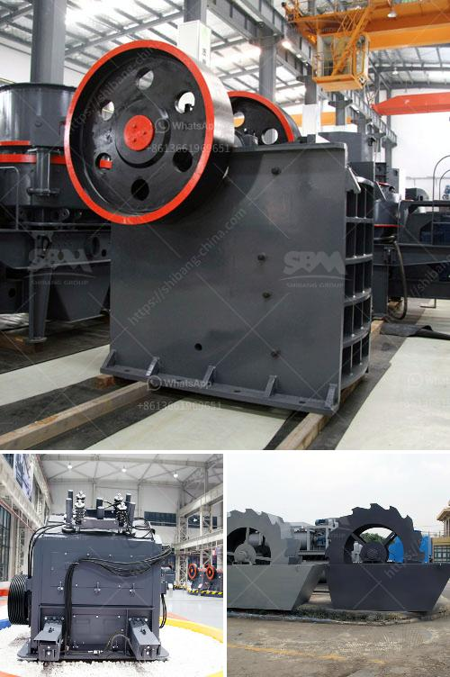

<h3>تكلفة عمليات مصنع الرمل والحصى</h3>
تعتبر عمليات مصنع الرمل والحصى أحد الأعمال الهامة في قطاع البناء والإنشاء. يتم استخدام هذا النوع من المصانع لإنتاج الرمل والحصى من الصخور والحجارة المنقولة من المحاجر، وذلك بهدف تحقيق المواصفات المطلوبة من قبل المستهلكين.

تتكون تكلفة عمليات مصنع الرمل والحصى من عدة عوامل. العوامل الرئيسية التي تؤثر على التكلفة هي تكلفة المواد الخام وتكلفة العمالة وتكلفة الطاقة وتكلفة المعدات وتكلفة الصيانة وتكلفة الإدارة.

أولًا، تكلفة المواد الخام. يُعتبر الرمل والحصى المستخدمان في عمليات المصنع من المواد الخام الأساسية. يُقدر سعر هذه المواد بناءً على نوع الصخور الموجودة في المنطقة وتكلفة استخراجها ونقلها إلى المصنع. قد يؤدي تغير في سعر المواد الخام إلى تغير في تكلفة الإنتاج.

ثانيًا، تكلفة العمالة. تشكل تكلفة العمالة جزءًا كبيرًا من تكلفة عمليات مصنع الرمل والحصى، حيث يتطلب تشغيل المصنع وجود فريق متخصص من العمال المدربين. يعمل هؤلاء العمال على عمليات التكسير والغسيل والفرز والتعبئة وغيرها من العمليات اللازمة لإنتاج الرمل والحصى بالجودة المطلوبة.

ثالثًا، تكلفة الطاقة. تتطلب عمليات مصنع الرمل والحصى استخدام كمية كبيرة من الطاقة. تُستخدم الطاقة في تشغيل المعدات والآلات الثقيلة، وتحريك الحصى والصخور والرمل خلال عملية الإنتاج. يجب على المصنع أن يحسب تكلفة الطاقة المستهلكة ويضمن كفاية الإمدادات وفعالية استخدامها.

رابعًا، تكلفة المعدات وتكلفة الصيانة. يتضمن مصنع الرمل والحصى عددًا من المعدات اللازمة لإنتاج المنتجات. تشمل هذه المعدات الكسارات والغرابيل والناقلات وأجهزة التحكم الآلي وغيرها. يجب على المصنع شراء هذه المعدات والاستثمار فيها بالإضافة إلى تحمل تكاليف الصيانة والإصلاح الدورية.

أخيرًا، تكلفة الإدارة. يتطلب تشغيل مصنع الرمل والحصى إدارة فعالة وكبيرة للتحكم في عمليات الإنتاج وجدولة الإنتاج والمبيعات والتسويق والشؤون المالية والموارد البشرية والسلامة والصحة المهنية وأنظمة الجودة. تكلفة الإدارة تشمل الأجور والرواتب وتكاليف البنية التحتية الخاصة بالمصنع.

باختصار، تكلفة عمليات مصنع الرمل والحصى تشمل تكلفة المواد الخام وتكلفة العمالة وتكلفة الطاقة وتكلفة المعدات وتكلفة الصيانة وتكلفة الإدارة. يجب على الشركات أن تقيم جميع هذه العوامل وتضمن كفاية التمويل لتشغيل مصنع الرمل والحصى بكفاءة وجودة عالية.
<h3>Contact us</h3><ul><li><strong>Whatsapp:&nbsp;<a href="https://wa.me/8613661969651">+8613661969651</a></strong></li><li><a href="https://swt.shibang-china.com/?git&amp;zhl&amp;تكلفة عمليات مصنع الرمل والحصى"><strong>Online Service(chat now)</strong></a></li></ul><h3>Related</h3><ul><li><a href='مصانع الكرات الصناعية.md'>مصانع الكرات الصناعية</a></li><li><a href='خط إنتاج الباريت.md'>خط إنتاج الباريت</a></li><li><a href='آلة صنع الحجر الجيري.md'>آلة صنع الحجر الجيري</a></li><li><a href='مطحنة الكرة لمسحوق الكوارتز في تاميل نادو.md'>مطحنة الكرة لمسحوق الكوارتز في تاميل نادو</a></li><li><a href='مشكلة الناقل الفحم.md'>مشكلة الناقل الفحم</a></li></ul>