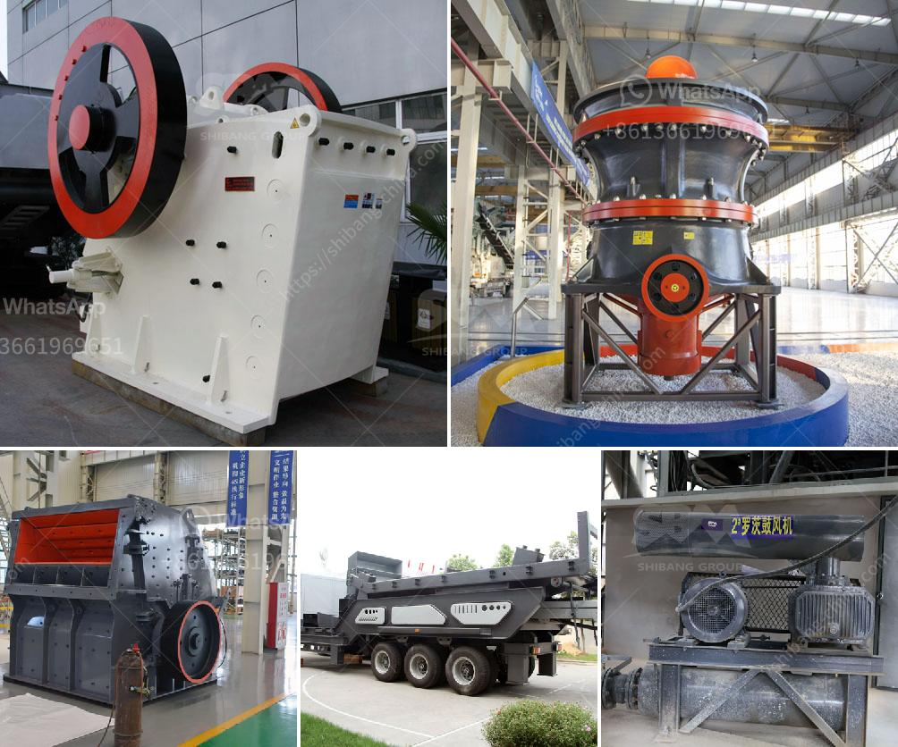

<h3>تكلفة عند استخدام كسارة الحجر</h3>
تعتبر كسارات الحجر أدوات حاسمة في صناعة البناء والإنشاءات. فهي تستخدم لسحق الصخور والحجارة الكبيرة إلى قطع أصغر من الحجم المطلوب للاستخدام في المشروعات المختلفة. يتطلب استخدام كسارة الحجر تخطيطًا جيدًا وتحليلًا دقيقًا للتكلفة المتوقعة والفوائد المحتملة.

تعتمد تكلفة استخدام كسارة الحجر على العوامل المختلفة مثل حجم الكسارة وقدرتها على سحق الصخور بكفاءة وسرعة. يؤثر أيضًا نوع الصخور والحجارة المطلوب سحقها على التكلفة. صخور أكثر صلابة ومتانة يمكن أن تتطلب قوة أعلى لسحقها، وبالتالي يجب استخدام كسارة قوية ومُجهزة بمعدات متقدمة، مما سيترتب على تكلفة أعلى.

من العوامل الأخرى التي تؤثر على التكلفة هي قدرة الكسارة على إنتاج الأحجام والجودة المطلوبة للمواد المسحوقة. بعض المشاريع قد تتطلب حجمًا يتراوح بين 0-5 ملم، بينما قد تحتاج المشاريع الأخرى إلى حجم أكبر مثل 0-20 ملم. يجب تحديد الحجم المطلوب مسبقًا لمعرفة الكسارة الملائمة والتكلفة المتوقعة.

بالإضافة إلى تكلفة الكسارة نفسها، هناك عوامل أخرى يجب مراعاتها عند حساب التكلفة. على سبيل المثال، يجب احتساب تكلفة المواد الخام المستخدمة في عملية السحق. يجب أن تكون جودة المواد الخام عالية وفحصها للتأكد من خلوها من الشوائب أو المواد المضرة. تكاليف الوقود والطاقة المستخدمة في تشغيل الكسارة تشكل أيضًا جزءًا من التكلفة الإجمالية. عوامل أخرى مثل صيانة الكسارة وقطع الغيار وتكلفة العمالة يجب أخذها بعين الاعتبار أيضًا.

يمكن تقليل تكلفة استخدام كسارة الحجر باتخاذ بعض الإجراءات المبتكرة. على سبيل المثال، يمكن استخدام كسارات الحجر المتنقلة بدلاً من الكسارات الثابتة لتخفيض تكاليف النقل والتثبيت. تستهلك الكسارات المتنقلة أقل كميات الطاقة والوقود، كما أنها تسمح بنقل الكسارة بسهولة بين المواقع المختلفة. 

في الختام، يمكن القول إن استخدام كسارة الحجر يتطلب تخطيطًا جيدًا وتحليلًا دقيقًا للتكلفة. عوامل مثل حجم الكسارة، قدرتها على سحق الصخور، حجم الحجارة المطلوب سحقها والمواد الخام المستخدمة يؤثرون على التكلفة النهائية. بالتالي، ينبغي للشركات والمشاريع أخذ هذه العوامل في الاعتبار واتخاذ القرارات اللازمة لتحقيق أقصى استفادة من استخدام كسارة الحجر بتكلفة معقولة.
<h3>Contact us</h3><ul><li><strong>Whatsapp:&nbsp;<a href="https://wa.me/8613661969651">+8613661969651</a></strong></li><li><a href="https://swt.shibang-china.com/?git&amp;zhl&amp;تكلفة عند استخدام كسارة الحجر"><strong>Online Service(chat now)</strong></a></li></ul><h3>Related</h3><ul><li><a href='تصميم آلة كسارة الحجر مخطط تدفق التجميع.md'>تصميم آلة كسارة الحجر مخطط تدفق التجميع</a></li><li><a href='سعر كسارة الهامر للطن الواحد في الساعة.md'>سعر كسارة الهامر للطن الواحد في الساعة</a></li><li><a href='تكلفة مصنع تكسير الذهب.md'>تكلفة مصنع تكسير الذهب</a></li><li><a href='شركة تصنيع مطاحن المطرقة في ماليزيا.md'>شركة تصنيع مطاحن المطرقة في ماليزيا</a></li><li><a href='سعة مطحنة الكرة بالأطنان.md'>سعة مطحنة الكرة بالأطنان</a></li></ul>