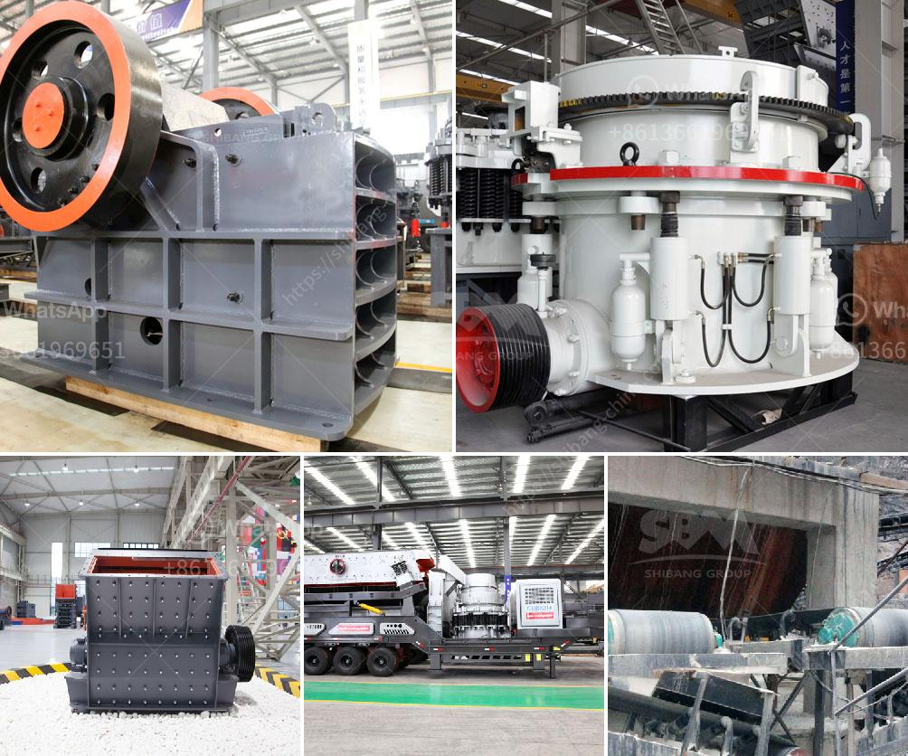

<h3>تكلفة فتح مصنع للأسمنت الصغير</h3>
في الآونة الأخيرة، زاد الطلب على الأسمنت في العديد من البلدان حول العالم، وهذا يجعل فرص فتح مصنع للأسمنت الصغير أمرًا مغريًا للمستثمرين. فتح مصنع للأسمنت الصغير يوفر فرصة للمشاركة في هذا السوق المتنامي وتحقيق أرباح كبيرة. ومع ذلك، ينبغي أخذ العديد من العوامل في الاعتبار عند حساب تكلفة فتح مصنع الأسمنت الصغير. 

فيما يلي سنناقش العوامل الرئيسية التي يجب مراعاتها عند تحديد تكلفة فتح مثل هذا المصنع:

1- الموقع: يعتبر اختيار الموقع المناسب هو أحد العوامل الحاسمة في تكلفة بناء وتشغيل مصنع الأسمنت الصغير. يجب أن يكون الموقع قريبًا من مصادر المواد الخام مثل الحجر الجيري والطين والغث المعدني. يجب أيضًا أن يكون قريبًا من أسواق البيع لتقليل تكاليف النقل.

2- التراخيص والتصاريح: يجب على المستثمر الحصول على التراخيص والتصاريح اللازمة لتشغيل مصنع الأسمنت. قد يستدعي ذلك الوقت والمال للتعامل مع الإجراءات القانونية والتنظيمية.

3- الآلات والمعدات: تعتبر الآلات والمعدات أساسية في إنشاء وتشغيل مصنع الأسمنت. يجب اختيار آلات ذات جودة عالية ومناسبة للمشروع وشراءها من مصادر موثوقة. بالإضافة إلى ذلك، قد يتطلب الأمر توظيف فنيين مهرة لتركيب وصيانة هذه الآلات.

4- توظيف العمالة: يجب أيضًا احتساب تكلفة توظيف العمالة الماهرة وغير الماهرة لتشغيل المصنع. على سبيل المثال، قد يتطلب الأمر توظيف مهندسين وفنيين وعمال إنتاج وعمال صيانة ومحاسبين.

5- تكاليف الطاقة والوقود: يعد استهلاك الطاقة والوقود أحد العوامل الرئيسية في تكلفة عمليات الإنتاج في مصنع الأسمنت. يجب حساب تكلفة الكهرباء والوقود المستخدم في تشغيل المصنع، والبحث عن طرق توفير الطاقة والحفاظ على استدامة المصنع.

6- التسويق والتوزيع: قد تحتاج تكلفة تسويق وتوزيع المنتجات إلى احتساب وتخطيط. يجب وضع خطة تسويقية فعالة للترويج للمنتجات وإيجاد المشترين وتطوير قنوات التوزيع المناسبة.

بالاعتبار لهذه العوامل وغيرها، فإن تكلفة فتح مصنع للأسمنت الصغير تتراوح عادة بين 200,000 إلى 400,000 دولار. يجب أن يتم إعطاء الأولوية للتخطيط المستدام والاستراتيجي للمشروع لتقليل التكاليف الإضافية وضمان النجاح المستقبلي للمصنع. علاوة على ذلك، يجب توظيف فريق مديرين محترفين وأكفاء للحفاظ على تشغيل المصنع بشكل فعال وربحي.
<h3>Contact us</h3><ul><li><strong>Whatsapp:&nbsp;<a href="https://wa.me/8613661969651">+8613661969651</a></strong></li><li><a href="https://swt.shibang-china.com/?git&amp;zhl&amp;تكلفة فتح مصنع للأسمنت الصغير"><strong>Online Service(chat now)</strong></a></li></ul><h3>Related</h3><ul><li><a href='طاحونة حديثة للكربونات.md'>طاحونة حديثة للكربونات</a></li><li><a href='سعر كسارة الحجر الصلب.md'>سعر كسارة الحجر الصلب</a></li><li><a href='عملية سحق الفحم 200 tph.md'>عملية سحق الفحم 200 tph</a></li><li><a href='آلة معالجة الجبس بسعة طن واحد.md'>آلة معالجة الجبس بسعة طن واحد</a></li><li><a href='مصنع طحن كلنكر الإسمنت في الهند.md'>مصنع طحن كلنكر الإسمنت في الهند</a></li></ul>