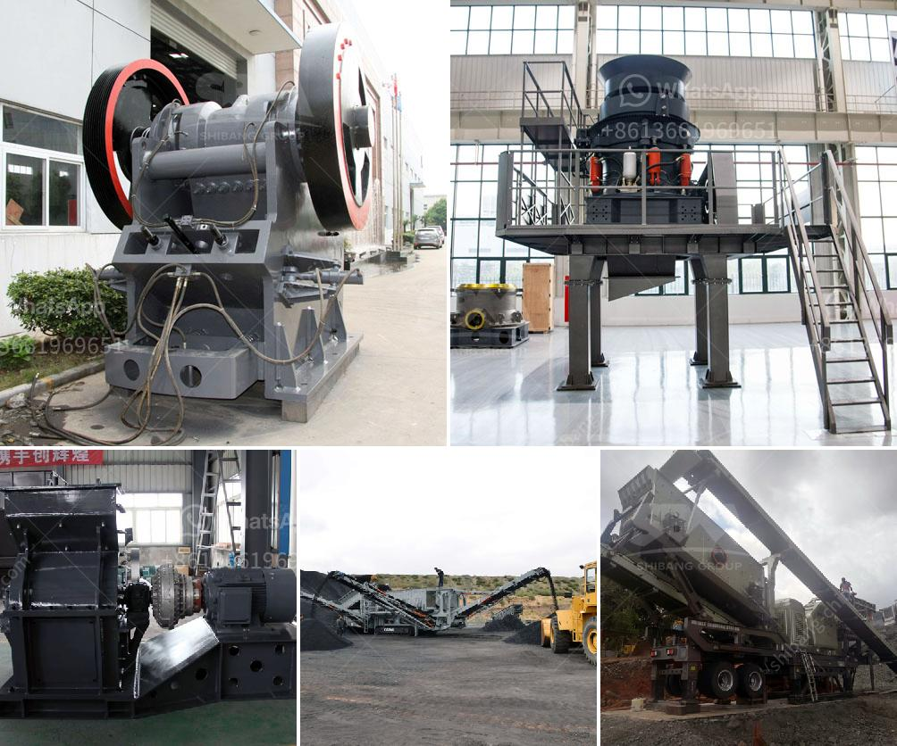

<h3>تكلفة كسارة الأسطوانة</h3>
تعتبر كسارة الأسطوانة واحدة من أهم الآلات التي تستخدم في صناعة التعدين والبناء، حيث تقوم بتكسير المواد الصلبة إلى قطع صغيرة يمكن استخدامها في عمليات البناء أو تجهيزها للمعالجة اللاحقة. ومن المعروف أن التكلفة هي عامل مهم يتم اختياره قبل شراء أي آلة، لذا سنتناول في هذه المقالة تكلفة كسارة الأسطوانة وعوامل تحديد سعرها.

1. حجم الكسارة: يعتبر حجم الكسارة أحد العوامل الرئيسية التي تؤثر في تكلفتها. فكلما كان حجم الكسارة أكبر، ازدادت تكلفتها بشكل طبيعي. وهذا يعود إلى أن الكسارات الأكبر حجمًا تحتاج إلى مواد بناء أكثر، وتحتوي على أنظمة تحكم وصيانة أكثر تعقيدًا. لذا فمن الطبيعي أنها ستكون أغلى بالسعر.

2. قوة المحرك: تعتمد تكلفة الكسارة أيضًا على قوة المحرك المستخدم في تشغيلها. فكلما زادت قوة المحرك، زادت تكلفة الكسارة. وتعتمد قوة المحرك على نوع المواد التي ستتم تكسيرها والكمية التي تستخدمها في إنتاجك. على سبيل المثال، إذا كانت الكسارة تستخدم لتكسير الصخور الصلبة، فإنها تحتاج لمحرك أقوى مقارنة بالكسارات التي تستخدم لتكسير الحجارة العادية.

3. العلامة التجارية: توجد العديد من الشركات المصنعة لكسارات الأسطوانة، ويختلف سعر كل علامة تجارية عن الأخرى. فمثلًا، قد يكون سعر كسارة من علامة تجارية مشهورة أعلى بالمقارنة مع علامة تجارية أخرى مجهولة. ويرتبط ذلك بسمعة وجودة المنتجات المصنوعة من قبل تلك العلامة التجارية، وكذلك بالضمان والخدمات المقدمة بعدها.

4. الآلية: تختلف كسارات الأسطوانة في الآلية التي تعمل بها. فقد تكون بعض الآلات بسيطة وأساسية في تصميمها ولا تحتوي على العديد من الخصائص والوظائف الإضافية. ومن الطبيعي أن تكون تلك الآلات أقل تكلفة مقارنة بتلك التي تحتوي على العديد من الميزات الإضافية مثل أنظمة التحكم الأوتوماتيكية أو أنظمة التبريد والتدفئة.

باختصار، يعتمد سعر كسارة الأسطوانة على العديد من العوامل المذكورة أعلاه، ويجب أن يتم اختيار الكسارة التي تتناسب مع احتياجات العمل والميزانية المتاحة. عند شراء كسارة، يجب النظر في الإرشادات الفنية والضمان المقدم من الشركة المصنعة، فضلاً عن التحقق من تقييمات المستخدمين السابقين لمثل هذه الكسارات. وبالتأكيد، ستكون هناك مجموعة متنوعة من الخيارات للكسارات المتاحة في السوق التي تتناسب مع الاحتياجات المختلفة وخيارات التكلفة المختلفة التي يمكن للمستخدمين اختيارها.
<h3>Contact us</h3><ul><li><strong>Whatsapp:&nbsp;<a href="https://wa.me/8613661969651">+8613661969651</a></strong></li><li><a href="https://swt.shibang-china.com/?git&amp;zhl&amp;تكلفة كسارة الأسطوانة"><strong>Online Service(chat now)</strong></a></li></ul><h3>Related</h3><ul><li><a href='أسعار معدات المحجر.md'>أسعار معدات المحجر</a></li><li><a href='مطحنة الأسطوانة للطحن.md'>مطحنة الأسطوانة للطحن</a></li><li><a href='سير ناقل لرماد الفحم.md'>سير ناقل لرماد الفحم</a></li><li><a href='معدات طحن الكلنكر لسعة ٥٠٠ طن يومياً.md'>معدات طحن الكلنكر لسعة ٥٠٠ طن يومياً</a></li><li><a href='مصنع غسيل الفحم للبيع في جنوب أفريقيا.md'>مصنع غسيل الفحم للبيع في جنوب أفريقيا</a></li></ul>