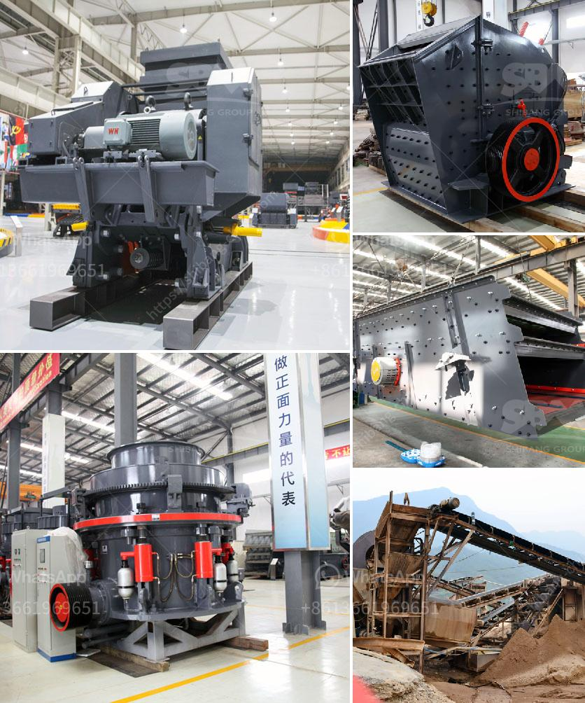

<h3>تكلفة كسارة الحجر في بيرو</h3>
تُعد كسارة الحجر أحد المعدات الأساسية المستخدمة في صناعة البناء وتكسير الحجارة الكبيرة إلى قطع صغيرة قابلة للاستخدام في عدة تطبيقات مختلفة. تتفاوت تكلفة كسارة الحجر في بيرو وذلك تبعًا للعديد من العوامل المختلفة التي يتم احتسابها في التكلفة النهائية. سنلقي نظرة على بعض هذه العوامل الرئيسية لفهم تكلفة كسارة الحجر في بيرو.

العامل الأول هو النوع المستخدم من كسارة الحجر. هناك العديد من أنواع كسارات الحجر المتاحة في السوق، وتختلف التكلفة حسب النوع. على سبيل المثال، تكون كسارات الفك أو الأسطوانة أغلى من الكسارات ذات الصدم الأفقية.

العامل الثاني هو سعة الإنتاج المطلوبة للكسارة. سعة الإنتاج هي عدد الأطنان التي يمكن للكسارة تكسيرها في وحدة زمنية محددة. كلما زادت سعة الإنتاج، زادت التكلفة. ويعود ذلك بسبب ضرورة استخدام معدات إضافية وأكبر للتكسير والإنتاج بشكل أكبر.

العامل الثالث هو جودة المواد والتصنيع المستخدمة في الكسارة. تؤثر جودة المواد المستخدمة في بناء الكسارة وأجزائها على تكلفتها النهائية. استخدام مواد ذات جودة عالية يزيد من التكلفة، ولكن في الوقت نفسه يعزز الأداء والتحمل الطويل الأمد للكسارة.

العامل الرابع هو تكاليف الصيانة والتشغيل. يجب أخذ تكاليف الصيانة والتشغيل في الاعتبار عند التوصل إلى تكلفة الكسارة النهائية. على سبيل المثال، يجب توفير قطع الغيار والمواد الاستهلاكية للكسارة بشكل منتظم، وذلك يؤثر على التكلفة الإجمالية للكسارة في الوقت الطويل.

بشكل عام، تتراوح تكلفة كسارة الحجر في بيرو بين 200 و400 دولار. ومع ذلك، يجب أن يتم احتساب جميع العوامل المذكورة أعلاه للوصول إلى تكلفة نهائية دقيقة تتناسب مع المتطلبات المحددة للمشروع والاعتماد على ميزانية الشركة أو المورد المعين.
<h3>Contact us</h3><ul><li><strong>Whatsapp:&nbsp;<a href="https://wa.me/8613661969651">+8613661969651</a></strong></li><li><a href="https://swt.shibang-china.com/?git&amp;zhl&amp;تكلفة كسارة الحجر في بيرو"><strong>Online Service(chat now)</strong></a></li></ul><h3>Related</h3><ul><li><a href='سعر كسارة مخروطية هيدروليكية بتغذية 20 مم.md'>سعر كسارة مخروطية هيدروليكية بتغذية 20 مم</a></li><li><a href='مزايا وعيوب مطحنة الطحن.md'>مزايا وعيوب مطحنة الطحن</a></li><li><a href='كسارة الفك في نيبال للبيع.md'>كسارة الفك في نيبال للبيع</a></li><li><a href='سعر كسارة الأسطوانة.md'>سعر كسارة الأسطوانة</a></li><li><a href='اتصالات أحزمة الناقلات.md'>اتصالات أحزمة الناقلات</a></li></ul>