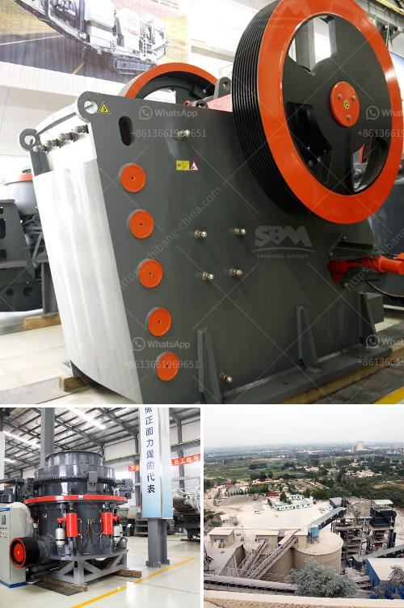

<h3>تكلفة كسارة الحجر</h3>
تعتبر كسارة الحجر من المعدات الهامة في صناعة البناء والمقاولات. تستخدم لسحق الصخور الكبيرة إلى حجم صغير يمكن استخدامه في البناء والطرق والتشييد. تختلف تكلفة كسارة الحجر بناءً على العديد من العوامل، بما في ذلك حجم الكسارة وقوتها والقدرة التشغيلية وموقع العمل.

إذا كانت كسارة الحجر صغيرة الحجم وتستخدم في مواقع البناء الصغيرة، فمن المتوقع أن تكون التكلفة أقل من كسارة الحجر الكبيرة. الكسارات الصغيرة في نطاق سعر 200 إلى 400 يورو قد تكون محمولة وسهلة النقل. يمكن استخدامها في مشاريع البناء الصغيرة مثل البناء المنزلي وتجديد المنزل. بالإضافة إلى ذلك، يمكن استخدامها في الزراعة والتعدين الصغير.

أما إذا كانت الكسارة كبيرة الحجم ومستخدمة في مشاريع البناء الكبيرة، فمن المتوقع أن تكون التكلفة أعلى. الكسارات الكبيرة قد تحتاج إلى إعداد خاص وتتطلب آلات أكبر لتشغيلها. قد تكون هذه الكسارات أكثر قوة وقدرة على سحق الصخور الكبيرة بشكل فعال لإنتاج مواد البناء عالية الجودة. بالإضافة إلى ذلك، في بعض الأحيان يتطلب استخدام الكسارات الكبيرة توظيف عمال مؤهلين لتشغيل وصيانة الآلات وهذا يزيد من تكاليف العمل.

تكلفة كسارة الحجر تتضمن أيضًا تكاليف الصيانة والإصلاح. يعتمد ذلك على نوع الكسارة ومكوناتها. يجب توفير الصيانة الدورية للكسارة لضمان استمرارية الأداء الجيد وتجنب التوقف غير المخطط له. بالإضافة إلى ذلك، في حالة حدوث أي عطل فني في الكسارة، قد يكون هناك حاجة لتكلفة إصلاح إضافية.

بشكل عام، من المهم أن يتم دراسة تكلفة كسارة الحجر بعناية قبل الشراء. يجب مراجعة متطلبات المشروع واختيار الكسارة المناسبة لتلبية تلك المتطلبات. إلى جانب ذلك، يجب النظر في تكاليف الصيانة والإصلاح لضمان قدرة الكسارة على العمل لفترة طويلة.

باختصار، تتفاوت تكلفة كسارة الحجر بين 200 و 400 يورو بناءً على حجم الكسارة وقوتها والقدرة التشغيلية وموقع العمل. من الضروري دراسة تلك العوامل واختيار الكسارة المناسبة لضمان التوازن بين التكلفة والأداء المطلوب.
<h3>Contact us</h3><ul><li><strong>Whatsapp:&nbsp;<a href="https://wa.me/8613661969651">+8613661969651</a></strong></li><li><a href="https://swt.shibang-china.com/?git&amp;zhl&amp;تكلفة كسارة الحجر"><strong>Online Service(chat now)</strong></a></li></ul><h3>Related</h3><ul><li><a href='صور مطحنة الكرات Ceramics.md'>صور مطحنة الكرات Ceramics</a></li><li><a href='تكلفة آلة سحق الحجر كسارة الحجر.md'>تكلفة آلة سحق الحجر كسارة الحجر</a></li><li><a href='كسارة الكوارتز السيليكون.md'>كسارة الكوارتز السيليكون</a></li><li><a href='أصغر كسارة فك محمولة للبيع في جنوب أفريقيا.md'>أصغر كسارة فك محمولة للبيع في جنوب أفريقيا</a></li><li><a href='كسارة الحجر 100 طن للبيع.md'>كسارة الحجر 100 طن للبيع</a></li></ul>