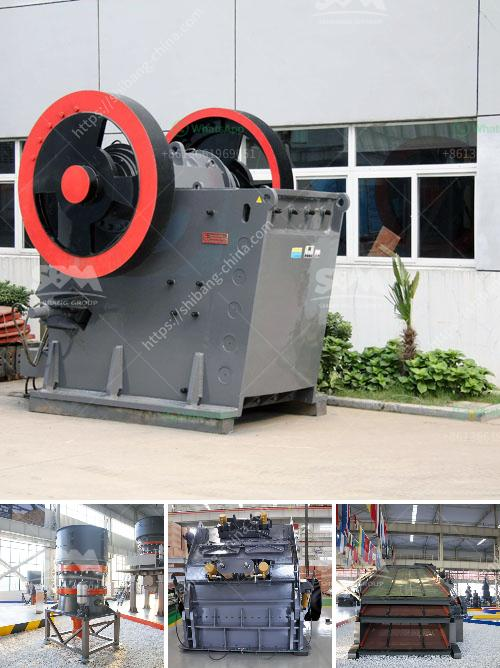

<h3>تكلفة كسارة الحصى</h3>
تعتبر كسارة الحصى أداة أساسية في صناعة البناء والإنشاءات، حيث يتم استخدامها في سحق الحصى وتحويله إلى حصمة مطابقة للمواصفات المطلوبة. وتختلف تكلفة كسارة الحصى من مكان إلى آخر وبناءً على حجم وقوة الكسارة ومتطلبات الإنتاج.

تتراوح تكلفة كسارة الحصى بين 200-400 دولار. ويعود السبب في هذا الاختلاف إلى العوامل التالية:

1- قوة الكسارة: الكسارات المتواضعة في القوة عادةً تكون أرخص في التكلفة، بينما الكسارات ذات القدرة العالية والقوية يمكن أن تكون أغلى في السعر. فمثلاً، يمكن أن تكون كسارة بطاقة إنتاجية عالية وقوة تحطيم قوية تكلفة أكثر من الكسارة ذات القدرات المتوسطة.

2- حجم العمل المطلوب: إذا كانت الاحتياجات للحصى كبيرة ومستمرة، فمن المحتمل أن يتوجب الاستثمار في كسارة أكثر تكلفة، تتمتع بالقدرة على إنتاج كميات كبيرة في فترات زمنية قصيرة. بينما إذا كانت الاحتياجات محدودة ومتقطعة، فمن الممكن استخدام كسارات تكلفة أقل وبقدرات أقل.

3- الموقع وتكاليف النقل: قد تشمل تكلفة الحصى أيضًا تكاليف النقل إلى موقع البناء. إذا كانت الكسارة بعيدة جغرافيًا عن المنطقة المطلوبة لتوريد الحصى، فقد يتعين دفع تكاليف نقل إضافية. لذلك، يجب أخذ هذه التكاليف في الاعتبار عند تقدير تكلفة الحصى.

4- تكاليف الصيانة والإصلاح: قد يكون لتكلفة الصيانة والإصلاح تأثير مباشر على تكلفة كسارة الحصى على المدى الطويل. الكسارات ذات المستوى العالي من البناء والتكنولوجيا عادةً تكون مكلفة في الصيانة والإصلاح، بينما الكسارات ذات الجودة الأدنى قد تكون أقل تكلفة وصيانة. لكن على المدى الطويل، قد يكون للكسارات ذات الجودة العالية تكاليف صيانة أقل مقارنة بالكسارات ذات الجودة الأدنى.

من الواضح أن تكلفة كسارة الحصى تتأثر بعدة عوامل، وعلى الرغم من أن هناك كسارات أرخص من غيرها، إلا أنه يجب أخذ في الاعتبار أن الاستثمار في كسارة ذات جودة وقوة عالية يمكن أن يؤدي إلى زيادة الإنتاجية وتقليل التكاليف على المدى الطويل.
<h3>Contact us</h3><ul><li><strong>Whatsapp:&nbsp;<a href="https://wa.me/8613661969651">+8613661969651</a></strong></li><li><a href="https://swt.shibang-china.com/?git&amp;zhl&amp;تكلفة كسارة الحصى"><strong>Online Service(chat now)</strong></a></li></ul><h3>Related</h3><ul><li><a href='كسارات محمولة في السعودية.md'>كسارات محمولة في السعودية</a></li><li><a href='عملية تعدين الذهب.md'>عملية تعدين الذهب</a></li><li><a href='مطاحن الكرة في فيزاج.md'>مطاحن الكرة في فيزاج</a></li><li><a href='كسارة الحجر في ليما.md'>كسارة الحجر في ليما</a></li><li><a href='عملية إنتاج لوحات الجبس.md'>عملية إنتاج لوحات الجبس</a></li></ul>