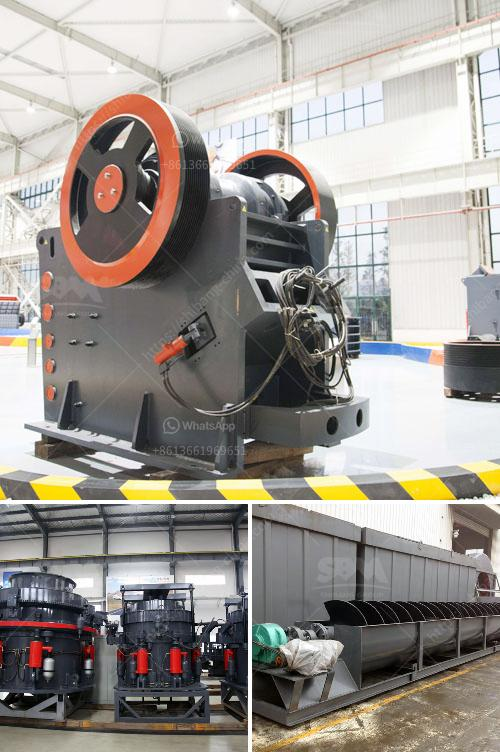

<h3>تكلفة كسارة الرمل</h3>
تعدّ كسارة الرمل واحدة من الآلات الهامة في صناعة البناء والمقاولات، حيث تعمل على طحن وتكسير الصخور والحصى الخشنة لإنتاج الرمال والمواد البنائية الأخرى. يعتمد سعر وتكلفة كسارة الرمل على عدة عوامل، بما في ذلك حجم الكسارة وقوتها وسعة الإنتاج وجودة المواد المستخدمة في تصنيعها.

عندما نتحدث عن تكلفة كسارة الرمل، يجب أن ننظر إلى التكاليف الأساسية التي تتضمن تصنيع الجهاز وشراءه وصيانته. قد يكون سعر كسارة الرمل الأساسية بين 200 و 400 دولار، ولكن هذا السعر قد يتغير بناءً على المواصفات والميزات الخاصة. وتصنع بعض الشركات كسارات الرمل ذات الجودة العالية بتكاليف أعلى، حيث تتمتع بمحركات أكثر قوة وتصميمات فاخرة توفر كفاءة عالية وأداء موثوق.

بالإضافة إلى تكلفة الشراء، يجب أيضًا مراعاة تكلفة استخدام وصيانة الكسارة على المدى الطويل. على سبيل المثال، قد تحتاج الكسارة إلى انتهاء معين بعد فترة زمنية محددة، مما يتطلب تكاليف صيانة وتجديد. بالإضافة إلى ذلك، يجب توفير قطع الغيار المستمرة والوقود والطاقة لتشغيل الكسارة. قد تكون هذه التكاليف متفاوتة بناءً على الموديل والحجم وأنواع الصيانة المطلوبة، ويمكن أن تتراوح بين 100 و 300 دولار شهريًا.

وفي النهاية وعلى الرغم من تكاليف شراء وصيانة كسارة الرمل، يجب مراعاة فوائدها الاقتصادية. فكسارة الرمل تطورت لتكون عاملاً مهماً في عمليات البناء، حيث تساهم في زيادة إنتاجية المواد البنائية وتقليل تكاليف النقل والشحن. بالإضافة إلى ذلك، فإن إنتاج الرمل المحلي يسهم في توفير الموارد وتخفيض التكاليف العامة. من خلال استخدام كسارة الرمل، يتم تحويل المواد الصلبة الخشنة إلى رمال ناعمة ونقية يمكن استخدامها في عمليات البناء المختلفة.

باختصار، تكلفة كسارة الرمل تعتمد على عدة عوامل، بما في ذلك المواصفات والميزات وجودة الجهاز. إضافةً إلى ذلك، يجب مراعاة تكاليف الصيانة وتجديد المعدات على المدى الطويل، إلى جانب الفوائد الاقتصادية التي توفرها كسارة الرمل. تحديد الاحتياجات والمتطلبات الخاصة الخاصة بك والبحث عن مورّدين وشركات موثوقة يمكن أن يساعدك في اتخاذ القرار الأمثل بشأن شراء كسارة الرمل الأنسب لك.
<h3>Contact us</h3><ul><li><strong>Whatsapp:&nbsp;<a href="https://wa.me/8613661969651">+8613661969651</a></strong></li><li><a href="https://swt.shibang-china.com/?git&amp;zhl&amp;تكلفة كسارة الرمل"><strong>Online Service(chat now)</strong></a></li></ul><h3>Related</h3><ul><li><a href='موردين مطحنة الأسطوانة الرأسية.md'>موردين مطحنة الأسطوانة الرأسية</a></li><li><a href='مصنع تكسير الحجر في الهند بسعر مناسب.md'>مصنع تكسير الحجر في الهند بسعر مناسب</a></li><li><a href='كسارة الجرانيت المحمولة.md'>كسارة الجرانيت المحمولة</a></li><li><a href='شركة مبيعات كسارة الحجر في كينيا.md'>شركة مبيعات كسارة الحجر في كينيا</a></li><li><a href='أسعار مطاحن الكرة وللبيع في سريلانكا.md'>أسعار مطاحن الكرة وللبيع في سريلانكا</a></li></ul>