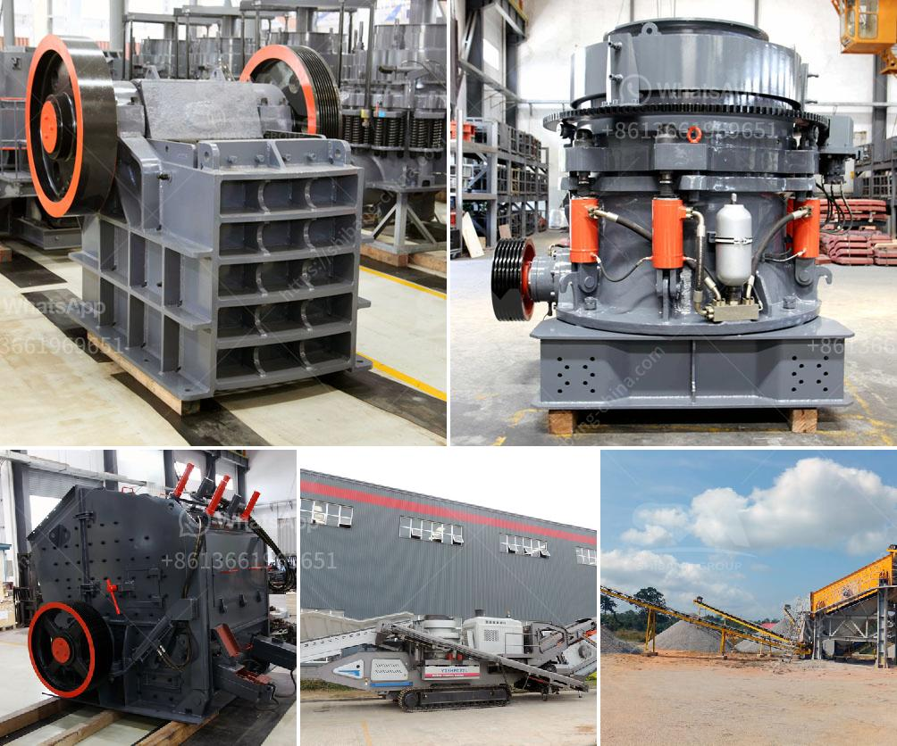

<h3>تكلفة كسارة السيليكا</h3>
كسارة السيليكا هي آلة تقوم بسحق الصخور والمواد الصلبة الأخرى إلى حجم أصغر من أجل استخدامها في العديد من الصناعات. تعد السيليكا واحدة من المواد الأساسية في صناعة الزجاج وصناعة الخزف والمواد اللاصقة والدهانات وصناعة البلاط والأسمنت، بالإضافة إلى الاستخدامات الأخرى في الكهرباء والإلكترونيات.

تتفاوت تكلفة كسارة السيليكا حسب الحجم والقدرة والمواصفات التقنية للآلة. في المتوسط ​​، تتراوح تكلفة كسارة السيليكا ذات الحجم الصغير بين 200 إلى 500 دولارًا. ومع ذلك، يمكن أن تكون هناك اختلافات في الأسعار بناءًا على الماركة والشركة المصنعة والموردين، بالإضافة إلى التكاليف الأخرى المرتبطة بنقل الآلة، وتركيبها، والصيانة وأجزاء الغيار.

بشكل عام، يمكن القول إن استثمار شراء كسارة السيليكا يعتبر استثمارًا مربحًا للعديد من الشركات والمصانع التي تحتاج إلى تكسير الصخور والمواد الخام لإنتاج سلع ومنتجات نهائية. فعلى المدى الطويل، توفر هذه الآلة توفيرًا في تكاليف الإنتاج وتحسين الكفاءة وزيادة الإنتاجية.

ومع ذلك، يجب أن يتم اختيار الكسارة المناسبة وفقًا للاحتياجات والمتطلبات الخاصة بالمشروع. كما يجب على المستخدم الاهتمام بنوعية المنتج النهائي ومستوى الأداء والصيانة المستدامة.

بالإضافة إلى تكلفة شراء الكسارة، يجب أيضًا مراعاة تكاليف التشغيل والصيانة الأخرى المرتبطة بها، مثل تكلفة الطاقة والوقود والماء وتكاليف الصيانة وتكلفة وقت العملاء في إدارة الآلة.

بشكل عام، يجب أن يتم إجراء دراسة جدوى متأنية قبل اتخاذ قرار شراء كسارة السيليكا لضمان أن التكلفة المالية والاقتصادية متوافقة مع فوائدها المتوقعة. كما ينبغي مراجعة الشركات المصنعة والموردين المختلفين للحصول على عروض سعر مقارنة والاستفادة من خدمات ما بعد البيع والدعم الفني.

باختصار، تكلفة كسارة السيليكا متفاوتة وتعتمد على العديد من العوامل المختلفة، وهي واحدة من الاستثمارات المربحة التي يمكن للشركات تحقيق فوائدها في المدى البعيد.
<h3>Contact us</h3><ul><li><strong>Whatsapp:&nbsp;<a href="https://wa.me/8613661969651">+8613661969651</a></strong></li><li><a href="https://swt.shibang-china.com/?git&amp;zhl&amp;تكلفة كسارة السيليكا"><strong>Online Service(chat now)</strong></a></li></ul><h3>Related</h3><ul><li><a href='تكلفة مشروع طحن التلك.md'>تكلفة مشروع طحن التلك</a></li><li><a href='أسعار مطاحن الكرة وللبيع في سريلانكا.md'>أسعار مطاحن الكرة وللبيع في سريلانكا</a></li><li><a href='تعدين المحاجر ومعدات البناء.md'>تعدين المحاجر ومعدات البناء</a></li><li><a href='مصنع تكسير الدولوميت في تركيا.md'>مصنع تكسير الدولوميت في تركيا</a></li><li><a href='كسارة الفلدسبار بتأثير.md'>كسارة الفلدسبار بتأثير</a></li></ul>