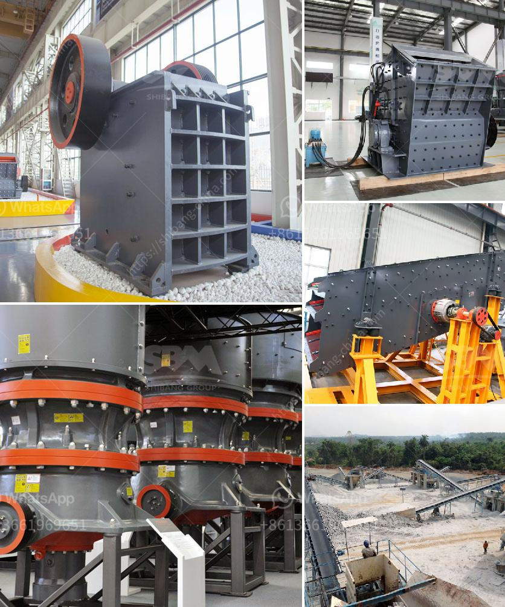

<h3>تكلفة كسارة الصدم</h3>
تعتبر كسارة الصدم، أو ما يُعرف أيضًا بكسارة التأثير، من أهم أدوات الهندسة الميكانيكية المستخدمة في مجال التكسير والتحطيم. في هذه المقالة، سنتناول مناقشة تكلفة كسارة الصدم وعوامل تحديدها.

تعتبر تكلفة كسارة الصدم أحد العوامل الرئيسية التي يجب مراعاتها عند شراء وتثبيت هذا الجهاز في مصنع أو منشأة تجهيز المعادن. تتراوح أسعار كسارات الصدم بين 200 إلى 400 ألف دولار، وهذا الفارق في السعر يعود إلى العديد من العوامل المؤثرة.

أولًا، يؤثر نوع الكسارة بشكل كبير في التكلفة. هناك عدة أنواع من كسارات الصدم تتراوح من الأحجام الصغيرة المحمولة إلى الأحجام الكبيرة الثابتة. وبطبيعة الحال، يتأثر السعر بحجم وطاقة الكسارة، حيث يترتب على ذلك استخدام مواد أكثر جودة وأجزاء متطورة ومحركات أقوى.

ثانيًا، يلعب الإنتاجية العامة للكسارة دورًا في تحديد التكلفة. إذا كان لديك إنتاجية عالية، مثلاً 2000 طن في الساعة، فمن المرجح أن يكون السعر أعلى بالمقارنة مع الإنتاجية المنخفضة في حدود 500 طن في الساعة.

ثالثًا، يتأثر السعر أيضًا بعوامل أخرى مثل الجودة والصيانة والضمان. يمكن أن يزيد الاستثمار في جودة الكسارة على المدى الطويل من الكفاءة والاستدامة وجودة المنتج النهائي. بالإضافة إلى ذلك، يجب أيضًا النظر في التكاليف المرتبطة بالصيانة والتشغيل. عادة ما تشكل قطع الغيار والخدمات الفنية حصة كبيرة من تكلفة التشغيل العامة للكسارة.

لا يمكن إغفال التكاليف الأخرى المرتبطة بالتركيب والتشغيل. يمكن أن يكون تثبيت وإعداد كسارة الصدم معقدًا ومكلفًا، وقد يتطلب التدريب الخاص للعاملين على التشغيل والصيانة. لذلك، ينبغي أخذ هذه العوامل في الاعتبار عند تقدير التكلفة الإجمالية للاستثمار في كسارة الصدم.

في النهاية، يبدو أن تكلفة كسارة الصدم تعتمد على العديد من العوامل المذكورة أعلاه، بالإضافة إلى العوامل الأخرى مثل الشركة المصنعة والموقع الجغرافي والسوق. لذلك، ينصح بإجراء دراسة دقيقة قبل الاستثمار في كسارة الصدم لضمان الحصول على أفضل قيمة مقابل المال المُدفوع.
<h3>Contact us</h3><ul><li><strong>Whatsapp:&nbsp;<a href="https://wa.me/8613661969651">+8613661969651</a></strong></li><li><a href="https://swt.shibang-china.com/?git&amp;zhl&amp;تكلفة كسارة الصدم"><strong>Online Service(chat now)</strong></a></li></ul><h3>Related</h3><ul><li><a href='شركة تصنيع لطحن الكلنكر.md'>شركة تصنيع لطحن الكلنكر</a></li><li><a href='أفضل علامات تجارية للآلات في المحجر.md'>أفضل علامات تجارية للآلات في المحجر</a></li><li><a href='تكسير الحجر المصنوع في ألمانيا.md'>تكسير الحجر المصنوع في ألمانيا</a></li><li><a href='كل معدة لكل جهاز كسارة فك.md'>كل معدة لكل جهاز كسارة فك</a></li><li><a href='المعدات المطلوبة لإنشاء محجر الجرانيت.md'>المعدات المطلوبة لإنشاء محجر الجرانيت</a></li></ul>