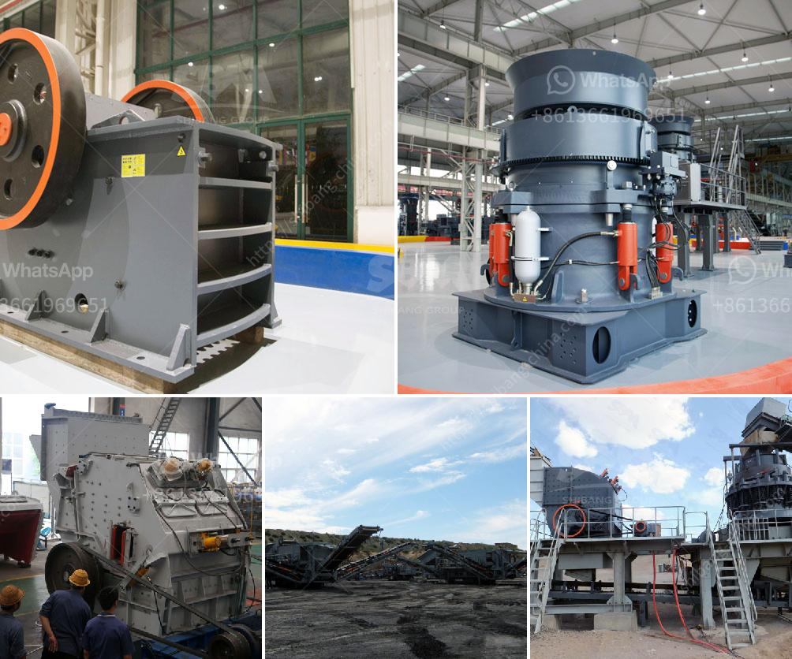

<h3>تكلفة كسارة الفك 24x36</h3>
تعتبر كسارة الفك 24x36 من المعدات المستخدمة في صناعة التعدين والتشييد، وتستخدم بشكل شائع في عمليات سحق الصخور الصلبة والتمهيد لمراحل المعالجة اللاحقة. تأتي هذه الكسارة بحجم يقدر بـ 24x36 بوصة، وتتميز بقدرتها على سحق الصخور بكفاءة عالية وإنتاجية كبيرة.

من أجل تحديد تكلفة كسارة الفك 24x36، يجب أخذ العديد من العوامل في الاعتبار. أحد هذه العوامل هو مصدر الكسارة والشركة المصنعة لها. يتوفر في السوق الكثير من الموردين والشركات المصنعة لكسارات الفك، وتختلف أسعارهم وجودتهم بناءً على التكنولوجيا المستخدمة والتحسينات التي تطبق على المعدة.

كما يؤثر الطلب على سعر كسارة الفك 24x36. عندما يكون الطلب على هذه الكسارات مرتفعًا، يمكن أن يزيد سعرها بشكل ملحوظ، بينما ينخفض سعرها عندما يكون الطلب منخفضًا. عوامل أخرى تؤثر أيضًا على السعر هي تكلفة المواد الخام وتكلفة النقل وتكاليف التشغيل والضرائب والرسوم.

كذلك، يتأثر سعر كسارة الفك 24x36 بحالة السوق والظروف الاقتصادية العامة. في فترات الانكماش الاقتصادي، قد يكون هناك تراجع في الطلب على المعدات الثقيلة وبالتالي قد يكون هناك تخفيض في الأسعار. بالمقابل، في فترات النمو الاقتصادي قد يحدث زيادة في الطلب وبالتالي زيادة في الأسعار.

وفي النهاية، يجب أيضًا أن نأخذ في الاعتبار إمكانية حجز الخدمات المرتبطة بكسارة الفك 24x36، مثل التدريب على استخدامها وصيانتها والدعم الفني. يمكن أن تتركب هذه الخدمات بعدا إضافيًا للتكلفة الإجمالية للكسارة.

عمومًا، يتراوح سعر كسارة الفك 24x36 بين 200 إلى 400 ألف دولار، وقد يكون أعلى أو أقل اعتمادًا على العوامل المذكورة والتحسينات التي تتم على المعدة. وبالنظر إلى القدرات العالية والتأثير الإيجابي الكبير على إنتاجية العمل وقدرة الكسارة على تحمل الأحمال الثقيلة، يمكن القول بأنها تستحق التكلفة.

في النهاية، يعتمد قرار شراء كسارة الفك 24x36 على احتياجات المشروع وميزانيته. يجب على المستثمرين تقييم متطلباتهم والتشاور مع الخبراء قبل اتخاذ قرار الشراء.
<h3>Contact us</h3><ul><li><strong>Whatsapp:&nbsp;<a href="https://wa.me/8613661969651">+8613661969651</a></strong></li><li><a href="https://swt.shibang-china.com/?git&amp;zhl&amp;تكلفة كسارة الفك 24x36"><strong>Online Service(chat now)</strong></a></li></ul><h3>Related</h3><ul><li><a href='مطحنة الهامر من إيديبيسا.md'>مطحنة الهامر من إيديبيسا</a></li><li><a href='سعر كسارة الحجر الأمريكي.md'>سعر كسارة الحجر الأمريكي</a></li><li><a href='تكلفة الحزام الناقل لكل متر.md'>تكلفة الحزام الناقل لكل متر</a></li><li><a href='إنتاج الكاولين في إثيوبيا بتنسيق PDF.md'>إنتاج الكاولين في إثيوبيا بتنسيق PDF</a></li><li><a href='كسارة صناعية.md'>كسارة صناعية</a></li></ul>