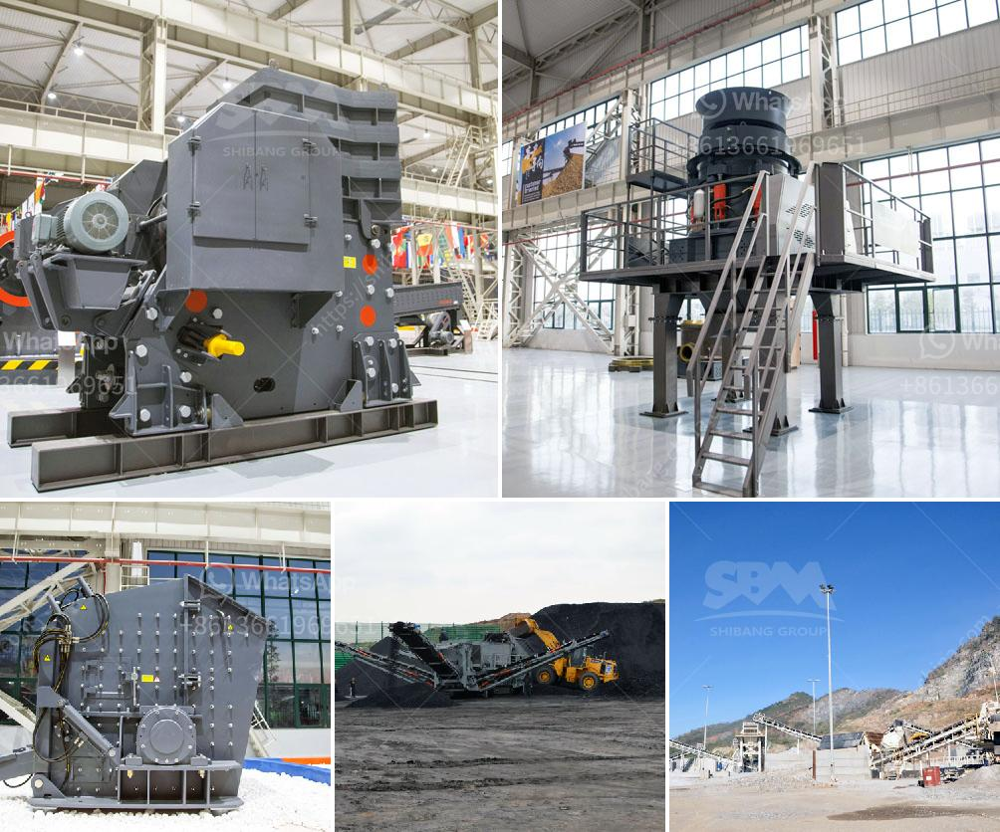

<h3>تكلفة كسارة المعدات في ماليزيا</h3>
تحظى صناعة التعدين والبناء بتطور مستمر في ماليزيا، حيث تعتبر البنية التحتية قوية وتتواجد بها العديد من المناجم ومحاجر الصخور ومحطات الكسارات. وتُعد كسارة المعدات أحد العناصر الرئيسية في هذه الصناعة، إذ تُستخدم في تكسير وسحق المواد الخام كالصخور والحجارة لاستخلاص المعادن وتحضير المواد اللازمة للبناء.

تختلف تكلفة كسارة المعدات في ماليزيا اعتمادًا على العديد من العوامل مثل الحجم والقدرة والكفاءة والميزات التقنية. يمكن الحصول على كسارة المعدات في ماليزيا بتكلفة تتراوح ما بين 200 - 400 ألف رنجت ماليزي (MYR)، وهذه التكلفة تشمل الجهاز الرئيسي والمحرك والأجزاء الأخرى التي تعمل على تشغيل الكسارة وتحقيق الكفاءة المثلى في عملية التكسير.

تعتبر الكفاءة والموثوقية من أهم العوامل التي يجب أخذها في الاعتبار عند شراء كسارة المعدات في ماليزيا. فهناك العديد من الشركات والموردين المعروفين في هذا المجال، حيث يمكن الحصول على معدات ذات جودة عالية وتكنولوجيا متقدمة. ويجب أن تتوافق تكلفة الكسارة بشكل عام مع الأداء والكفاءة التي تقدمها، لضمان أنها ستلبي احتياجات العملاء بأفضل طريقة ممكنة.

بالإضافة إلى تكلفة الشراء، يجب النظر أيضًا في تكاليف الصيانة والتشغيل لكسارة المعدات في ماليزيا. يتضمن ذلك تكلفة قطع الغيار والصيانة الدورية وتكاليف الوقود والطاقة اللازمة لتشغيل الكسارة. قبل الاستثمار في كسارة معدات، يجب أن يتم حساب تلك التكاليف إلى جانب تكلفة الشراء الأساسية، لضمان أنها مستدامة واقتصادية على المدى الطويل.

من المهم أيضًا الاهتمام بتدريب العمال على استخدام الكسارات بشكل آمن وفعال. يجب أن تقدم الشركات المصنعة تعليمات وتوجيهات صحيحة للعمال حول كيفية استخدام الكسارة بأمان وتفادي حوادث العمل والضمان بأن العمال مؤهلين ويحترفون في أداء مهمتهم بطريقة سليمة.

في الختام، تكلفة كسارة المعدات في ماليزيا تتراوح ما بين 200 - 400 ألف رنجت ماليزي، وتتأثر بالعديد من العوامل مثل الحجم والقدرة والكفاءة وميزات التقنية. يجب أن يتم النظر في الكفاءة والتوفر وتكاليف الصيانة والتشغيل، بالإضافة إلى تدريب العمال على الاستخدام الآمن للكسارة. باختيار كسارة المعدات المناسبة والعمل بشكل جيد، يمكن للشركات الماليزية تحقيق تطور مستدام في صناعة التعدين والبناء، وتلبية الاحتياجات المحلية والعالمية.
<h3>Contact us</h3><ul><li><strong>Whatsapp:&nbsp;<a href="https://wa.me/8613661969651">+8613661969651</a></strong></li><li><a href="https://swt.shibang-china.com/?git&amp;zhl&amp;تكلفة كسارة المعدات في ماليزيا"><strong>Online Service(chat now)</strong></a></li></ul><h3>Related</h3><ul><li><a href='حجر الحجر الجيري المسحوق بحجم 34 بوصة.md'>حجر الحجر الجيري المسحوق بحجم 3/4 بوصة</a></li><li><a href='إنتاج الحصى الجيري.md'>إنتاج الحصى الجيري</a></li><li><a href='نظام مصنع البنتونيت.md'>نظام مصنع البنتونيت</a></li><li><a href='مصنع كسارة الدولوميت في ناجبور.md'>مصنع كسارة الدولوميت في ناجبور</a></li><li><a href='كيف يعمل مطحنة الطحن.md'>كيف يعمل مطحنة الطحن</a></li></ul>