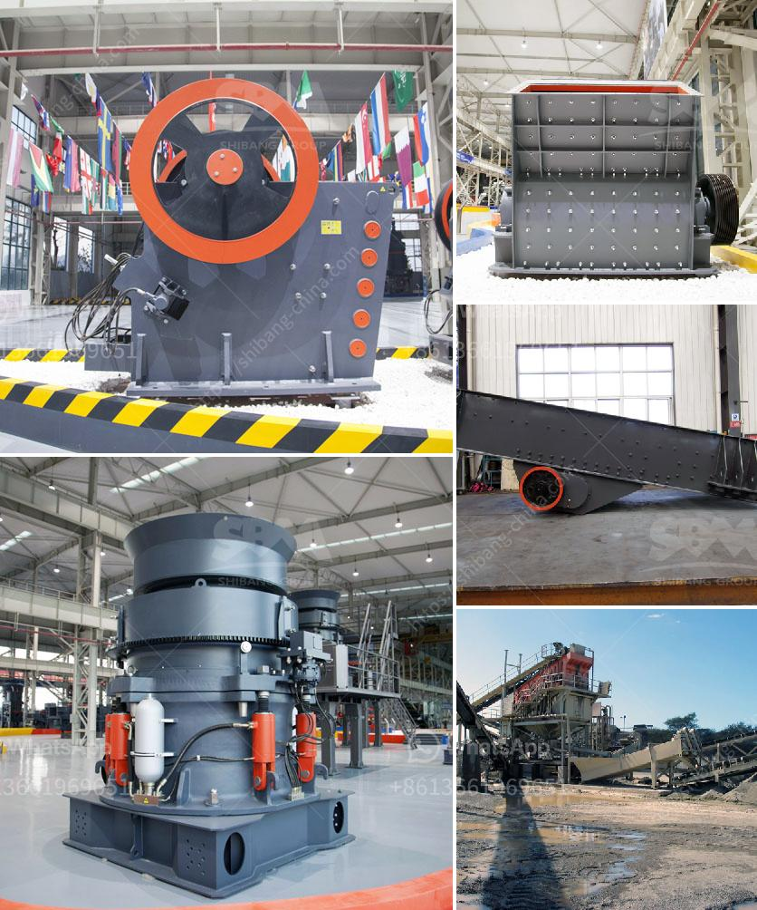

<h3>تكلفة كسارة النحاس</h3>
كسارة النحاس هي أداة أساسية في عملية تكسير خام النحاس للحصول على النحاس المستخدم في صناعة العديد من المنتجات. تعتبر تكلفة كسارة النحاس عاملاً مهماً في عملية الإنتاج النحاسي، حيث يجب أن تكون التكلفة مستدامة وتتناسب مع جدوى العمل.

تتأثر تكلفة كسارة النحاس بعدة عوامل. أحد هذه العوامل هو حجم الكسارة، حيث تكون تكلفة الكسارات الصغيرة أقل من الكسارات الكبيرة. بالإضافة إلى ذلك، يؤثر أيضًا نوعية المواد المستخدمة في الكسارة على تكلفتها. يجب أن تكون المواد ذات جودة عالية ومتينة للحصول على كسارة متينة وفعالة.

تتنوع أسعار كسارات النحاس بين 200 إلى 400 دولار، ويرجع ذلك إلى العلامة التجارية وجودة المنتج والميزات المرفقة بالكسارة. يمكن أن تكون هذه الميزات تشمل المحركات والتحكم الكهربائي والمرونة في الإعدادات وسهولة التشغيل والصيانة. بشكل عام، تعتبر الكسارات الفعالة من الناحية التكلفة هي تلك التي تجمع بين الأداء الجيد والتكلفة المناسبة.

إلا أنه يجب أن نأخذ في الاعتبار أن تكلفة شراء الكسارة هي جزء فقط من التكاليف الإجمالية لعملية تكسير النحاس. يجب أيضًا أخذ في الاعتبار تكاليف التشغيل والصيانة واستهلاك الطاقة واستبدال الأجزاء والعمالة والمواد اللازمة للعملية بشكل عام. لذا، يجب أن يتم تحديد الميزانية المتاحة وتقييم التكاليف الإجمالية في الحسبان قبل شراء كسارة النحاس.

في النهاية، يمكن القول أن تكلفة كسارة النحاس تتأثر بعدة عوامل مثل حجم الكسارة ونوعية المواد المستخدمة والميزات المرفقة بالكسارة. يجب أن يتم تقييم التكلفة الإجمالية لعملية تكسير النحاس بشكل شامل لضمان نجاح العملية وجودة النتائج المتوقعة.
<h3>Contact us</h3><ul><li><strong>Whatsapp:&nbsp;<a href="https://wa.me/8613661969651">+8613661969651</a></strong></li><li><a href="https://swt.shibang-china.com/?git&amp;zhl&amp;تكلفة كسارة النحاس"><strong>Online Service(chat now)</strong></a></li></ul><h3>Related</h3><ul><li><a href='كسارة الخرسانة المستعملة للبيع.md'>كسارة الخرسانة المستعملة للبيع</a></li><li><a href='محطات تكسير محمولة.md'>محطات تكسير محمولة</a></li><li><a href='مصنع مطاحن الأسمنت بسعة 100 طن يومياً.md'>مصنع مطاحن الأسمنت بسعة 100 طن يومياً</a></li><li><a href='مطحنة كرات لتعدين الذهب للبيع.md'>مطحنة كرات لتعدين الذهب للبيع</a></li><li><a href='كسارة الصخور.md'>كسارة الصخور</a></li></ul>