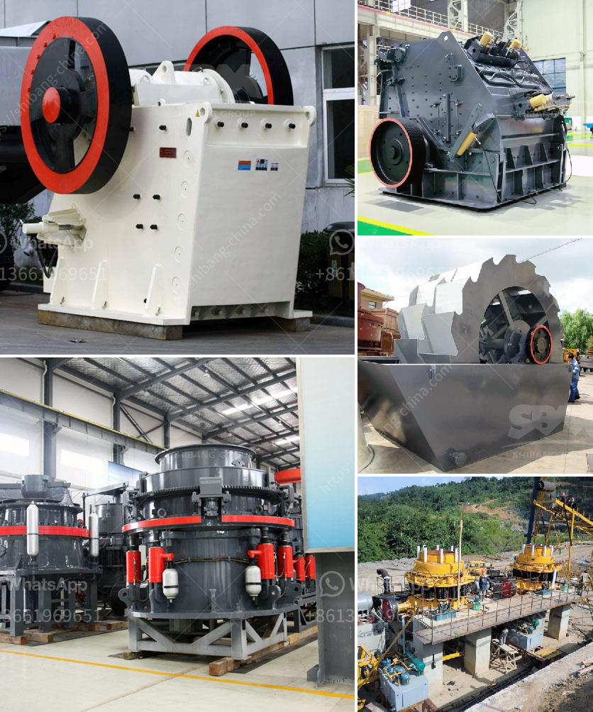

<h3>تكلفة كسارة محمولة كم</h3>
تعتبر الكسارات المحمولة من الأجهزة الحديثة والمبتكرة التي أصبحت شائعة الاستخدام في مجال صناعة البناء والتشييد. وتعتبر الكسارة المحمولة أداة مهمة تستخدم لسحق وتكسير المواد الصلبة، مثل الأحجار والحجارة والخرسانة، في موقع العمل مما يجعل عملية التشييد أسهل وأكثر فعالية. ومن المعروف أن سعر الكسارة المحمولة متفاوت ويعتمد على عدة عوامل.

أحد العوامل الرئيسية التي تؤثر في تكلفة الكسارة المحمولة هو نوع الكسارة وحجمها. الكسارات المحمولة متوفرة بعدة أحجام وقدرات، وبالتالي فإن سعرها يتغير بناءً على الحجم والإمكانيات المتاحة بها. وفي العادة، يزيد سعر الكسارة المحمولة كلما زاد حجمها وقدرتها على التكسير. إذاً، يجب على المشتري أن يحدد احتياجاته بدقة قبل الشراء لتجنب الإنفاق على الحجم والإمكانيات الزائدة.

عامل آخر يؤثر في تكلفة الكسارة المحمولة هو الماركة والجودة. هناك العديد من الشركات المصنعة للكسارات المحمولة، وتختلف تكاليفها بناءً على سمعتها وجودتها. قد يكون سعر الكسارات المحمولة للشركات المعروفة أعلى بعض الشيء مقارنة بالشركات الأخرى. ولكن الاستثمار في كسارة ذات جودة عالية يعني أداء أفضل وثبات وأقل تكاليف صيانة في المستقبل.

بالإضافة إلى ذلك، يجب أن نأخذ في الاعتبار تكاليف الشحن والتركيب. يمكن أن تكون تكلفة شحن الكسارة المحمولة باهظة الثمن خاصة إذا كانت تصل من بلد بعيد. كما يجب أن نفكر في تكاليف التركيب والتشغيل والصيانة الأخرى التي قد تترتب عن استخدام الكسارة المحمولة.

في الختام، يمكن القول أن تكلفة الكسارة المحمولة تختلف بناءً على العديد من العوامل المختلفة. ومن المهم أخذ جميع هذه العوامل في الاعتبار قبل اتخاذ قرار الشراء. ينصح بالبحث والاستفسار عن أسعار مختلف الشركات المصنعة وقراءة المراجعات والتوصيات من المستخدمين الآخرين قبل اتخاذ القرار النهائي.
<h3>Contact us</h3><ul><li><strong>Whatsapp:&nbsp;<a href="https://wa.me/8613661969651">+8613661969651</a></strong></li><li><a href="https://swt.shibang-china.com/?git&amp;zhl&amp;تكلفة كسارة محمولة كم"><strong>Online Service(chat now)</strong></a></li></ul><h3>Related</h3><ul><li><a href='كسارة الفك في نيبال للبيع.md'>كسارة الفك في نيبال للبيع</a></li><li><a href='أسعار كسارات الخرسانة.md'>أسعار كسارات الخرسانة</a></li><li><a href='آلة كسارة حجر للبيع.md'>آلة كسارة حجر للبيع</a></li><li><a href='سعر آلة تكسير الذهب في الولايات المتحدة.md'>سعر آلة تكسير الذهب في الولايات المتحدة</a></li><li><a href='أنواع كسارات الحجر الجيري.md'>أنواع كسارات الحجر الجيري</a></li></ul>