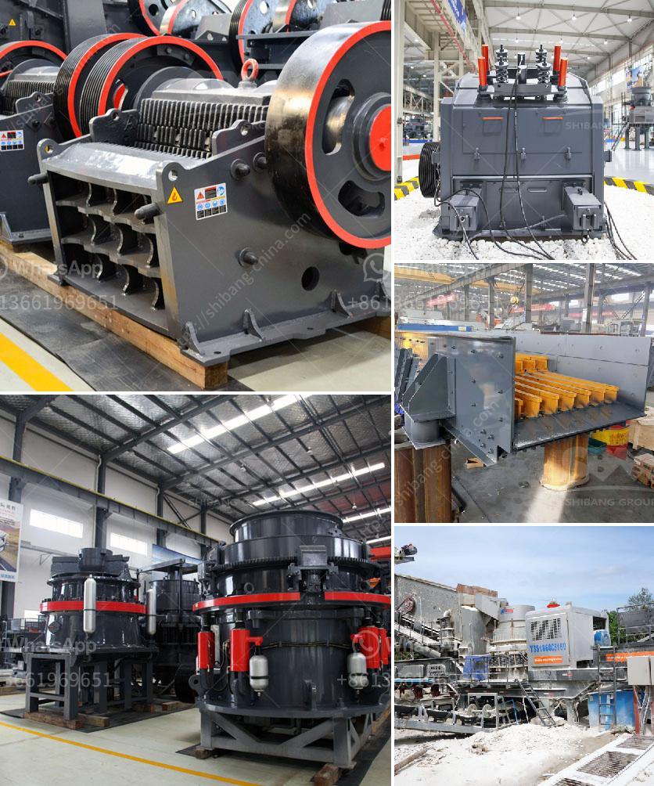

<h3>تكلفة ماكينات كسارة المحاجر</h3>
تعتبر ماكينات كسارة المحاجر أداة أساسية في صناعة التعدين والبناء. تقوم هذه الماكينات بتكسير الصخور والحجارة الكبيرة إلى قطع صغيرة يمكن استخدامها في إنتاج المواد الإنشائية والحجارة الزاخرة بالمعادن المختلفة.

تختلف تكلفة ماكينات كسارة المحاجر وفقًا للعديد من العوامل، بما في ذلك:

1. الحجم والسعة: يشترط تحديد حجم وسعة الماكينة التي يتم شراؤها، حيث يعتمد ذلك على حجم المحجر وقدرة الإنتاج المطلوبة. كلما كانت السعة أكبر، زادت التكلفة.

2. نوع الماكينة: هناك العديد من الأنواع المختلفة من ماكينات كسارة المحاجر، بما في ذلك كسارات الفك، وكسارات الصدم، وكسارات المخروطية. تختلف تكلفة كل نوع وفقًا للمواصفات والقدرات المختلفة التي تتميز بها.

3. العلامة التجارية: هناك العديد من الشركات المصنعة لماكينات كسارة المحاجر، وتختلف تكلفة الماكينات بناءً على العلامة التجارية. يتمتع العديد من العلامات التجارية بسمعة جيدة وأداء عالي، مما يزيد من تكلفتها.

4. التكنولوجيا والمزايا الإضافية: بعض الماكينات الحديثة تأتي مزودة بتقنيات ومزايا إضافية مثل التحكم عن بُعد وأنظمة السلامة المتقدمة. قد يتطلب الحصول على هذه المزايا الإضافية دفع تكاليف إضافية.

بشكل عام، يمكن أن تتراوح تكلفة ماكينات كسارة المحاجر من عدة آلاف إلى عدة ملايين من الدولار. من الضروري التشاور مع مختصين في صناعة التعدين والبناء لتحديد الاحتياجات الخاصة بك وتقديم تقدير مستند للتكاليف.

إذا كنت تفكر في شراء ماكينة كسارة محجرية، فمن المهم اتخاذ القرار الصائب بشأن النوع المناسب والحجم والسعة التي تلبي احتياجاتك، وذلك بناءً على الميزانية المتاحة لديك وتقدير العائد المالي المتوقع. قبل اتخاذ القرار النهائي، يُفضل أيضًا التفاوض مع البائعين والطلب تصفيات وعروض أسعار متعددة لمقارنة التكاليف والفوائد المحتملة.
<h3>Contact us</h3><ul><li><strong>Whatsapp:&nbsp;<a href="https://wa.me/8613661969651">+8613661969651</a></strong></li><li><a href="https://swt.shibang-china.com/?git&amp;zhl&amp;تكلفة ماكينات كسارة المحاجر"><strong>Online Service(chat now)</strong></a></li></ul><h3>Related</h3><ul><li><a href='معدات استخراج الذهب من الصخور.md'>معدات استخراج الذهب من الصخور</a></li><li><a href='أفضل آلات الكسارة.md'>أفضل آلات الكسارة</a></li><li><a href='معدات طحن مطحنة ريموند.md'>معدات طحن مطحنة ريموند</a></li><li><a href='مطحنة أسطوانية ثنائية المرور.md'>مطحنة أسطوانية ثنائية المرور</a></li><li><a href='سعر كسارة الحجر المحمولة في الفلبين.md'>سعر كسارة الحجر المحمولة في الفلبين</a></li></ul>