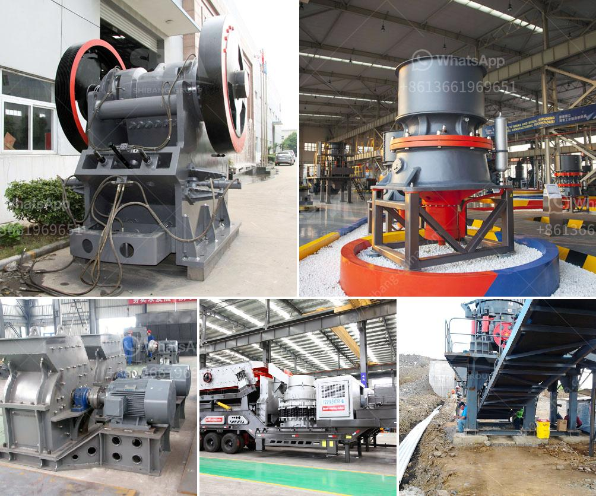

<h3>تكلفة مجفف الرمال في ولاية كيرالا</h3>
يُعدّ مجفف الرمال أحد الأجهزة الضرورية في عملية استخراج الرمال، التي تعتبر مادة خام أساسية في العديد من الصناعات. ومن بين الولايات الهندية التي تشتهر بعمليات استخراج الرمال هي ولاية كيرالا. ومن المؤكد أن تكلفة مجفف الرمال لها تأثير كبير على أرباح المنتجين والمشغلين في هذا القطاع.

تتأثر تكلفة مجفف الرمال في ولاية كيرالا بالعوامل المتعددة، بدءًا من تكاليف الشراء والتركيب وصولاً إلى تكاليف التشغيل والصيانة اليومية. عند شراء مجفف الرمال، يعتبر الجودة والقدرة على التحمل أحد العوامل الرئيسية، وهذا قد يعني أن المنتجين يفضلون شراء مجففات الرمال ذات الجودة العالية حتى وإن كانت تكلفتها أعلى بعض الشيء عن البدائل الأخرى. بالإضافة إلى ذلك، يجب مراعاة سعة مجفف الرمال وفقًا لحجم عمليات استخراج الرمال وتوقعات الإنتاج المستقبلية.

من الجوانب الأخرى التي يجب اعتبارها في تكلفة مجفف الرمال هي تكاليف التشغيل والصيانة الروتينية. تشمل هذه التكاليف تكلفة الكهرباء المطلوبة لتشغيل المجفف وتكلفة العمالة المطلوبة لصيانته وتشغيله. قد يلجأ بعض المشغلين إلى استخدام تكنولوجيا أكثر تطورًا وكفاءة في المجففات التي تستهلك كميات أقل من الكهرباء، وهذا قد يقلل من تكاليف التشغيل.

بالإضافة إلى ذلك، يمكن للمشغلين الاستفادة من الأبحاث والدراسات المتعلقة بتحسين مجفف الرمال وتقليل تكاليفه. فعلى سبيل المثال، يمكن استخدام التكنولوجيا الحديثة مثل الأتمتة والتحكم بالكمبيوتر لتحسين كفاءة المجفف وتقليل فاقد الطاقة.

بالنظر إلى جميع العوامل المذكورة أعلاه، يتراوح سعر مجفف الرمال في ولاية كيرالا عادةً بين 200 إلى 400 دولارًا. ومع ذلك، قد يختلف هذا السعر وفقًا لعوامل مثل جودة المجفف وسعته وتكاليف التشغيل والصيانة.

مما سبق يمكن القول بأن تكلفة مجفف الرمال في ولاية كيرالا تعتمد على العديد من العوامل، والمنتجين والمشغلين في هذا القطاع يجب أن يأخذوا كل هذه العوامل في الاعتبار عند اتخاذ قرار شراء مجفف الرمال المناسب لعملياتهم.
<h3>Contact us</h3><ul><li><strong>Whatsapp:&nbsp;<a href="https://wa.me/8613661969651">+8613661969651</a></strong></li><li><a href="https://swt.shibang-china.com/?git&amp;zhl&amp;تكلفة مجفف الرمال في ولاية كيرالا"><strong>Online Service(chat now)</strong></a></li></ul><h3>Related</h3><ul><li><a href='أحجام كسارة الفك الحجر الجيري.md'>أحجام كسارة الفك الحجر الجيري</a></li><li><a href='مطحنة الكرة في الصناعة.md'>مطحنة الكرة في الصناعة</a></li><li><a href='آلة حزمة مطحنة الكرة.md'>آلة حزمة مطحنة الكرة</a></li><li><a href='مصانع تجفيف رمل الفراك للبيع.md'>مصانع تجفيف رمل الفراك للبيع</a></li><li><a href='مصانع الكسارات تصنع.md'>مصانع الكسارات تصنع</a></li></ul>