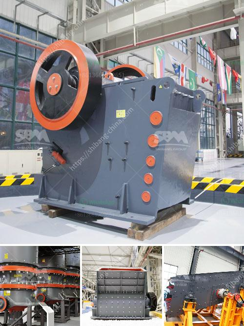

<h3>تكلفة مشروع إنتاج الرمل في الهند</h3>
تعتبر الهند واحدة من أكبر الدول المنتجة للرمال في العالم، حيث تعدّ الرمال من الموارد الطبيعية الأساسية التي تستخدم في العديد من الصناعات مثل البناء، وصناعة الزجاج، وصناعة السيراميك. ترجع أهمية الرمل إلى توافره الوفير في الطبيعة وسهولة استخدامه وتشكيله.

تختلف تكلفة إنتاج الرمل في الهند بين العديد من العوامل. واحدة من هذه العوامل هي المنطقة الجغرافية للمشروع. فالهند تتمتع بتنوع جغرافي واسع، وبالتالي قد تختلف تكلفة إنتاج الرمل في المناطق الساحلية عن تلك التي تقع في الداخل القاري.

من أجل تقليل التكلفة في مشروع إنتاج الرمل، يمكن استخدام آلات تقوم بعملية استخلاص وتنقية الرمل بشكل سريع وفعال، وهذا يقلل من العمالة اللازمة للإنتاج ويزيد من الكفاءة. بالإضافة إلى ذلك، يجب أيضًا تحسين عملية نقل الرمل بين المصنع والمستهلكين بشكل فعال، لتقليل تكاليف النقل.

كما يتأثر تكلفة مشروع إنتاج الرمل أيضًا بتكلفة المواد الخام والمعدات اللازمة للعملية. فإذا كانت تكلفة الآلات والمعدات مرتفعة، فقد يؤدي ذلك إلى زيادة تكلفة الإنتاج. ولكن في الوقت نفسه، يمكن تجاوز هذا العائق من خلال تحسين كفاءة استخدام المعدات وتقليل التكاليف الإضافية.

علاوة على ذلك، تتأثر تكلفة مشروع إنتاج الرمل بالضرائب والأوامر الحكومية المفروضة على صناعة الرمل. قد تكون هناك ضرورة لدفع ضريبة القيمة المضافة على المشروع، بالإضافة إلى رسوم أخرى مثل رسوم الاستخراج أو رسوم البيئة. وبالتالي، يجب مراعاة هذه العوامل عند حساب تكلفة الإنتاج.

بشكل عام، يمكن أن تتراوح تكلفة مشروع إنتاج الرمل في الهند بين 200 إلى 400 دولار للطن، وذلك يعتمد على العوامل المذكورة سابقاً. يمكن أن تزداد التكاليف في المناطق النائية أو التي تحتاج إلى وسائل نقل إضافية.

باختصار، تتأثر تكلفة مشروع إنتاج الرمل في الهند بالعديد من العوامل المتنوعة مثل المنطقة الجغرافية، التكنولوجيا المستخدمة، التنظيمات الحكومية، وتكاليف المعدات والمواد الخام. من المهم دراسة وتحليل هذه العوامل بعناية لضمان تحقيق أعلى ربحية وكفاءة في مشروع إنتاج الرمل.
<h3>Contact us</h3><ul><li><strong>Whatsapp:&nbsp;<a href="https://wa.me/8613661969651">+8613661969651</a></strong></li><li><a href="https://swt.shibang-china.com/?git&amp;zhl&amp;تكلفة مشروع إنتاج الرمل في الهند"><strong>Online Service(chat now)</strong></a></li></ul><h3>Related</h3><ul><li><a href='مصنع الحجر الجيري والآلات في تاميل نادو للبيع.md'>مصنع الحجر الجيري والآلات في تاميل نادو للبيع</a></li><li><a href='كسارة الحصى للبيع في كينيا.md'>كسارة الحصى للبيع في كينيا</a></li><li><a href='تعدين الكاولين في إندونيسيا.md'>تعدين الكاولين في إندونيسيا</a></li><li><a href='طاحونة كرات لطحن الحجر الجيري.md'>طاحونة كرات لطحن الحجر الجيري</a></li><li><a href='متطلبات أعمال مصنع الكسارة في باكستان.md'>متطلبات أعمال مصنع الكسارة في باكستان</a></li></ul>