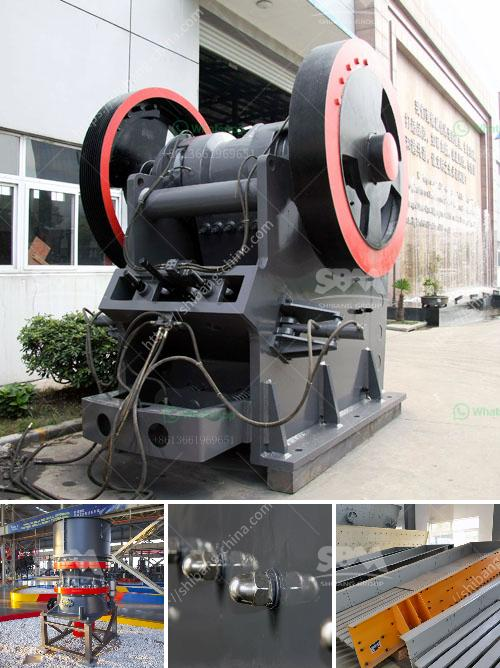

<h3>تكلفة مشروع طحن التلك</h3>
مشروع طحن التلك هو مشروع صناعي يهدف إلى تحويل خام التلك إلى منتجات مثل مساحيق التجميل والمواد الكيميائية والمعدات الصناعية الأخرى. يعتبر التلك معدنًا طبيعيًا يتكون بشكل رئيسي من المغنيسيوم والسيليكا، ويستخدم في العديد من الصناعات.

تحويل خام التلك إلى مسحوق يشمل عددًا من العمليات التكنولوجية، بدءًا من تكسير الخام ، ثم الطحن ، والتجفيف، والفصل الجاذبية، والتعبئة والتغليف النهائي للمنتجات النهائية. وبالتالي، فإن التكلفة الإجمالية للمشروع تتأثر بواسطة العديد من العوامل المتعلقة بكلّ من هذه العمليات.

قد تتراوح تكاليف مشروع طحن التلك بين ما بين 200,000 دولار إلى 400,000 دولار، على سبيل المثال. ومع ذلك، يجب التوجه إلى أن هذه الأرقام هي تقديرات تقريبية ويمكنها أن تختلف بشكل كبير اعتمادًا على الأسواق والموقع الجغرافي والمتطلبات التشغيلية الخاصة بالمشروع.

في البداية، يتعين شراء المعدات اللازمة للعمليات مثل الكسّارات والطواحين والأجهزة التجفيف وآلات الفصل الجاذبية. يعتمد سعر هذه المعدات على السعودة والبراند والحجم والقدرة المطلوبة. قد يكون للمعدات إما أن تكون جديدة أو مستعملة، ويعتمد هذا الخيار أيضًا على الميزانية المتاحة للمشروع.

علاوة على ذلك، يجب النظر في تكاليف تشغيل المشروع. هذه التكاليف تشمل التيار الكهربائي، وأجور العمال، وقطع الغيار، وتكاليف الصيانة العامة للمعدات، وتكاليف النظافة وغيرها. يجب أيضًا احتساب تكاليف التسويق والترويج للمنتجات المصنعة.

التجديد والاحتفاظ بالتراخيص وتوفير مياه الشرب والصرف الصحي والتأمين الهندسي والاحتفاظ بمستودع للمواد الخام وسلبية الأرباح المتوقعة أيضًا يعدان جزءًا من التكاليف الإجمالية لهذا المشروع.

في النهاية، يجب أن يحسب المستثمر قيمة إجمالية للتكلفة المتوقعة لهذا المشروع بناءً على التفاصيل المحددة للعملية. ينصح دائمًا بإجراء دراسة جدوى مالية وميدانية مفصلة لتقدير التكاليف وتحديد الأرباح المتوقعة قبل أخذ أي قرار مستثمر.
<h3>Contact us</h3><ul><li><strong>Whatsapp:&nbsp;<a href="https://wa.me/8613661969651">+8613661969651</a></strong></li><li><a href="https://swt.shibang-china.com/?git&amp;zhl&amp;تكلفة مشروع طحن التلك"><strong>Online Service(chat now)</strong></a></li></ul><h3>Related</h3><ul><li><a href='أعمال تكسير الصخور في باكستان.md'>أعمال تكسير الصخور في باكستان</a></li><li><a href='خط إنتاج التلك.md'>خط إنتاج التلك</a></li><li><a href='آلة صنع الرمل VSI.md'>آلة صنع الرمل VSI.</a></li><li><a href='كسارة الفك هي.md'>كسارة الفك هي</a></li><li><a href='نوع الفك محطم.md'>نوع الفك محطم</a></li></ul>