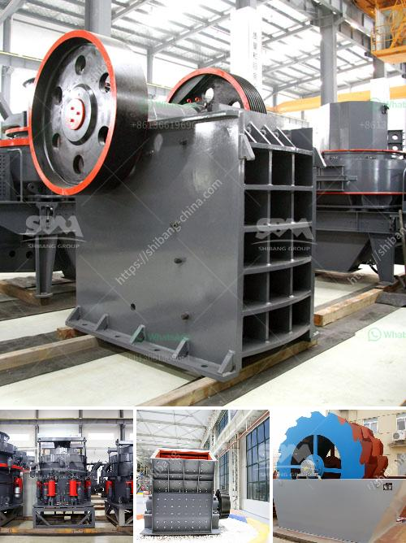

<h3>تكلفة مشروع مصنع طحن الكلنكر الصغير</h3>
تعد صناعة الأسمنت أحد الصناعات الأساسية المهمة في العديد من البلدان، حيث يتم استخدام الأسمنت في البناء والتشييد بشكل واسع. واحتياج المجتمعات المتنامية إلى المساكن والمنشآت التجارية والصناعية يجعل من قطاع الأسمنت يشهد نمواً مستمراً وازدياد الطلب عليه.

واحتياج العديد من البلدان إلى توسيع إنتاجها المحلي من الأسمنت يجعل من إقامة مشروع مصنع طحن للكلنكر الصغير فكرة جيدة للغاية. فإقامة مصنع طحن الكلنكر يسهم في إضافة القيمة للمواد الخام وتحقيق الاكتفاء الذاتي للبلد في إنتاج الأسمنت.

تتكون تكلفة مشروع مصنع طحن الكلنكر الصغير من عدة جوانب أساسية، ومن أبرزها:

1. انتقاء الموقع: يعتبر اختيار الموقع المناسب لإقامة المصنع من أهم العوامل الحاسمة. يجب التأكد من قرب الموقع من مصدر المواد الخام الأساسية مثل الكلنكر والجبس والحجر الجيري. كما يجب النظر في موقع المصنع بالنسبة لمصادر الماء والكهرباء وطرق النقل.

2. الأراضي والبنية التحتية: يجب شراء الأرض المطلوبة لإنشاء المصنع، وإعدادها من ناحية البنية التحتية والاحتياجات الأساسية مثل الطرق والمباني المكتبية وورش العمل وغيرها.

3. المعدات والآلات: يشمل شراء المعدات اللازمة لعملية طحن الكلنكر بما في ذلك الكسارات والمطاحن والغرابيل والأفران ومعدات النقل والتعبئة والتغليف.

4. التراخيص والتصاريح: يجب الحصول على التراخيص والتصاريح اللازمة من الجهات الحكومية المختصة لإقامة المصنع وتشغيله، مما يكلف المال والجهد.

5. الموارد البشرية: يتطلب المشروع توظيف فريق عمل فني وإداري مؤهل ومدرب لتشغيل المصنع بنجاح، مما يشمل تكلفة المرتبات والتأمين الاجتماعي والمكافآت وغيرها من المصروفات المتعلقة بالعمالة.

وفيما يلي مجموعة من التكاليف المتوقعة لمشروع مصنع طحن الكلنكر الصغير الذي يتراوح بين 200-400 كلمة:

- تكلفة البنية التحتية والمعالجات الأرضية: قد تتراوح بين 50000-100000 دولار.

- تكاليف الموارد البشرية: قد تتراوح بين 80000-150000 دولار سنوياً.

من الضروري الإشارة إلى أن تكلفة المشروع يمكن أن تختلف اعتمادًا على عدة عوامل مثل الموقع الجغرافي والمتطلبات المحلية وحجم المصنع المراد إقامته. إلا أنه يمكن اعتبار هذه النسب المذكورة أعلاه تقديرًا مبدئيًا للتكلفة التقريبية للمشروع.

في النهاية، يمكن القول بأن إقامة مشروع مصنع طحن الكلنكر الصغير يتطلب استثمارًا ماليًا كبيرًا ودراسة متأنية للتوازن بين التكاليف والعائد المتوقع من المشروع على المدي الطويل. كما يمكن أن يسهم هذا المشروع في تحقيق الاكتفاء الذاتي في إنتاج الأسمنت وتلبية الطلب المحلي، ويمكن أن يوفر فرص عمل جديدة ويحسن الاقتصاد المحلي.
<h3>Contact us</h3><ul><li><strong>Whatsapp:&nbsp;<a href="https://wa.me/8613661969651">+8613661969651</a></strong></li><li><a href="https://swt.shibang-china.com/?git&amp;zhl&amp;تكلفة مشروع مصنع طحن الكلنكر الصغير"><strong>Online Service(chat now)</strong></a></li></ul><h3>Related</h3><ul><li><a href='سعر كسارة الفك.md'>سعر كسارة الفك</a></li><li><a href='مطحنة أسطوانية عمودية للفحم.md'>مطحنة أسطوانية عمودية للفحم</a></li><li><a href='آلات الطحن والتعبئة في باكستان.md'>آلات الطحن والتعبئة في باكستان</a></li><li><a href='كيف يعمل مطحنة الهامر.md'>كيف يعمل مطحنة الهامر</a></li><li><a href='قائمة الآلات المستخدمة في تعدين الفحم.md'>قائمة الآلات المستخدمة في تعدين الفحم</a></li></ul>