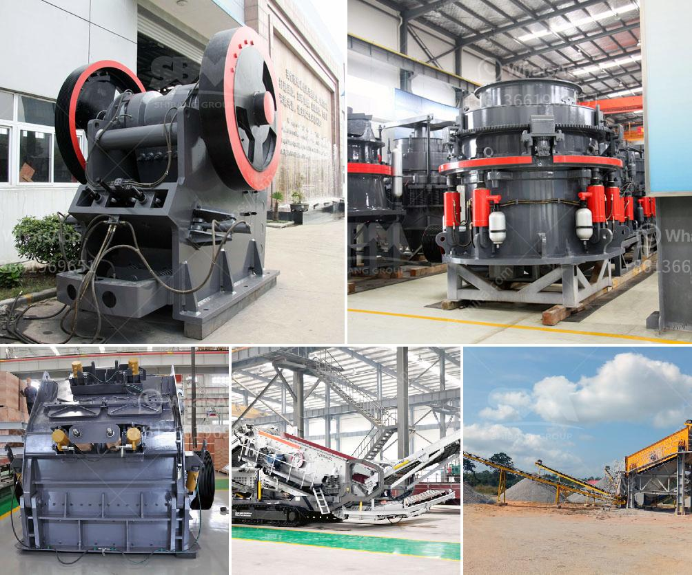

<h3>تكلفة مشروع نظام حزام الناقل</h3>
يُعد نظام حزام الناقل أحد الأجهزة الهامة في مجال الصناعة والتصنيع، حيث يعمل هذا النظام على نقل المواد والمنتجات من مكان إلى آخر بكفاءة عالية. وعندما نتحدث عن تكلفة إقامة مشروع نظام حزام الناقل، يجب أن نأخذ بعين الاعتبار عدة عوامل.

أحد العوامل الهامة في تحديد التكلفة هو حجم ونطاق المشروع. فكلما كان المشروع أكبر وأكثر تعقيدًا، زادت التكلفة. يأخذ في الاعتبار أيضًا نوع الصناعة التي سيعمل فيها النظام. فمثلاً، يتطلب التركيب في القطاعات الثقيلة أو المناجم تحمل أعباء تكلفة إضافية نظرًا للظروف البيئية والعملية الصعبة.

قد يتأثر سعر المشروع أيضًا بمكان شراء المنتجات والمعدات الخاصة بالنظام. يفضل شراء المعدات من مصنعين موثوق بهم لضمان عملية تصنيع عالية الجودة وأداء موثوق به.

عمومًا، يتأثر سعر المشروع بتكلفة المواد اللازمة لإقامته. يشتمل ذلك على حزام الناقل نفسه، وأجزائه المختلفة مثل الأسطوانات والمحامل والسيور والأنظمة الهيدروليكية والكهربائية، بالإضافة إلى البرمجيات وأجهزة التحكم في النظام. يجب الحصول على المواد من موردين موثوق بهم وبأفضل سعر ممكن.

وبالطبع، لا يمكن أن ننسى تكاليف العمالة والتثبيت. يجب توظيف فريق متخصص لإعداد وتجميع النظام بشكل صحيح. يجب تحسين عمليات العملية وتحديد المهام المُطلوبة لإكمال المشروع في الوقت المحدد.

بغض النظر عن التكلفة الإجمالية لمشروع نظام حزام الناقل، يجب أن نؤخذ في الاعتبار أن هذا النظام يوفر العديد من الفوائد للشركات والصناعات. فإنه يساعد في زيادة كفاءة الإنتاج وتحسين سير العمليات، مما يؤدي في النهاية إلى زيادة الإنتاجية وتقليل التكاليف العامة للشركة.

وبشكل عام، يمكن أن تتراوح تكلفة إقامة مشروع نظام حزام الناقل بين 200-400 ألف دولار. ومع ذلك، قد يختلف هذا الرقم تبعًا للعوامل المذكورة أعلاه واحتياجات المشروع الفردية. يجب على المستثمرين أن يقوموا بتقييم جميع العوامل قبل اتخاذ أي قرار حول إقامة مشروع نظام حزام الناقل.
<h3>Contact us</h3><ul><li><strong>Whatsapp:&nbsp;<a href="https://wa.me/8613661969651">+8613661969651</a></strong></li><li><a href="https://swt.shibang-china.com/?git&amp;zhl&amp;تكلفة مشروع نظام حزام الناقل"><strong>Online Service(chat now)</strong></a></li></ul><h3>Related</h3><ul><li><a href='كثافة أحزمة الناقلات للتعدين.md'>كثافة أحزمة الناقلات للتعدين</a></li><li><a href='شركة تصنيع كسارات الحجر.md'>شركة تصنيع كسارات الحجر</a></li><li><a href='كسارة الفك في كينيا مصنعة.md'>كسارة الفك في كينيا مصنعة</a></li><li><a href='المعدات المطلوبة لتعدين الذهب على نطاق واسع.md'>المعدات المطلوبة لتعدين الذهب على نطاق واسع</a></li><li><a href='موردين طاحونة الفحم.md'>موردين طاحونة الفحم</a></li></ul>