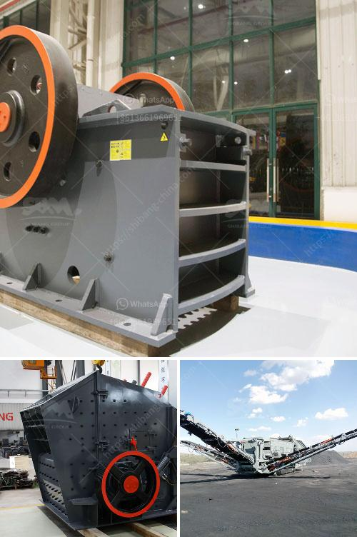

<h3>تكلفة مشروع وحدة طحن الكلنكر</h3>
تتعدد المشاريع الصناعية المختلفة وتختلف في تكلفتها حسب نوع المشروع وحجمه. يعتبر مشروع وحدة طحن الكلنكر أحد المشاريع الهامة في صناعة الأسمنت، وهو يعنى بطحن الكلنكر الخام ليتحول إلى مسحوق الأسمنت النهائي.

1. حجم المشروع: يعتمد حجم المشروع على القدرة الإنتاجية المطلوبة، فكلما كانت القدرة الإنتاجية أكبر، زادت التكلفة. على سبيل المثال، يمكن أن تتراوح تكلفة وحدة طحن الكلنكر بسعة 1 طن في الساعة بين 500,000 - 1,000,000 دولار أمريكي. بينما يمكن أن تصل تكلفة وحدة طحن الكلنكر بسعة 2 طن في الساعة إلى 1,500,000 - 3,000,000 دولار أمريكي أو أكثر.

2. تكنولوجيا المعدات: تعتمد تكلفة مشروع وحدة طحن الكلنكر أيضًا على التكنولوجيا المستخدمة في المعدات. فمعدات طحن الكلنكر متقدمة ومن أحدث الأنظمة التقنية يمكن أن تكون أكثر تكلفة مقارنة بمعدات أقدم تقنيًا. وبالتالي، تختلف التكلفة وفقًا للتكنولوجيا المستخدمة.

3. تكاليف البناء: تشمل تكلفة مشروع وحدة طحن الكلنكر أيضًا تكاليف البناء والهندسة المدنية اللازمة لتركيب المعدات. وتختلف هذه التكاليف حسب الموقع والمقاولين المستخدمين ونوعية المباني.

4. التكاليف الأخرى: بالإضافة إلى التكاليف المذكورة أعلاه، هناك العديد من التكاليف الأخرى التي يجب احتسابها في تكلفة مشروع وحدة طحن الكلنكر، مثل التكاليف الإدارية والتشغيلية وتكلفة العمالة والصيانة. يجب أن يؤخذ كل ذلك في الاعتبار عند حساب التكلفة النهائية للمشروع.

باختصار، تكلفة مشروع وحدة طحن الكلنكر تتراوح بين 500,000 - 3,000,000 دولار أمريكي أو ربما أكثر تبعًا لحجم المشروع وتكنولوجيا المعدات المستخدمة وتكاليف البناء والتشغيل الأخرى. تهدف هذه المشروعات إلى إنتاج الأسمنت النهائي من الكلنكر الخام، الذي يعد أحد المواد الأساسية في صناعة البناء والبنية التحتية.
<h3>Contact us</h3><ul><li><strong>Whatsapp:&nbsp;<a href="https://wa.me/8613661969651">+8613661969651</a></strong></li><li><a href="https://swt.shibang-china.com/?git&amp;zhl&amp;تكلفة مشروع وحدة طحن الكلنكر"><strong>Online Service(chat now)</strong></a></li></ul><h3>Related</h3><ul><li><a href='مصنع طحن الحجر.md'>مصنع طحن الحجر</a></li><li><a href='آلة ميكرونيزر الحجر الجيري مطحنة ميكرونيزر.md'>آلة ميكرونيزر الحجر الجيري مطحنة ميكرونيزر</a></li><li><a href='كسارة هيدروليكية.md'>كسارة هيدروليكية</a></li><li><a href='مصنع الأسمنت في تركيا.md'>مصنع الأسمنت في تركيا</a></li><li><a href='كسارات متنقلة للتأجير في جوهانسبرغ.md'>كسارات متنقلة للتأجير في جوهانسبرغ</a></li></ul>