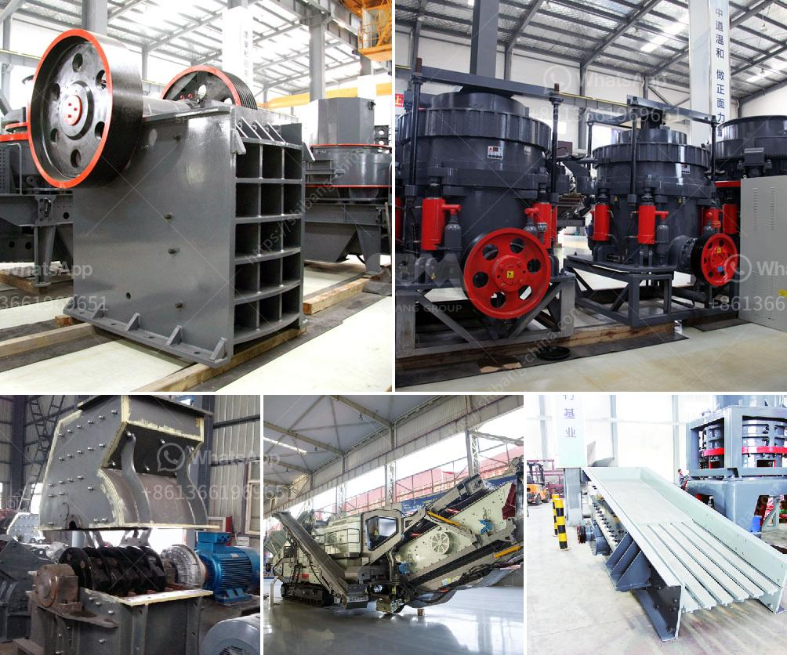

<h3>تكلفة مصنع الأسمنت 200 طن في اليوم</h3>
قد تعتبر صناعة الأسمنت أحد الصناعات الرئيسية في العديد من الدول حول العالم، وتتطلب تنفيذها استثمارات كبيرة لإقامة مصنع الأسمنت. تقدر تكلفة بناء مصنع الأسمنت بناءً على العديد من العوامل، منها الحجم والطاقة الإنتاجية التي يتم تصميم المصنع عليها. في هذه المقالة، سنناقش تكلفة بناء مصنع الأسمنت بطاقة إنتاجية تبلغ 200 طن في اليوم.

أولاً وقبل البدء في بناء مصنع الأسمنت، يجب إجراء دراسة جدوى متأنية لتحديد التفاصيل المطلوبة وتكلفة المشروع. يتضمن ذلك تحديد موقع المصنع والأراضي المطلوبة، مصادر التمويل المتاحة، شراء وتركيب المعدات اللازمة وتكاليف العمالة والمواد الأولية والتشغيلية والصيانة اللاحقة.

قد تتفاوت تكاليف المصنع وفقًا للتكنولوجيا التي يستخدمها، حيث يمكن أن يكون المصنع الأقدم بنية بسيطة وتكاليف أقل تقريبًا، بينما يمكن أن يكون المصنع الحديث متقدمًا تكنولوجياً وتكلفته أعلى. يجب أخذ جميع هذه العوامل في الاعتبار أثناء حساب تكلفة المشروع.

قد تشمل تكلفة بناء مصنع الأسمنت عناصر مثل الهياكل المعدنية والمباني، وتركيب المعدات الرئيسية مثل الأفران والمطاحن ومحطات توليد الطاقة، ومعدات معالجة الوقود والمواد الأولية، ونظام التحكم المركزي والتبريد والتدفئة. كل هذه العناصر وغيرها تزيد من تكلفة بناء المصنع.

بالإضافة إلى ذلك، تشمل التكاليف الأخرى رواتب العمال وحاجة المشروع للكهرباء والماء، وتكاليف النقل والشحن، والتأمين والضرائب والعوائد المتوقعة للمستثمرين.

بصفة عامة، يمكن تقدير تكلفة بناء مصنع الأسمنت بسعة إنتاجية تبلغ 200 طن في اليوم بين 200 و 400 مليون دولار أمريكي، ولكن هذا الرقم يمكن أن يختلف وفقًا للعديد من العوامل المشار إليها سابقًا.

في النهاية، يجب على المستثمرين الاستشارة مع خبراء في هذا المجال للحصول على تقدير دقيق للتكلفة، وتوفير التمويل اللازم لتنفيذ هذا المشروع الضخم الذي يستمر لسنوات بعد بنائه. إن التوازن الجيد بين التكاليف والجودة هو الطريقة الأمثل لضمان نجاح مصنع الأسمنت.
<h3>Contact us</h3><ul><li><strong>Whatsapp:&nbsp;<a href="https://wa.me/8613661969651">+8613661969651</a></strong></li><li><a href="https://swt.shibang-china.com/?git&amp;zhl&amp;تكلفة مصنع الأسمنت 200 طن في اليوم"><strong>Online Service(chat now)</strong></a></li></ul><h3>Related</h3><ul><li><a href='آلة فحص متنقلة في جنوب أفريقيا.md'>آلة فحص متنقلة في جنوب أفريقيا</a></li><li><a href='مورد آلة صنع الرمل.md'>مورد آلة صنع الرمل</a></li><li><a href='كسارة سريلانكا.md'>كسارة سريلانكا</a></li><li><a href='آلة معالجة البازلت.md'>آلة معالجة البازلت</a></li><li><a href='شركة كسارة الحجر.md'>شركة كسارة الحجر</a></li></ul>