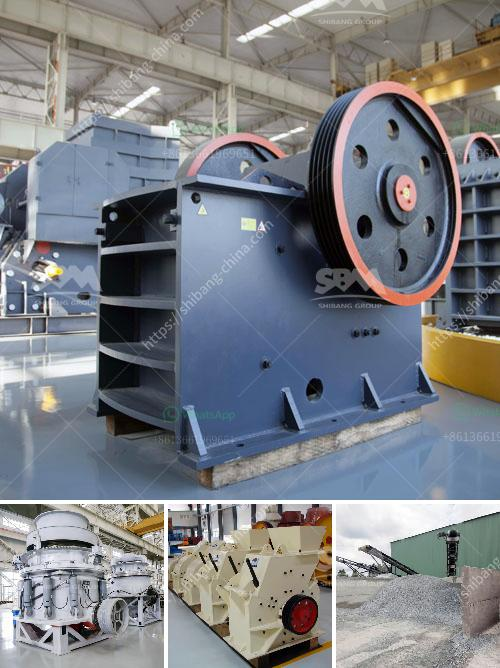

<h3>تكلفة مصنع الأسمنت</h3>
تعد صناعة الأسمنت أحد القطاعات الحيوية في الاقتصاد العالمي، حيث تلعب دورًا رئيسيًا في تطوير البنية التحتية والبناء والتطوير العمراني. يتطلب تأسيس مصنع للأسمنت تكلفة كبيرة نظرًا للموارد الضخمة التي يتطلبها، ولكن تكلفته يمكن تحديدها بناءً على عدة عوامل ومتغيرات مختلفة.

من بين أبرز العوامل التي تؤثر في تكلفة مصنع الأسمنت هو الحجم المتوقع للإنتاج السنوي. فكلما كانت الطاقة الإنتاجية أكبر، زادت التكلفة بشكل عام. غالبًا ما يتم تقييم القدرة الإنتاجية للمصنع بالأطنان في السنة، وتختلف تكلفة الإنتاج حسب السعة الإنتاجية المطلوبة.

بالإضافة إلى ذلك، يتعلق تكلفة مصنع الأسمنت أيضًا بأنواع المعدات والآلات المستخدمة في العملية الإنتاجية. فعلى سبيل المثال، قد تكون هناك حاجة لآلات التكسير والطحن والسحق وتشكيل الكلنكر ومجففات الخام وغيرها من المعدات، وتختلف تكلفة هذه المعدات باختلاف الماركات والتقنيات المستخدمة.

كما يؤثر الموقع الجغرافي على تكلفة المصنع، حيث يجب أن يتوفر المصنع في موقع مناسب يسهل نقل المواد الخام والمنتجات النهائية. قد تتكبد تكاليف إضافية في حالة البناء في مناطق نائية أو في الأماكن التي ليست قريبة جدًا من مصادر المواد الخام والأسواق.

وأخيرًا، يجب أيضًا أخذ في الاعتبار تكاليف الموارد البشرية والطاقة والصيانة والتشغيل العام للمصنع. يجب توظيف فريق فني ومدرب لإدارة عمليات التصنيع والإنتاج، بالإضافة إلى تخصيص ميزانية لصيانة المعدات وإدارة المخاطر.

باختصار، تتراوح تكلفة مصنع الأسمنت عادةً بين 200 و 400 مليون دولار تقريبًا، وذلك اعتمادًا على عوامل متعددة مثل الطاقة الإنتاجية، والمعدات المستخدمة، والموقع الجغرافي، والموارد البشرية والطاقة.
<h3>Contact us</h3><ul><li><strong>Whatsapp:&nbsp;<a href="https://wa.me/8613661969651">+8613661969651</a></strong></li><li><a href="https://swt.shibang-china.com/?git&amp;zhl&amp;تكلفة مصنع الأسمنت"><strong>Online Service(chat now)</strong></a></li></ul><h3>Related</h3><ul><li><a href='مطحنة رايموند في ماليزيا.md'>مطحنة رايموند في ماليزيا</a></li><li><a href='سعر آلة كسارة الرمل.md'>سعر آلة كسارة الرمل</a></li><li><a href='شراء وبيع حجر الكسارة في ماليزيا.md'>شراء وبيع حجر الكسارة في ماليزيا</a></li><li><a href='مشغل مصنع كسارة في كسارة.md'>مشغل مصنع كسارة في كسارة</a></li><li><a href='كسارات صخور cec للبيع.md'>كسارات صخور cec للبيع</a></li></ul>