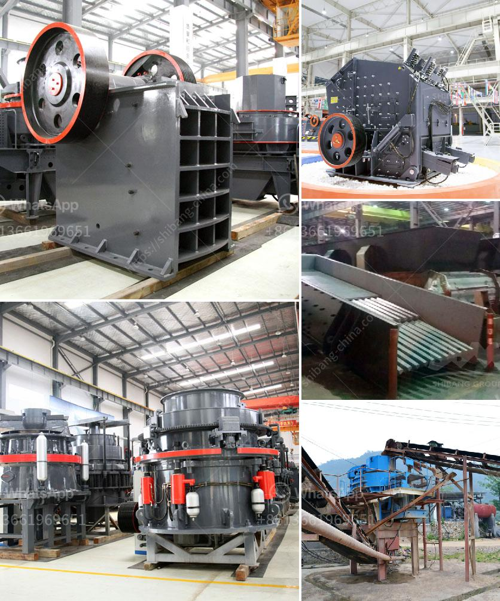

<h3>تكلفة مصنع الإسمنت الصغير بسعة 2000 طن يوميًا</h3>
يعد مصنع الإسمنت الصغير بسعة 2000 طن يوميًا مشروعًا هامًا في قطاع البناء والتشييد. يتطلب تشييده تكلفة معينة تعتمد على عدد من العوامل المهمة. في هذه المقالة، سنتحدث عن تلك العوامل وتأثيرها على تكلفة المصنع.

أولاً وقبل كل شيء، يتوجب توفر مساحة كبيرة لإقامة المصنع، بما في ذلك المخازن والورش اللازمة للعمليات الإنتاجية. تحتاج هذه المساحة إلى اعتبارات هندسية واستراتيجية معينة لضمان سهولة الوصول للمواد الخام وتوفير طرق سلسة لنقل المنتجات النهائية.

بالإضافة إلى ذلك، يتطلب المصنع معدات خاصة لعملية الإنتاج. أجهزة الكسارة، والطواحين، وأفران الحرق، والمصاعد، وغيرها من المعدات اللازمة يجب أن تكون عالية الأداء ومتجددة مستمرة. لا بد من اختيار المعدات المثلى التي تعطي أقصى إنتاجية بأقل تكلفة.

من ناحية أخرى، يجب الاهتمام بتوفير مصدر موثوق ومستدام للطاقة. يستهلك مصنع الإسمنت كميات كبيرة من الطاقة الكهربائية والوقود اللازمين لتشغيل المعدات والأفران. من توفير مصدر طاقة مستدام، يمكن تقليل التكاليف العالية المرتبطة بتشغيل المصنع.

تأتي تكلفة المواد الخام أيضًا على رأس العوامل المؤثرة. تعتبر الحجر الجيري والطين والمارل والسيليكا أهم المواد الخام التي يتم استخدامها في إنتاج الإسمنت. يتوجب توفير هذه المواد بكميات كافية وبأسعار مناسبة لضمان استمرارية إنتاج المصنع.

وأخيرًا، يجب الانتباه إلى متطلبات العمالة. يحتاج مصنع الإسمنت إلى فريق عمل كبير ومؤهل لتشغيل المعدات والمراقبة الفنية. يجب أن تتوفر مصاريف التوظيف والتدريب لتأمين تعاقد مع الكفاءات المناسبة.

مع كل العوامل المذكورة أعلاه، فإن تكلفة إقامة مصنع الإسمنت الصغير بسعة 2000 طن يوميًا تتراوح عادة بين العشرات الملايين من الدولارات. ومع ذلك، يجب الأخذ في الاعتبار أن هذه التكلفة تختلف من بلد لآخر بناءً على العوامل المحلية المرتبطة بالبناء والنقل والطاقة والعمالة.
<h3>Contact us</h3><ul><li><strong>Whatsapp:&nbsp;<a href="https://wa.me/8613661969651">+8613661969651</a></strong></li><li><a href="https://swt.shibang-china.com/?git&amp;zhl&amp;تكلفة مصنع الإسمنت الصغير بسعة 2000 طن يوميًا"><strong>Online Service(chat now)</strong></a></li></ul><h3>Related</h3><ul><li><a href='مطحنة نيجيريا.md'>مطحنة نيجيريا</a></li><li><a href='سعر كسارة الباريت.md'>سعر كسارة الباريت</a></li><li><a href='معدات كسارة الفك للبيع في الفلبين.md'>معدات كسارة الفك للبيع في الفلبين</a></li><li><a href='محطة تكسير الصخور.md'>محطة تكسير الصخور</a></li><li><a href='آلات تعدين الذهب الطمي.md'>آلات تعدين الذهب الطمي</a></li></ul>