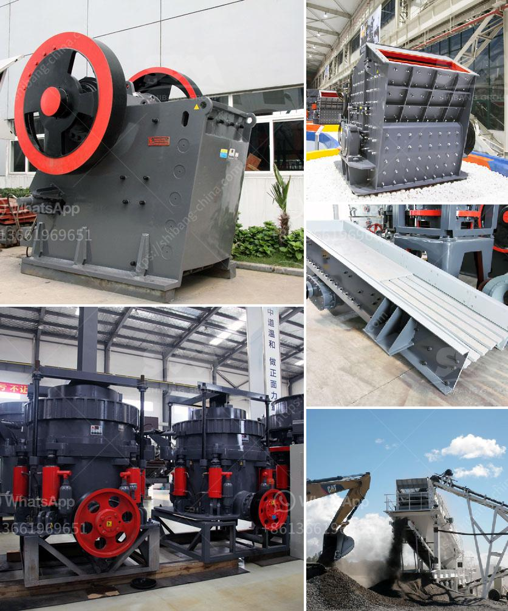

<h3>تكلفة مصنع الكسارة</h3>
مصنع الكسارة هو مرفق صناعي يستخدم لسحق الصخور والحصى والمواد الخام الأخرى لاستخدامها في البناء والإنشاءات. يعتبر قطاع التعدين والبناء من أكثر القطاعات استهلاكًا للمواد الخام في العالم.

تختلف تكاليف بناء وتشغيل مصنع الكسارة بناءً على العديد من العوامل مثل الحجم والموقع والقوة الإنتاجية المطلوبة وأيضًا نوع الصخور التي سيتم سحقها. تقدر التكلفة العامة لبناء مصنع الكسارة عادة بمئات الآلاف إلى الملايين من الدولارات.

المعدات هي العنصر الأساسي لأي مصنع كسارة وتشمل الكسارات الأسطوانية والفكية والمخروطية وآلات الغربلة وأنظمة النقل والأجهزة الهيدروليكية والكهربائية. تختلف تكاليف الشراء والصيانة لهذه المعدات اعتمادًا على الحجم والجودة والتكنولوجيا المستخدمة.

بجانب ذلك، ينبغي أيضًا الاهتمام بتكاليف الهيكل التحتي مثل بناء الأبنية وأعمدة الدعم والتهوية وتصريف المياه والطرق وأنظمة الإضاءة وغيرها. قد يتطلب تجهيز الموقع أيضًا تعديلات على الطرق المحلية لنقل الصخور والمواد الخام.

وبالمثل، تشمل التكاليف الأخرى لمصنع الكسارة لوائح السلامة والاحتياطات البيئية والتراخيص والتأمين والإدارة والعمالة والصيانة والتزود بالمواد والمشتريات الأخرى. علاوة على ذلك، هناك تكاليف الطاقة التي يتم استخدامها في تشغيل المعدات وتهوية المبنى وإضاءته.

بالإضافة إلى تكاليف البناء، هناك أيضًا تكاليف التشغيل الاستثمارية والثابتة. هذه التكاليف تتضمن رواتب الموظفين والاستهلاك المستمر للطاقة والماء والمواد الكيميائية والزيوت وأجرة المعدات المستأجرة وتكاليف الصيانة الدورية والأخرى.

باختصار، تكون تكلفة بناء وتشغيل مصنع الكسارة عالية. ومع ذلك، من المهم لأصحاب المصانع توفير عملية فعالة ومستدامة لتحقيق أقصى استفادة من الاستثمار. يجب الاهتمام بأنظمة الإدارة الفعالة والتخطيط المبادئ والموارد والتقنيات الحديثة للحفاظ على تشغيل المصنع بكفاءة عالية وتحقيق أرباح مالية قوية.
<h3>Contact us</h3><ul><li><strong>Whatsapp:&nbsp;<a href="https://wa.me/8613661969651">+8613661969651</a></strong></li><li><a href="https://swt.shibang-china.com/?git&amp;zhl&amp;تكلفة مصنع الكسارة"><strong>Online Service(chat now)</strong></a></li></ul><h3>Related</h3><ul><li><a href='كسارة محرك ديزل صغيرة من تنزانيا.md'>كسارة محرك ديزل صغيرة من تنزانيا</a></li><li><a href='اليابان لمصنع تكسير متنقل.md'>اليابان لمصنع تكسير متنقل</a></li><li><a href='مصنع كسارة للبيع في باكستان.md'>مصنع كسارة للبيع في باكستان</a></li><li><a href='أنواع كسارات الحجر الجيري.md'>أنواع كسارات الحجر الجيري</a></li><li><a href='تركيب مصنع صنع الرمل الاصطناعي.md'>تركيب مصنع صنع الرمل الاصطناعي</a></li></ul>