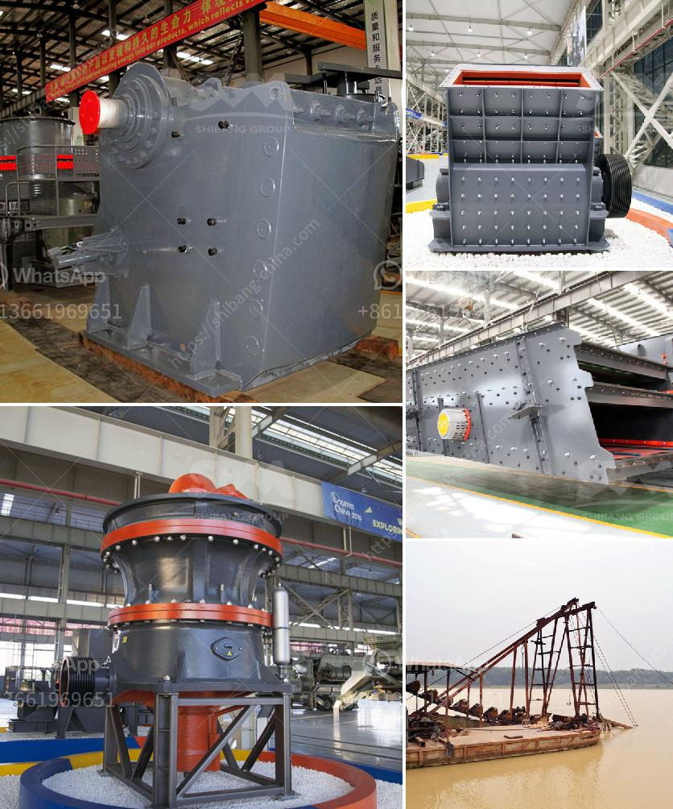

<h3>تكلفة مصنع تكسير الحجر</h3>
تكسير الحجر هو عملية تحويل الصخور الكبيرة إلى قطع أصغر من الحجم المطلوب. يُستخدم غالبًا في عمليات البناء والبناء العام. ولتنفيذ هذه العملية، يتم استخدام مصانع تكسير الحجر المتخصصة، التي تحتاج إلى استثمار كبير لتقديم الأداء المطلوب وضمان الكفاءة.

تكنولوجيا المطاحن ومصانع التكسير الحجرية تتطلب التجهيزات التالية: المغذي الاهتزازي، كسارة الفك، كسارة الصدم، الكسارة المخروطية أو الكسارة الدوارة، الغربال الاهتزازي، الناقلات، والكسارة الفكية تحتاج أيضًا إلى الكسارة الفكية، لتكسير الحجر المستخدم في البناء.

تكلفة مصنع تكسير الحجر تتأثر بعدة عوامل، بما في ذلك حجم المشروع ونوع الحجر المطلوب تكسيره والتقنية المستخدمة والمعدات والآلات المستخدمة. من المهم أن يتم تحليل هذه العوامل لتحديد التكلفة بدقة.

أما بالنسبة للتكلفة العامة لبناء مصنع تكسير الحجر، فإنها تتضمن تكاليف التربية المدنية والهيكلية للمبنى وشراء المعدات والآلات وتوظيف العمالة والتكاليف الإدارية والصيانة المستقبلية. العملية تبدأ من دراسة الجدوى التجارية وصولاً إلى تشغيل المصنع.

تكلفة مصنع تكسير الحجر يمكن أن تتراوح بين عدة مئات من الآلاف إلى الملايين من الدولارات ، حسب حجم المصنع والتقنية المستخدمة وجودة المعدات المستخدمة. يجب أخذ هذه العوامل في الاعتبار أثناء إعداد الدراسة وتحديد الميزانية المطلوبة.

علاوة على ذلك، يجب أن يتم احتساب التكاليف الإضافية لتشغيل المصنع بعد تجهيزه. تشمل هذه التكاليف تكاليف الطاقة اللازمة لتشغيل المعدات والآلات، وتكاليف الصيانة الدورية للحفاظ على كفاءة المصنع، وتكاليف إدارية مثل الأجور والرواتب والضرائب والضمان الاجتماعي.

باختصار، مصنع تكسير الحجر هو استثمار كبير يتطلب تخطيطًا جيدًا ودراسة دقيقة للتكلفة. الاعتبارات الأساسية في تقدير التكلفة هي حجم المشروع ونوع الحجر والتقنية المستخدمة واحتياجات المصنع. بالإضافة إلى ذلك، يجب أن يتم احتساب التكاليف الإضافية لتشغيل المصنع والصيانة المستقبلية.
<h3>Contact us</h3><ul><li><strong>Whatsapp:&nbsp;<a href="https://wa.me/8613661969651">+8613661969651</a></strong></li><li><a href="https://swt.shibang-china.com/?git&amp;zhl&amp;تكلفة مصنع تكسير الحجر"><strong>Online Service(chat now)</strong></a></li></ul><h3>Related</h3><ul><li><a href='أنواع الكسارات المستخدمة في التعدين pdf.md'>أنواع الكسارات المستخدمة في التعدين pdf</a></li><li><a href='مصنع معالجة خام الذهب 200 طن في الساعة.md'>مصنع معالجة خام الذهب 200 طن في الساعة</a></li><li><a href='أحزمة ناقلة الشيفرون في الفلبين.md'>أحزمة ناقلة الشيفرون في الفلبين</a></li><li><a href='آلات صنع الحصى الكوارتز في الهند.md'>آلات صنع الحصى الكوارتز في الهند</a></li><li><a href='مطحنة الكرة مطرقة مطحنة مطحنة أسطوانية آلة.md'>مطحنة الكرة مطرقة مطحنة مطحنة أسطوانية آلة</a></li></ul>