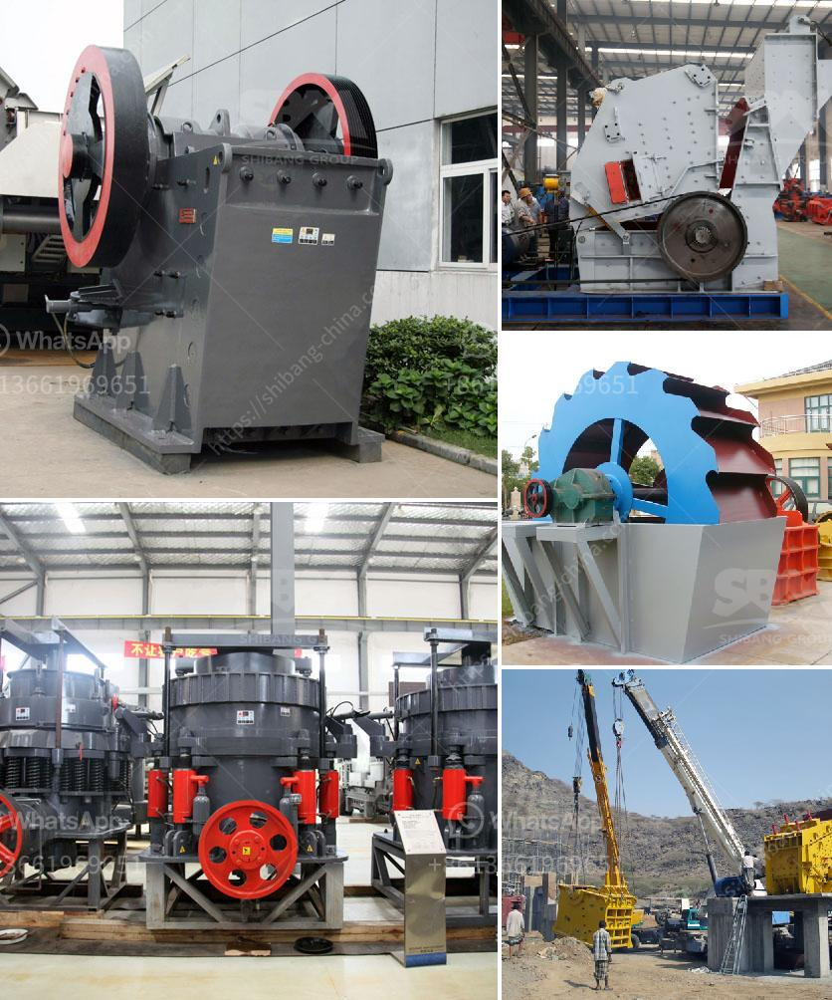

<h3>تكلفة مصنع تكسير الذهب</h3>
تعد صناعة تعدين وتكسير الذهب أحد القطاعات الحيوية في عالم صناعة المعادن. وفي هذه الصناعة، يتم اختبار واستخراج الذهب من الصخور والمناجم باستخدام آلات تكسير وتكنولوجيا متطورة. لكن مع تقدم التكنولوجيا وتعقيد العمليات، تزداد تكاليف إنشاء وتشغيل مصانع تكسير الذهب.

يتأثر سعر المصنع بعدة عوامل، مثل حجم المصنع ومدى تعقيد العمليات اللازمة لاستخراج الذهب. إلى جانب ذلك، تلعب تكاليف تشغيل منشآت تكسير الذهب دورًا هامًا في تحديد التكلفة الكلية لإنشاء وتشغيل المصنع.

بشكل عام، يمكن توزيع تكاليف المصنع على عدة عناصر أساسية. أولًا، هناك تكاليف المعدات والآلات التي يتطلبها عمل المصنع. تشمل هذه التكاليف شراء وتركيب آلات التكسير والمعدات الأخرى اللازمة للعملية مثل الكسارات والمطاحن وأدوات التكسير الصناعي.

ثانيًا، هناك تكاليف الطاقة التي تشمل تكاليف الكهرباء والوقود الضرورية لتشغيل المصنع. يحتاج مصنع تكسير الذهب إلى كميات كبيرة من الطاقة لتشغيل أجهزته وأدواته المختلفة. وتعتمد هذه التكاليف بشكل كبير على سعر الطاقة وموقع المصنع.

ثالثًا، هناك تكاليف العمالة والصيانة التي تضاف إلى الفاتورة. يحتاج مصنع تكسير الذهب إلى العديد من العمال المهرة لتشغيل وصيانة المعدات والآلات بطريقة فعالة ومستدامة. ومن المعروف أن العمالة المهرة ذات التكلفة العالية تؤثر بشكل كبير على تكلفة المشروع.

أخيرًا، هناك تكاليف البنية التحتية والموقع. قد يحتاج المصنع إلى بناء هياكل دائمة لتخزين الذهب والحفاظ على الأمان. ويمكن أن تكون هذه التكاليف مرتفعة في حالة تواجد المصنع في منطقة نائية أو صعبة الوصول.

لا يمكن تحديد تكلفة مصنع تكسير الذهب بشكل دقيق بين 200-400 كلمة، فالتكلفة الإجمالية للمصنع تختلف بناءً على الاحتياجات والظروف الفردية لكل مشروع. ومن المستحيل تلبية جميع المتطلبات وفقًا لتكاليف محددة دون حساب التحديات المحتملة والتكاليف الإضافية المتوقعة.

في النهاية، إن تكلفة مصنع تكسير الذهب هي استثمار ضخم يعتمد على العديد من العوامل المختلفة. قد تتضمن هذه التكاليف تكلفة المعدات والطاقة والعمالة والصيانة والبنية التحتية. لذا، يجب على المستثمرين دراسة كل هذه العناصر بعناية قبل اتخاذ قرار الاستثمار في مصنع تكسير الذهب لضمان الاستدامة والنجاح المالي للمشروع.
<h3>Contact us</h3><ul><li><strong>Whatsapp:&nbsp;<a href="https://wa.me/8613661969651">+8613661969651</a></strong></li><li><a href="https://swt.shibang-china.com/?git&amp;zhl&amp;تكلفة مصنع تكسير الذهب"><strong>Online Service(chat now)</strong></a></li></ul><h3>Related</h3><ul><li><a href='رسم مطحنة رايموند.md'>رسم مطحنة رايموند</a></li><li><a href='آلة صنع المسحوق في جنوب أفريقيا.md'>آلة صنع المسحوق في جنوب أفريقيا</a></li><li><a href='الفرق بين مطاحن الكرة وكسارة الفك.md'>الفرق بين مطاحن الكرة وكسارة الفك</a></li><li><a href='مطحنة هامر مختبرية.md'>مطحنة هامر مختبرية</a></li><li><a href='آلة طحن الكرة في الهند.md'>آلة طحن الكرة في الهند</a></li></ul>