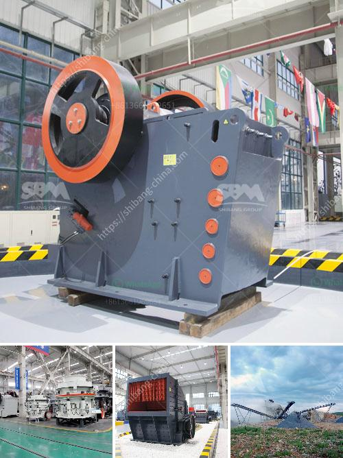

<h3>تكلفة مصنع سحق bmw 200tph stage</h3>
يعد مصنع سحق بي إم دبليو 200 طن في الساعة بمرحلتين من أحدث المصانع والتكنولوجيا المستخدمة في صناعة المعادن والأحجار الكبيرة. يستخدم في هذا المصنع مواد ذات صلابة عالية مثل الجرانيت والحجر الجيري والبازلت وغيرها من الأحجار الطبيعية.

تُعد تكلفة إنشاء وتشغيل مصنع سحق بي إم دبليو 200 طن في الساعة بمرحلتين مرتفعة نسبيًا، وذلك بسبب التكنولوجيا المتطورة التي يستخدمها والمعدات الثقيلة المطلوبة لصناعة المعادن بكميات كبيرة.

1. معدات السحق: تتكون معدات السحق في هذا المصنع من الكسارة الفكية، الكسارة المخروطية، والكسارة التصادمية. يتطلب شراء وصيانة هذه المعدات تكاليف عالية ومستمرة.

2. المواد الأولية: يجب شراء المواد الأولية مثل الحجارة والمعادن بكميات كبيرة لتغذية المصنع. يتطلب ذلك إجراء دراسات للحصول على مواد عالية الجودة بأسعار مناسبة.

3. تكاليف الطاقة: يحتاج المصنع إلى طاقة كهربائية كبيرة لتشغيل المعدات وتشغيل عمليات السحق. تكاليف الطاقة تعد جزءًا هامًا من تكاليف التشغيل.

4. تكاليف العمالة: يتطلب تشغيل المصنع فريقًا متخصصًا من العمالة المدربة لتشغيل المعدات بفعالية وبأمان. تحتاج هذه التكاليف إلى توظيف عمالة مهرة وتدريبها بشكل مستمر.

5. تكاليف الصيانة: يحتاج المصنع إلى صيانة وتشغيل مستمر للمعدات والآلات للحفاظ على أدائها الأمثل. يجب أن يتم تخصيص ميزانية كبيرة للصيانة الدورية وإصلاح العطل العارض.

6. تكاليف الأمان والسلامة: يجب على المصنع الامتثال للمعايير والقوانين الخاصة بالأمان والسلامة للعاملين والمعدات. تتطلب هذه الالتزامات التالية بتكاليف إضافية لتجهيز المصنع بأجهزة السلامة وتوفير التدريب والتأمين اللازم.

بشكل عام، يمكن أن تتراوح تكلفة إنشاء وتشغيل مصنع سحق بي إم دبليو 200 طن في الساعة بمرحلتين ما بين عدة ملايين إلى عشرات الملايين من الدولارات، وهذا يعتمد على عوامل مثل الحجم المرجو للمصنع والمعدات المستخدمة وتكاليف العمل والصيانة والأمان والسلامة.

عليه، تعتبر تكلفة مصنع سحق بي إم دبليو 200 طن في الساعة بمرحلتين مرتفعة، ويجب دراسة الجوانب المالية والاقتصادية بعناية قبل الاستثمار في هذا القطاع. يجب النظر في الطلب على المواد المحمولة، والتنافس في السوق، والتكنولوجيا المتاحة للمعدات قبل اتخاذ قرار الاستثمار الناجح.
<h3>Contact us</h3><ul><li><strong>Whatsapp:&nbsp;<a href="https://wa.me/8613661969651">+8613661969651</a></strong></li><li><a href="https://swt.shibang-china.com/?git&amp;zhl&amp;تكلفة مصنع سحق bmw 200tph stage"><strong>Online Service(chat now)</strong></a></li></ul><h3>Related</h3><ul><li><a href='مصنع الجير والدولوميت في ماليزيا.md'>مصنع الجير والدولوميت في ماليزيا</a></li><li><a href='أفضل موردين كسارة الفحم في جنوب أفريقيا.md'>أفضل موردين كسارة الفحم في جنوب أفريقيا</a></li><li><a href='مطحنة عمودية للبيع في الولايات المتحدة.md'>مطحنة عمودية للبيع في الولايات المتحدة</a></li><li><a href='معدات التعويم للتعدين للبيع في جنوب أفريقيا.md'>معدات التعويم للتعدين للبيع في جنوب أفريقيا</a></li><li><a href='كسارة تأثير الفك بولندا.md'>كسارة تأثير الفك بولندا</a></li></ul>