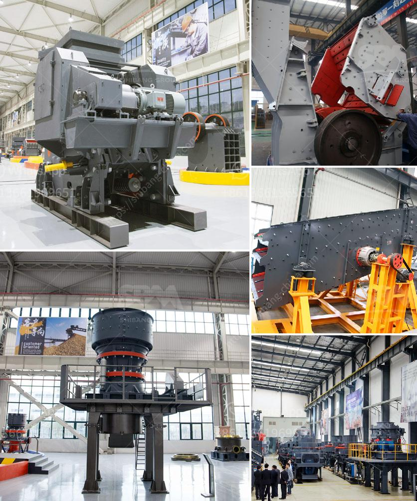

<h3>تكلفة مصنع كسارة الحجر الجيري</h3>
تُعد كسارة الحجر الجيري أحد المعدات الأساسية في صناعة البناء والانشاءات المدنية. تستخدم هذه الآلة لسحق الحجارة الكبيرة إلى حجارة صغيرة أو أحجار الزلط؛ التي تستخدم في إنتاج الخرسانة والأسفلت والبناء الطرقي والبناء العمراني. تتفاوت تكلفة مصنع كسارة الحجر الجيري حسب العديد من العوامل المختلفة. من بين هذه العوامل الحجم المراد سحقه، ومواصفات المعدات المستخدمة، وموقع المصنع، وتكاليف المواد الخام والطاقة والعمالة.

أحد العوامل الأساسية التي تؤثر على تكلفة مصنع كسارة الحجر الجيري هو الحجم المراد سحقه. فكلما زاد حجم الحجر المراد سحقه، زادت تكلفة المعدات اللازمة للقيام بذلك. على سبيل المثال، إذا كان المطلوب هو سحق حجر بحجم كبير جدًا، قد يكون هناك حاجة لاستخدام كسارات ذات طاقة إنتاجية عالية تتطلب تكاليف إضافية.

بجانب ذلك، تؤثر المواصفات المستخدمة للمعدات في تكلفة المصنع. يمكن أن تختلف أنواع المعدات المستخدمة، مثل الكسارات الفكية والكسارات الصدمية والكسارات المخروطية، في سعرها وأدائها. قد تحتاج إلى شراء معدات مستعملة أو جديدة حسب الميزانية المتاحة.

موقع المصنع هو عامل آخر يؤثر على تكلفة مصنع كسارة الحجر الجيري. إذا كان المصنع قريبًا من مناجم الحجر الجيري، فقد يكون هناك توفر في تكاليف الشحن والنقل. ولكن إذا كان الموقع بعيدًا عن المناجم، فقد يتطلب ذلك إنفاقًا إضافيًا على النقل واللوجستيات.

بالإضافة إلى ذلك، تشمل تكاليف المشروع تكاليف المواد الخام والطاقة والعمالة. على سبيل المثال، تكلفة الحجر الجيري قد تختلف بناءً على موقع المنجم ونوعية الحجر وسوق العرض والطلب. كما يمكن أن تستهلك الكسارة كميات كبيرة من الطاقة الكهربائية أو الوقود، مما يؤثر على تكلفة التشغيل. وأخيرًا، تعتمد تكلفة العمالة على الدولة والمهارة المطلوبة.

باختصار، تتفاوت تكلفة مصنع كسارة الحجر الجيري بناءً على العديد من العوامل المختلفة، بما في ذلك الحجم المراد سحقه، والمواصفات المستخدمة، وموقع المصنع، وتكاليف المواد الخام والطاقة والعمالة. يجب دراسة هذه العوامل بعناية عند التخطيط للمشروع وتحليل تكلفته، لضمان الحصول على أفضل قيمة ممكنة وتحقيق العائد المرجو.
<h3>Contact us</h3><ul><li><strong>Whatsapp:&nbsp;<a href="https://wa.me/8613661969651">+8613661969651</a></strong></li><li><a href="https://swt.shibang-china.com/?git&amp;zhl&amp;تكلفة مصنع كسارة الحجر الجيري"><strong>Online Service(chat now)</strong></a></li></ul><h3>Related</h3><ul><li><a href='عملية مصنع الأحجار الكوارتز 3080.md'>عملية مصنع الأحجار الكوارتز 30-80</a></li><li><a href='كسارة الحجر ديربان.md'>كسارة الحجر ديربان</a></li><li><a href='تكلفة كسارة الفلسبار.md'>تكلفة كسارة الفلسبار</a></li><li><a href='أنا أبحث عن كسارة في ماليزيا.md'>أنا أبحث عن كسارة في ماليزيا</a></li><li><a href='تصميم مصانع التكسير الصناعية.md'>تصميم مصانع التكسير الصناعية</a></li></ul>