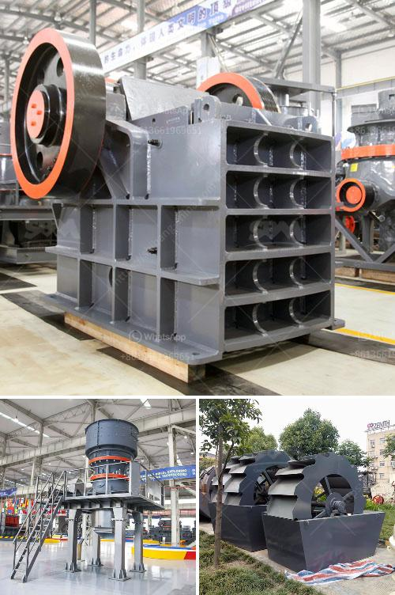

<h3>تكلفة مصنع كسارة خام الحديد</h3>
تعتبر صناعة التعدين وتكرير الخامات من بين الصناعات الهامة التي تساهم في اقتصاد الدول العديدة. واحدة من المواد الرئيسية التي يتم تعدينها هي خام الحديد. يتم استخراج خام الحديد من المناجم وتكسيره وتكريره لاستخدامه في إنتاج الصلب.

إنشاء مصنع كسارة خام الحديد يتطلب جهودًا هائلة واستثمارات ضخمة. وتتأثر تكلفة المصنع بعوامل عديدة تشمل حجم المصنع المطلوب، والتقنيات المستخدمة في معالجة الخامات، وتكلفة المعدات والمواد اللازمة، بالإضافة إلى تكلفة العمالة ومصاريف الإدارة.

يتراوح السعر التقريبي لإنشاء مصنع كسارة خام الحديد بين 200 إلى 400 مليون دولار أمريكي. تتضمن هذه التكلفة شراء المعدات المهمة مثل الكسارات والغرابيل والحزام الناقل وآلات المعالجة الأخرى. بالإضافة إلى ذلك، يجب أيضًا تحمل تكلفة بناء المرافق اللازمة مثل مبنى الإدارة وورش الصيانة والمستودعات. كما يجب اعتبار تكاليف الطاقة والماء والكهرباء والمواد الكيميائية اللازمة لعملية تكرير الخام.

وبالتأكيد، تكلفة تشغيل المصنع هي جزء آخر ومهم للغاية من تكلفة المصنع. تتضمن هذه التكاليف أجور العمال والتأمين الصحي وتكاليف الصيانة المستمرة للمعدات وقطع الغيار. كما يجب أخذ في الاعتبار تكاليف الوقود والزيوت والمواد الكيميائية الأخرى المستخدمة في عمليات التكرير.

بصفة عامة، يتعين توافر رأس مال قوي وتمويل كافٍ لإنشاء مصنع كسارة خام الحديد. وعلاوة على ذلك، يجب أيضًا مراعاة تكاليف الصيانة المستمرة وأعباء التشغيل المستمرة لضمان جاهزية المصنع وكفاءته في الإنتاج.

في النهاية، تكلفة إنشاء مصنع كسارة خام الحديد قد تختلف حسب العوامل المذكورة أعلاه. يجب أن تقوم الشركات المهتمة بإجراء تحليل تكلفة-فائدة شامل لتقدير الاستثمار المطلوب وضمان الاستدامة المستقبلية للمصنع.
<h3>Contact us</h3><ul><li><strong>Whatsapp:&nbsp;<a href="https://wa.me/8613661969651">+8613661969651</a></strong></li><li><a href="https://swt.shibang-china.com/?git&amp;zhl&amp;تكلفة مصنع كسارة خام الحديد"><strong>Online Service(chat now)</strong></a></li></ul><h3>Related</h3><ul><li><a href='كسارات محمولة مستعملة للبيع في جنوب أفريقيا.md'>كسارات محمولة مستعملة للبيع في جنوب أفريقيا</a></li><li><a href='آلات الطحن والتعبئة في باكستان.md'>آلات الطحن والتعبئة في باكستان</a></li><li><a href='كسارة الحجر في أوغندا.md'>كسارة الحجر في أوغندا</a></li><li><a href='آلة صنع الكرةست.md'>آلة صنع الكرةست</a></li><li><a href='مطحنة طحن للكوارتز في الهند.md'>مطحنة طحن للكوارتز في الهند</a></li></ul>