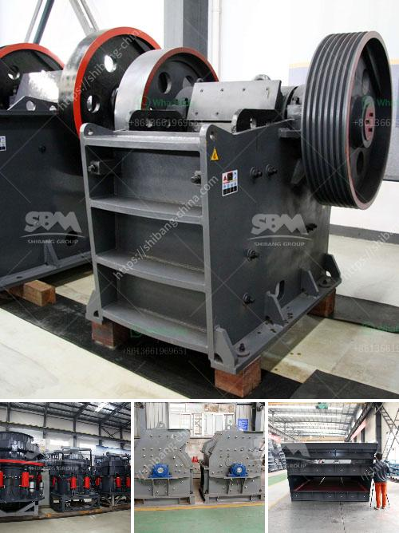

<h3>تكلفة مصنع لوحات الجبس في الهند</h3>
تعد الهند واحدة من أكبر الأسواق لصناعة البناء في العالم، وتشهد صناعة لوحات الجبس ارتفاعًا كبيرًا في الطلب والاستخدام في السنوات الأخيرة. تعتبر لوحات الجبس مادة بناء رئيسية في تشطيبات الجدران والسقوف، لتوفير العزل الحراري والصوتي وتحسين المظهر العام للمنازل والمنشآت التجارية.

يتأثر سعر لوحات الجبس بعدة عوامل. تتضمن هذه العوامل تكلفة المواد الخام وتكلفة العمل وأسعار النقل وتكاليف الطاقة والضرائب وتكلفة توفير المعدات اللازمة للإنتاج.

في الهند، تختلف تكلفة إنتاج لوحات الجبس حسب المدينة والمنطقة وحجم المصنع وتقنيات الإنتاج المستخدمة. ومع ذلك، فإن الأسعار الشائعة تتراوح عادةً بين 200-400 روبية هندية للوحة الواحدة بحجم 4x8 قدم.

يعود سبب تدني تكلفة لوحات الجبس في الهند إلى توفر المواد الخام، حيث تمتلك الهند احتياطيات كبيرة من الجبس الطبيعي. كما أن الهند تنتج معظم الجبس المطلوب محليًا، مما يقلل من تكاليف الاستيراد والنقل. بالإضافة إلى ذلك، يعد العمال المهرة في الهند متاحين بتكاليف منخفضة، مما يقلل من تكلفة العمالة.

مع زيادة الطلب على لوحات الجبس في الهند والنمو المستمر في صناعة البناء، تتوقع الصناعة أن تستمر تكلفة لوحات الجبس في الهند في الارتفاع. قد تزداد تكاليف المواد الخام وأسعار النقل وتكاليف العمل، مما يؤدي إلى زيادة التكلفة النهائية للوحات الجبس.

بالنظر إلى ذلك، قد يكون التركيز على تحسين كفاءة إنتاج لوحات الجبس وتبني تقنيات إنتاج أكثر اقتصادية هو الحلاقة اليوم، حيث يمكن لهذه الخطوات تقديم لوحات الجبس بأسعار أكثر تنافسية في السوق. كما أن استثمار المزيد في البحث والتطوير يمكن أن يساهم في تحسين العمليات الإنتاجية وتقديم منتجات أفضل بتكاليف أقل.

من المهم أن يتعاون المصنعون والحكومة والمستهلكون لتعزيز صناعة لوحات الجبس في الهند وتخفيض التكاليف وتحسين الجودة وتوفير منتجات بأسعار معقولة للمستهلكين.
<h3>Contact us</h3><ul><li><strong>Whatsapp:&nbsp;<a href="https://wa.me/8613661969651">+8613661969651</a></strong></li><li><a href="https://swt.shibang-china.com/?git&amp;zhl&amp;تكلفة مصنع لوحات الجبس في الهند"><strong>Online Service(chat now)</strong></a></li></ul><h3>Related</h3><ul><li><a href='أسعار مطحنة الكرة في زيمبابوي.md'>أسعار مطحنة الكرة في زيمبابوي</a></li><li><a href='إجراء إنتاج الأسمنت في المطحنة العمودية.md'>إجراء إنتاج الأسمنت في المطحنة العمودية</a></li><li><a href='مصانع غسيل الذهب للبيع في غانا.md'>مصانع غسيل الذهب للبيع في غانا</a></li><li><a href='تعدين الجبس والكروم والحجر الجيري.md'>تعدين الجبس والكروم والحجر الجيري</a></li><li><a href='آلة طحن الطين الصيني.md'>آلة طحن الطين الصيني</a></li></ul>