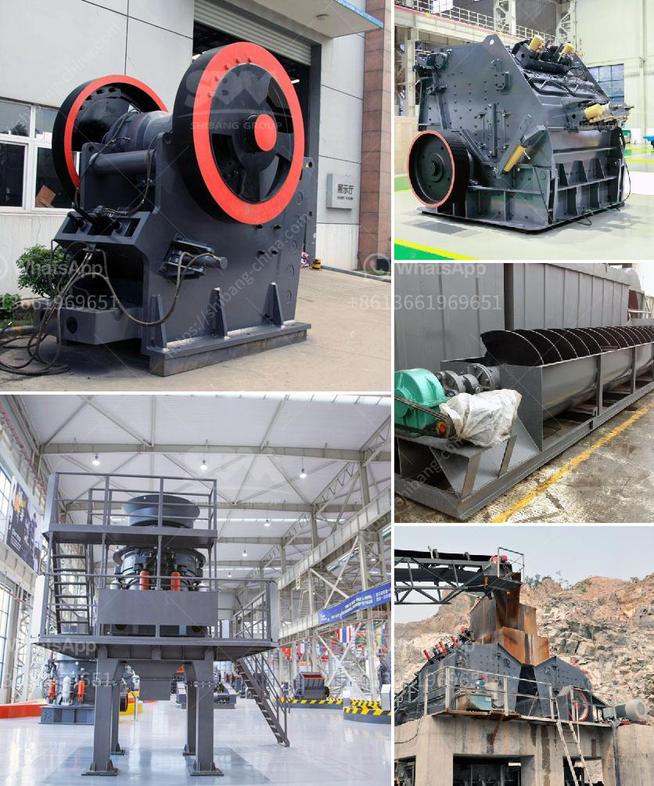

<h3>تكلفة مطاحن الهامر للسعر</h3>
تُعتبر مطاحن الهامر أداة هامة في صناعة الأعلاف وتكسير المواد الخام في المزارع والمصانع الزراعية. تعد هذه المطاحن مفيدة جدًا في عمليات التحضير الأولي للمواد الغذائية وتكسيرها بقطع صغيرة مناسبة للطيور والحيوانات الأخرى. وتعتبر هذه الأداة ضرورية لبناء عملية إعداد الأعلاف بصورة فعالة واقتصادية.

تختلف تكلفة المطاحن الهامر تبعاً لعدة عوامل مثل الحجم والقدرة والموديل والماركة. وعادةً ما يتراوح سعر مطحنة الهامر بين 200 و 400 دولار أمريكي. ومع ذلك، يجب أن تتضمن التكلفة أيضًا قطع الغيار والصيانة الدورية للحفاظ على أداء المطحنة بكفاءة عالية على المدى الطويل.

عند اختيار مطحنة الهامر، يجب مراعاة عدة عوامل. واحدة منها هي القدرة، حيث يجب اختيار مطحنة تتناسب مع حجم عملك واحتياجات الإنتاج الخاصة بك. إذا كنت تدير مزرعة صغيرة، فإن مطحنة بسعة صغيرة قد تكون كافية بينما إذا كنت تدير مزرعة كبيرة قد تحتاج مطحنة بسعة أكبر.

بالإضافة إلى ذلك، يجب مراعاة المواد التي ستتم معالجتها بواسطة المطحنة وخصائصها. يجب أن تختار مطحنة لديها قوة وسرعة مناسبة لموادك الخام. قوة المحرك للمطحنة وسرعة التدوير تؤثر على كفاءة العملية وجودة النتيجة النهائية.

بالإضافة إلى ذلك، قد تختلف التكاليف أيضًا بناءً على الماركة والجودة. يُفضل اختيار مطحنة ذات جودة عالية حتى تكون بالقدرة على العمل بكفاءة لفترة طويلة دون مشاكل. قد يكون سعر الماركات الشهيرة أعلى بعض الشيء، لكنها قد توفر أفضل جودة وأداء.

في النهاية، عند اقتناء مطحنة الهامر، يجب أن تنظر إلى طبيعة عملك واحتياجاتك الخاصة وتكلفة الشراء الميسرة. يجب استثمار المال بحكمة واختيار مطحنة تلبي احتياجاتك وتضمن أعلى جودة في الأداء والمواد المعالجة.

باختصار، تكلفة مطاحن الهامر تتفاوت وفقًا للحجم، والقدرة، والموديل، والماركة، وتكاليف الصيانة المستقبلية. يجب البحث ومراجعة الميزات المختلفة وتقييم احتياجاتك قبل اتخاذ قرار الشراء لضمان الحصول على أعلى جودة وأفضل قيمة مقابل المال الذي ستدفعه.
<h3>Contact us</h3><ul><li><strong>Whatsapp:&nbsp;<a href="https://wa.me/8613661969651">+8613661969651</a></strong></li><li><a href="https://swt.shibang-china.com/?git&amp;zhl&amp;تكلفة مطاحن الهامر للسعر"><strong>Online Service(chat now)</strong></a></li></ul><h3>Related</h3><ul><li><a href='مصنع آلات كسارة الحجر في كمبوديا.md'>مصنع آلات كسارة الحجر في كمبوديا</a></li><li><a href='كسارة تعدين الحجر الجيري في فيتنام.md'>كسارة تعدين الحجر الجيري في فيتنام</a></li><li><a href='الفرق بين الطحن والتلميع.md'>الفرق بين الطحن والتلميع</a></li><li><a href='سحق الجرانيت إلى مسحوق.md'>سحق الجرانيت إلى مسحوق</a></li><li><a href='مستخدمة لمطاحن ريموند للبيع في الهند.md'>مستخدمة لمطاحن ريموند للبيع في الهند</a></li></ul>