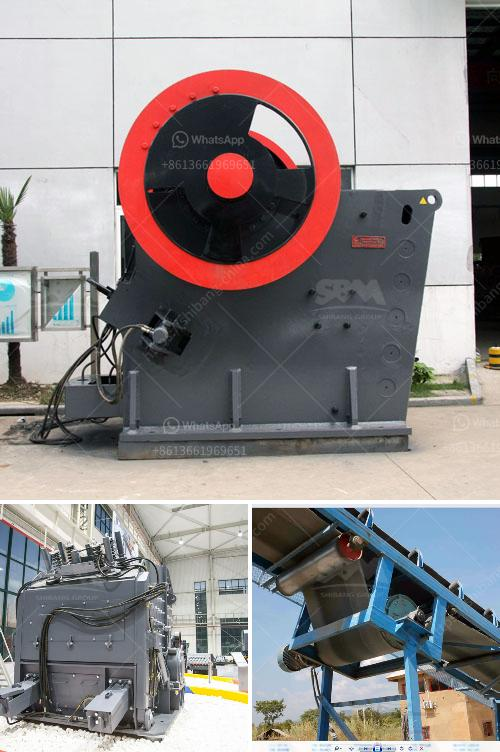

<h3>تكلفة مطحنة مسحوق صغيرة</h3>
تشتهر مطاحن المسحوق الصغيرة بقدرتها على طحن المواد الصلبة إلى مسحوق ناعم. تعتبر هذه المطاحن أداة هامة في الكثير من الصناعات مثل الأغذية والصيدلة والكيمياء. واحدة من العوامل الرئيسية التي تؤثر في اختيار المطحنة هي التكلفة. في هذه المقالة، سنناقش تكلفة مطاحن المسحوق الصغيرة التي تتراوح بين 200 و 400 كلمة.

قبل الحديث عن التكلفة، يجب أن نتطرق إلى الخصائص الرئيسية التي يجب أن تتوفر في مطحنة المسحوق الصغيرة. تشمل هذه الخصائص: التشغيل السهل، والأمان، والكفاءة العالية، والصيانة البسيطة. يجب أن تتوفر هذه العوامل في المطحنة لضمان استخدامها بشكل فعال وفعالية تامة.

التكلفة لشراء مطحنة المسحوق الصغيرة يمكن أن تتراوح بين 200 و 400 دولار. للوهلة الأولى، قد يبدو هذا الرقم مرتفعًا. ومع ذلك، يجب أن نأخذ في الاعتبار أن هذه المطاحن تتميز بتكنولوجيا متطورة وأنها ذات جودة عالية. من الطبيعي أن الجودة يرتبط بها ثمن. إذا كنت ترغب في شراء مطحنة مسحوق ذات جودة عالية، فقد تحتاج إلى التفكير في دفع المزيد من المال.

بالإضافة إلى الثمن، يجب أن تنظر أيضاً في التكلفة الشاملة والتشغيلية للمطحنة. مطاحن المسحوق تحتاج إلى استهلاك الطاقة الكهربائية للعمل. هذه التكلفة يجب أن تكون جزءًا من الاعتبار عندما تقوم بتحديد الميزانية الخاصة بك. يمكنك أيضًا أن تدرس مدى كفاءة استهلاك الطاقة للمطحنة قبل الشراء، والتي يمكن أن تؤثر على تكلفة التشغيل العامة.

مع الاهتمام المتزايد بالبيئة، قد يأتي الاتجاه نحو استخدام مطاحن المسحوق الصغيرة ذات الطاقة البديلة. هذه المطاحن تعمل بالطاقة الشمسية أو بالبطاريات. لكن، غالبًا ما تكون هذه المطاحن مكلفة أكثر من المطاحن التقليدية. إذا كنت مهتمًا بالاعتماد على مصادر الطاقة البديلة، فقد تحتاج إلى زيادة الميزانية.

بشكل عام، يجب أن تدرس الميزانية الخاصة بك واحتياجاتك قبل شراء مطحنة المسحوق الصغيرة. يمكنك أيضًا مقارنة الأسعار والموديلات المختلفة المتاحة في السوق. بعد دراسة المزيد من المعلومات واستشارة الخبراء، ستكون قادراً على اتخاذ قرار مستنير حول المطحنة التي تناسبك وتناسب ميزانيتك.
<h3>Contact us</h3><ul><li><strong>Whatsapp:&nbsp;<a href="https://wa.me/8613661969651">+8613661969651</a></strong></li><li><a href="https://swt.shibang-china.com/?git&amp;zhl&amp;تكلفة مطحنة مسحوق صغيرة"><strong>Online Service(chat now)</strong></a></li></ul><h3>Related</h3><ul><li><a href='شركة تصنيع مطحنة الفحم في الصين.md'>شركة تصنيع مطحنة الفحم في الصين</a></li><li><a href='الشاشات الاهتزازية في إيطاليا.md'>الشاشات الاهتزازية في إيطاليا</a></li><li><a href='مطحنة كرات مخروطية للبيع.md'>مطحنة كرات مخروطية للبيع</a></li><li><a href='مطاحن الكرة الفلسبار.md'>مطاحن الكرة الفلسبار</a></li><li><a href='مطحنة الفحم في محطة توليد الطاقة.md'>مطحنة الفحم في محطة توليد الطاقة</a></li></ul>