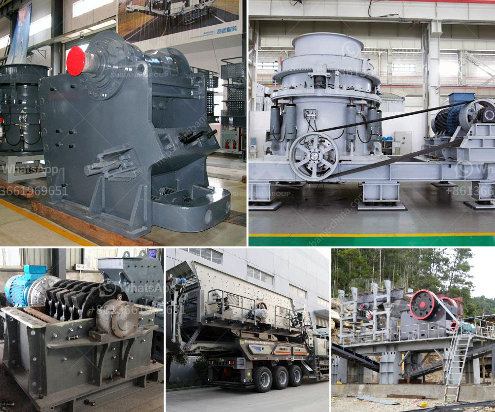

<h3>تكلفة معدات التكسير والطحن في إثيوبيا</h3>
تعتبر صناعة التكسير والطحن من الصناعات الهامة في إثيوبيا، حيث تسهم في تطوير البنية التحتية وتوفير فرص العمل للسكان، بالإضافة إلى تلبية الاحتياجات المحلية وزيادة الصادرات. وبالتالي، فإن تحقيق الاستدامة المالية لهذه الصناعة يتطلب النظر في تكلفة المعدات اللازمة لعمليات التكسير والطحن.

تتفاوت تكلفة المعدات المستخدمة في التكسير والطحن في إثيوبيا بناءً على الحجم والقدرة والتقنية المطلوبة. وتشمل هذه المعدات الكسارات والطواحين والمناخل والمصافي والمعدات الأخرى المتعلقة بعمليات التكسير والطحن. قد تكون تلك المعدات من الأنواع الصغيرة والمتوسطة والكبيرة، حسب احتياجات المشروع الذي يتم تنفيذه.

عوامل عديدة تؤثر في تكلفة هذه المعدات، بما في ذلك تكلفة المواد الخام المستخدمة في صناعتها، وتكلفة المعدات ذاتها، وتكلفة النقل والتركيب، وتكلفة التشغيل والصيانة المستمرة. وتعتمد تكلفة المعدات أيضًا على الجودة والكفاءة والتكنولوجيا المستخدمة في تصنيعها.

من المهم أيضًا أن نلاحظ أن تكلفة المعدات قد تختلف من مشروع إلى آخر، حيث يعتمد ذلك على نوعية التربة والمعادن والصخور الموجودة في المنطقة المعنية بالتكسير والطحن. قد يشتمل المشروع على عمليات تكسير وطحن بسيطة، أو عمليات معقدة تتطلب معدات وتقنيات أكثر تطورًا.

وفي العادة، يمكن أن تتراوح تكلفة معدات التكسير والطحن في إثيوبيا بين 200,000 إلى 400,000 دولار. ومع ذلك، يجب أن نأخذ في الاعتبار أن هذه التكاليف تشمل فقط المعدات الأساسية ولا تشمل التكاليف الإضافية مثل التكنولوجيا المتقدمة وقطع الغيار والمواد الاستهلاكية.

وبالاستفادة من الموارد الطبيعية الوفيرة في إثيوبيا، يُمكن تقليل تكلفة هذه المعدات عن طريق اعتماد المصانع المحلية في تصنيعها. وبالتالي، يمكن تعزيز التوجه الاقتصادي المحلي وتوفير فرص العمل الجديدة.

وفي الختام، تُعتبر تكلفة معدات التكسير والطحن في إثيوبيا مختلفة بناءً على حجم المشروع والتقنية المستخدمة. وتعتبر هذه المعدات استثمارًا هامًا لتحقيق النمو الاقتصادي والتنمية المستدامة في البلاد. يجب أن تأخذ الحكومة والمستثمرين والمهندسين في الاعتبار تلك التكاليف وتطوير سياسات وإجراءات لتسهيل الوصول إلى هذه المعدات وتعزيز الصناعة المحلية.
<h3>Contact us</h3><ul><li><strong>Whatsapp:&nbsp;<a href="https://wa.me/8613661969651">+8613661969651</a></strong></li><li><a href="https://swt.shibang-china.com/?git&amp;zhl&amp;تكلفة معدات التكسير والطحن في إثيوبيا"><strong>Online Service(chat now)</strong></a></li></ul><h3>Related</h3><ul><li><a href='مصنع عملية التصنيع في جنوب أفريقيا.md'>مصنع عملية التصنيع في جنوب أفريقيا</a></li><li><a href='مصنع كسارة الحجر بسعة 100 طن.md'>مصنع كسارة الحجر بسعة 100 طن</a></li><li><a href='كسارة المحجر للحجر.md'>كسارة المحجر للحجر</a></li><li><a href='مصنع غسيل الرمل 50 طن في الساعة.md'>مصنع غسيل الرمل 50 طن في الساعة</a></li><li><a href='مواصفات مصنع سحق الحجر الجيري 450 طن في الساعة.md'>مواصفات مصنع سحق الحجر الجيري 450 طن في الساعة</a></li></ul>