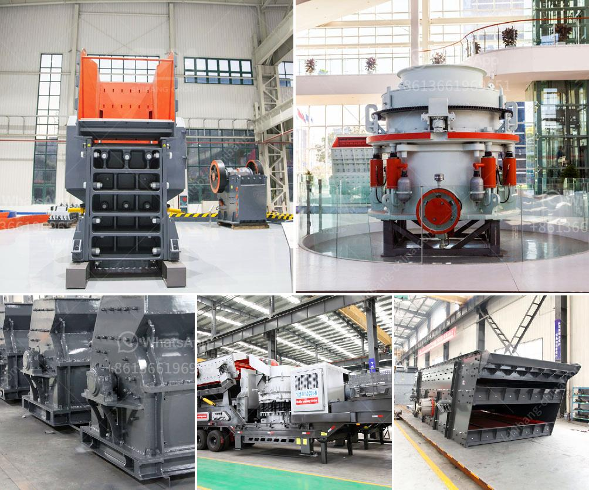

<h3>تكلفة معدات سحق الجرانيت</h3>
تعتبر معدات سحق الجرانيت ضرورية لعمليات تحطيم وطحن الجرانيت للاستخدام في العديد من الصناعات مثل البناء والتشييد والتعدين. يتطلب عملية سحق الجرانيت معدات مختلفة تشمل الكسارة الفكية وكسارة المخروط وكسارة الصدم وغربال الاهتزاز والناقل الفعال وغيرها من المعدات اللازمة لإكمال العملية بنجاح.

تشتمل تكلفة معدات سحق الجرانيت على عدة جوانب. الجانب الأول هو تكلفة الشراء للمعدات اللازمة. يتوقف سعر المعدات على نوع المعدة وجودتها وإمكانياتها وحجمها. على سبيل المثال، يكون سعر الكسارات الفكية الصغيرة في نطاق 5000-20000 دولار، بينما تكون الأسعار للكسارات الفكية الكبيرة والكسارات المخروطية والكسارات ذات الصدم أعلى.

وبالإضافة إلى تكلفة شراء المعدات، هناك أيضًا تكلفة الصيانة والتشغيل. يجب توفير الموظفين المهرة لتشغيل وصيانة المعدات بشكل منتظم بناءً على متطلبات الإنتاج. بالإضافة إلى ذلك، فإن تكلفة الطاقة اللازمة لتشغيل المعدات يجب أخذها في الاعتبار أيضًا.

علاوة على ذلك، يتطلب سحق الجرانيت أيضًا تكلفة إزالة الأتربة والرمال ومواد التفتيت الأخرى من الجرانيت الخام قبل البدء في عملية السحق. يجب استخدام المعدات الخاصة بالأعمال الأولية مثل الجرافات والشاحنات لتنفيذ هذه العمليات.

لذا، من الواضح أن تكلفة معدات سحق الجرانيت قد تكون مرتفعة. إلا أنه يجب أيضًا أخذ في الاعتبار أن هذه المعدات هي استثمارات طويلة الأجل تساعد في تحسين كفاءة الإنتاج وتوفير الوقت والجهد في عملية سحق الجرانيت.

في الختام، يعتبر سحق الجرانيت عملية أساسية للاستفادة من هذه المادة القيمة في العديد من الصناعات المختلفة. رغم التكلفة العالية لمعدات سحق الجرانيت، إلا أن الاستثمار فيها يستحق لما لها من أهمية في تحقيق الإنتاج الفعال والربحية العالية في المدى الطويل.
<h3>Contact us</h3><ul><li><strong>Whatsapp:&nbsp;<a href="https://wa.me/8613661969651">+8613661969651</a></strong></li><li><a href="https://swt.shibang-china.com/?git&amp;zhl&amp;تكلفة معدات سحق الجرانيت"><strong>Online Service(chat now)</strong></a></li></ul><h3>Related</h3><ul><li><a href='كسارة متنقلة بنظام هيدروليكي.md'>كسارة متنقلة بنظام هيدروليكي</a></li><li><a href='كسارة الصدم PF لآلة تكسير الحجر للبيع.md'>كسارة الصدم PF لآلة تكسير الحجر للبيع</a></li><li><a href='مطاحن الأسطوانة العليا للبيع.md'>مطاحن الأسطوانة العليا للبيع</a></li><li><a href='كسارة تشغيل للبيع في صباح.md'>كسارة تشغيل للبيع في صباح</a></li><li><a href='آلة مسحوق رمل السيليكا إندونيسيا.md'>آلة مسحوق رمل السيليكا إندونيسيا</a></li></ul>