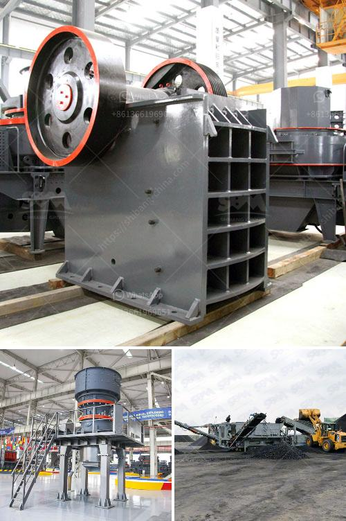

<h3>تكلفة منخفضة لسعر كسارة الفك في أوغندا</h3>
تعتبر كسارة الفك واحدة من أهم الآلات المستخدمة في صناعة التعدين والبناء وتكسير الصخور. وبفضل التطور التكنولوجي، أصبحت كسارات الفك المتاحة في السوق تتمتع بالعديد من المزايا، بما في ذلك التكلفة المنخفضة والكفاءة العالية.

في أوغندا، يوجد الكثير من المصانع التي تنتج كسارات الفك. وتتنوع تكلفة هذه الكسارات بناءً على العديد من العوامل، مثل قوة المحرك وقدرة الإنتاج وجودة المواد المستخدمة في البناء.

واحدة من أهم العوامل التي تؤثر على تكلفة الكسارة هي المحرك المستخدم فيها. فعادةً ما تكون الكسارات التي تعمل بقوة محرك أعلى تكلفة أكبر من تلك التي تعمل بمحرك أقل قوة. وبالطبع، يعتمد اختيار المحرك على الاحتياجات الفردية للمشروع.

بالنسبة لقدرة الإنتاج، تتوفر كسارات الفك في السوق بسعة تصل إلى عدة أطنان في الساعة. وطبعًا، كلما زادت السعة، زادت تكلفة الكسارة. لذا، يجب مراعاة الاحتياجات المحددة للمشروع قبل اتخاذ القرار بشأن السعة المطلوبة.

وبالنسبة لجودة المواد المستخدمة في البناء، فإن الكسارات التي تستخدم مواد ذات جودة عالية عادةً ما تكون أكثر تكلفة من تلك التي تستخدم مواد أقل جودة. وهنا ينبغي أخذ في الاعتبار الاستخدام المتوقع للكسارة، حيث أن البعض قد ينفق المزيد للحصول على كسارة متينة قادرة على تحمل الاستخدام الشاق.

علاوة على ذلك، يجب أيضًا أخذ في الاعتبار تكاليف الصيانة والتشغيل. على سبيل المثال، قد تتطلب بعض الكسارات صيانة دورية وشراء قطع غيار، مما يزيد من التكاليف الإجمالية على المدى الطويل.

وفي النهاية، يمكن القول إن تكلفة الكسارة الفك في أوغندا تتنوع بناءً على العديد من العوامل المذكورة أعلاه، وغالبًا ما تتراوح بين 200 و 400 دولار. ولذا، من الضروري تقدير الاحتياجات الفردية للمشروع ومراجعة الميزات المختلفة للكسارات المتاحة في السوق قبل اتخاذ قرار الشراء.
<h3>Contact us</h3><ul><li><strong>Whatsapp:&nbsp;<a href="https://wa.me/8613661969651">+8613661969651</a></strong></li><li><a href="https://swt.shibang-china.com/?git&amp;zhl&amp;تكلفة منخفضة لسعر كسارة الفك في أوغندا"><strong>Online Service(chat now)</strong></a></li></ul><h3>Related</h3><ul><li><a href='أفضل مورد لمعدات التعدين في جنوب أفريقيا.md'>أفضل مورد لمعدات التعدين في جنوب أفريقيا</a></li><li><a href='معالجة تكسير البازلت.md'>معالجة تكسير البازلت</a></li><li><a href='طبقة من مطحنة ريمون.md'>طبقة من مطحنة ريمون</a></li><li><a href='كسارة صخور محمولة صغيرة.md'>كسارة صخور محمولة صغيرة</a></li><li><a href='بيع كسارة الحجر.md'>بيع كسارة الحجر</a></li></ul>