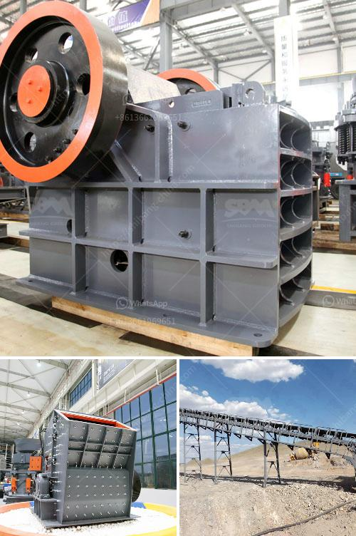

<h3>تكلفة ناقل الحزام لصناعة التعدين</h3>
تعد صناعة التعدين من أهم الصناعات المعدنية التي تعمل على استخراج وتصنيع المعادن والمواد الخام. وتُعد آلات نقل المواد من أهم العناصر في هذه الصناعة، وهنا نجد ناقل الحزام واحدًا من أهم وأكثر الأنواع استخدامًا.

تعد تكلفة ناقل الحزام أحد العوامل الرئيسية التي يجب مراعاتها لنجاح عمليات التعدين. تختلف تكلفة ناقل الحزام من حيث السعر الأولي للشراء وتكاليف الصيانة والتشغيل اليومية. يعد سعر الناقل نفسه أحد العوامل المؤثرة في التكلفة، حيث يمكن أن تتراوح تكلفته في حدود 200-400 ألف دولار أمريكي، بناءً على المواصفات والمقاييس والقدرة التحميلية للناقل.

بالإضافة إلى ذلك، يجب أيضًا مراعاة تكاليف الصيانة والتشغيل اليومية لناقل الحزام. تشمل هذه التكاليف تكلفة الوقود أو الكهرباء المستخدمة في تشغيل الناقل، وتكاليف الصيانة المنتظمة واستبدال الأجزاء التالفة أو المتآكلة. يعتمد حجم هذه التكاليف على عدة عوامل، مثل الاستخدام المستمر والبيئة التشغيلية وتوفر قطع الغيار.

يعد استخدام ناقل الحزام في صناعة التعدين مفيدًا بشكل عام، حيث يتميز بالكفاءة والقدرة على نقل كميات كبيرة من المواد على مسافات طويلة. ومع ذلك، قد تكون تكلفته العالية بعض الشيء المهمة، لذا ينبغي للشركات المعدنية أن تراعي تكلفة ناقل الحزام عند تخطيطها لعمليات التعدين.

في النهاية، يمكن القول بأن تكلفة ناقل الحزام لصناعة التعدين تتفاوت بشكل كبير وتتأثر بعدة عوامل ، مما يتطلب من الشركات الاقتصادية والمعدنية اعتبار هذه التكاليف وضبط استخدامها بما يتلاءم مع الظروف المحيطة وتحقيق العمل بأفضل وأقل التكاليف.
<h3>Contact us</h3><ul><li><strong>Whatsapp:&nbsp;<a href="https://wa.me/8613661969651">+8613661969651</a></strong></li><li><a href="https://swt.shibang-china.com/?git&amp;zhl&amp;تكلفة ناقل الحزام لصناعة التعدين"><strong>Online Service(chat now)</strong></a></li></ul><h3>Related</h3><ul><li><a href='كسارة الحجر المحمولة.md'>كسارة الحجر المحمولة</a></li><li><a href='سعر مصنع كربونات الكالسيوم.md'>سعر مصنع كربونات الكالسيوم</a></li><li><a href='كسارات وشاشات متنقلة مستعملة في جنوب أفريقيا.md'>كسارات وشاشات متنقلة مستعملة في جنوب أفريقيا</a></li><li><a href='مورد كسارة الحجر الجيري.md'>مورد كسارة الحجر الجيري</a></li><li><a href='كسارة للبيع في جنوب أفريقيا.md'>كسارة للبيع في جنوب أفريقيا</a></li></ul>