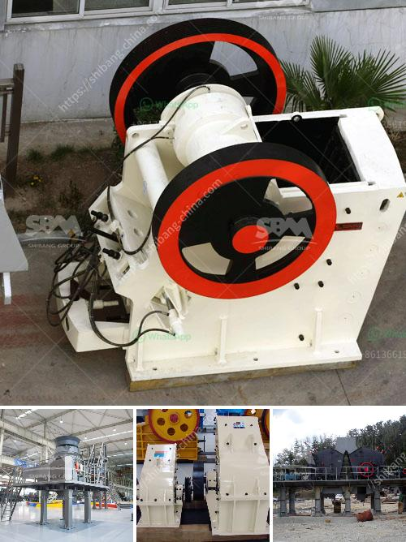

<h3>تكلفة وحدة طحن الأسمنت tpd كسارة</h3>
تكلفة وحدة طحن الأسمنت TPD (طن في اليوم) هي موضوع يثير اهتمام العديد من الشركات في صناعة الأسمنت. تعتبر عملية طحن الأسمنت جزءًا أساسيًا من عملية إنتاج الأسمنت، وهي تتطلب تجهيزات وتكنولوجيا متقدمة لضمان الإنتاج الفعال والنوعية العالية. من المهم أن نتعرف على تكلفة وحدة طحن الأسمنت TPD وكيف يؤثر ذلك على صناعة الأسمنت.

تتأثر تكلفة وحدة طحن الأسمنت TPD بعدة عوامل. أولاً وقبل كل شيء، يتوقف سعر وحدة طحن الأسمنت TPD على الحجم الإجمالي للإنتاج المطلوب. فكلما زادت الكمية المطلوبة للإنتاج، زادت التكلفة بشكل مباشر.

ثانيًا، يعتمد سعر وحدة طحن الأسمنت TPD على نوع الآلات والمعدات المطلوبة. يجب شراء ماكينات طحن أسمنت عالية الجودة والكفاءة التي تستخدم تكنولوجيا حديثة لضمان الأداء الفعال. بالإضافة إلى ذلك، يجب أيضًا شراء معدات التجهيز والأجهزة الأخرى المرتبطة بعملية الطحن.

ثالثًا، تؤثر تكلفة وحدة طحن الأسمنت TPD على التكاليف الإضافية مثل تكلفة الطاقة والمياه والصيانة والعمالة والمواد الأولية اللازمة للعملية. يجب أخذ جميع هذه العوامل في الاعتبار عند حساب الكلفة الإجمالية لوحدة طحن الأسمنت.

وغالبًا ما ترتبط تكلفة وحدة طحن الأسمنت TPD أيضًا بالعوامل المتعلقة بالبيئة. يجب على الشركات اتباع المعايير البيئية والاهتمام بمعالجة النفايات والغازات السامة الناتجة عن عملية الطحن. قد تزيد هذه العوامل التكلفة، ولكنها ضرورية للحفاظ على البيئة والصحة العامة.

في النهاية، يمكن القول أن تكلفة وحدة طحن الأسمنت TPD هي مشكلة معقدة تتأثر بعدة عوامل. يجب على الشركات تقدير تكاليف الاستثمار والاستغناء الفني لتحقيق الأداء المثلى والربحية المرجوة. ومع ذلك، فإن ضمان جودة الإنتاج واستدامتها يتطلب الاستثمار في تكنولوجيا حديثة والتزامات بيئية قوية، وهو أمر لا يجب التغاضي عنه بغض النظر عن التكلفة.
<h3>Contact us</h3><ul><li><strong>Whatsapp:&nbsp;<a href="https://wa.me/8613661969651">+8613661969651</a></strong></li><li><a href="https://swt.shibang-china.com/?git&amp;zhl&amp;تكلفة وحدة طحن الأسمنت tpd كسارة"><strong>Online Service(chat now)</strong></a></li></ul><h3>Related</h3><ul><li><a href='آلة قطع الحجر المستخدمة من اليابان.md'>آلة قطع الحجر المستخدمة من اليابان</a></li><li><a href='مطحنة هامر للحجر الجيري في جنوب أفريقيا.md'>مطحنة هامر للحجر الجيري في جنوب أفريقيا</a></li><li><a href='ميزات كسارة الفك.md'>ميزات كسارة الفك</a></li><li><a href='سعر أحزمة الناقلات.md'>سعر أحزمة الناقلات</a></li><li><a href='مصنع تكسير الحصى بمقياس كبير.md'>مصنع تكسير الحصى بمقياس كبير</a></li></ul>