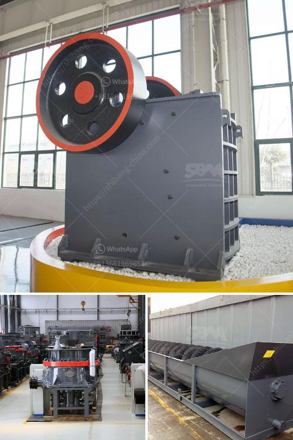

<h3>تكلفة وحدة طحن الأسمنت في الهند</h3>
تعتبر الهند واحدة من أكبر دول العالم من حيث إنتاج الأسمنت واستهلاكها. يُعَدّ الأسمنت من المكونات الأساسية للبنية التحتية والمباني في الهند، بالإضافة إلى استخدامه في قطاعات أخرى مثل الهندسة المدنية والصناعة. تعود تطور وحدات طحن الأسمنت في الهند إلى القرن العشرين، وهي تعد اليوم أحد المصادر الرئيسية للأسمنت في البلاد.

تختلف تكاليف الوحدات الطحن في الهند بناءً على العوامل المختلفة مثل الطاقة المطلوبة، وسعة الإنتاج، ونوعية الأسمنت المنتج، وتكلفة الاستثمار في المعدات والتجهيزات، والعاملين. وبشكل عام، تتراوح تكلفة وحدة طحن الأسمنت في الهند بين 200 إلى 400 روبية هندية لكل طن من الأسمنت المنتج.

تعتمد تكلفة الطاقة بشكل كبير على استخدام الفحم والطاقة الكهربائية في عملية الإنتاج. يُعدّ الفحم الوقود الأساسي المستخدم في وحدات الطحن، وتختلف تكاليف الفحم حسب الجودة والتوافر المحلي أو الاستيراد. يتم استخدام الفحم الحجري والفحم المستورد في الهند بشكل كبير.

بالإضافة إلى تكلفة الفحم، فإن تكلفة الطاقة الكهربائية تلعب دورًا هامًا في تحديد تكاليف وحدة طحن الأسمنت. يعتمد العديد من مصانع الأسمنت الهندية على الطاقة الكهربائية المحلية حيث تحدث تقلبات في تكلفتها بناءً على العرض والطلب والتغيرات في أسعار الوقود. بعض المصانع تستخدم أيضًا الطاقة الشمسية كمصدر للطاقة بغية تخفيف التكاليف.

تدخل تكلفة الاستثمار في المعدات والتجهيزات أيضًا في تحديد تكلفة الوحدة الواحدة لطحن الأسمنت. تعتمد هذه العوامل على سعة الإنتاج والتكنولوجيات المستخدمة والتحسينات الحديثة في عملية الطحن. مع زيادة الإنتاجية والتأثيرات التكنولوجية، يمكن تحقيق توفير في تكاليف إنتاج الأسمنت.

لإنتاج الأسمنت عالي الجودة مطلوبة خبرة عالية من العمال. يتطلب ذلك عمالًا مهرة ومدربين لضمان الكفاءة العالية والجودة في العمليات الصناعية. تكلفة العمل يمكن أن تكون مرتفعة، خاصة في المناطق التي يعاني فيها قلص العمالة المهرة.

باختصار، يُعَدّ تحديد تكلفة وحدة طحن الأسمنت في الهند مهمة تعتمد على مجموعة متنوعة من العوامل المختلفة. لكن بشكل عام، يمكن أن تتراوح التكاليف بين 200 إلى 400 روبية هندية لكل طن من الأسمنت المنتج. تحقيق التكاليف المنخفضة يتطلب الاستثمار في تكنولوجيا متقدمة وتحسين عمليات الإنتاج والبحث عن مصادر طاقة أكثر اقتصادية.
<h3>Contact us</h3><ul><li><strong>Whatsapp:&nbsp;<a href="https://wa.me/8613661969651">+8613661969651</a></strong></li><li><a href="https://swt.shibang-china.com/?git&amp;zhl&amp;تكلفة وحدة طحن الأسمنت في الهند"><strong>Online Service(chat now)</strong></a></li></ul><h3>Related</h3><ul><li><a href='المعدات المطلوبة لإنشاء محجر الجرانيت.md'>المعدات المطلوبة لإنشاء محجر الجرانيت</a></li><li><a href='مصانع معالجة الخام الصينية.md'>مصانع معالجة الخام الصينية</a></li><li><a href='كسارة الحجر الجيري المتنقلة.md'>كسارة الحجر الجيري المتنقلة</a></li><li><a href='محطات الكسارات للبيع في باكستان.md'>محطات الكسارات للبيع في باكستان</a></li><li><a href='معدات سحق الصناعات الثقيلة في ماليزيا.md'>معدات سحق الصناعات الثقيلة في ماليزيا</a></li></ul>