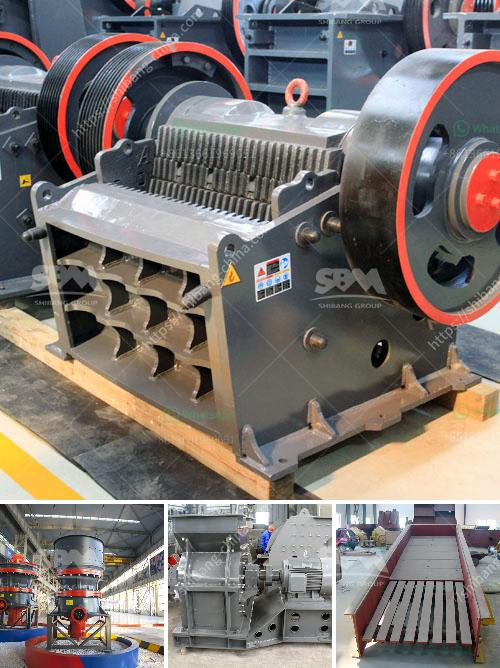

<h3>تكنولوجيا عملية البنتونيت للبيع</h3>
تعتبر تكنولوجيا عملية البنتونيت من العمليات المهمة في صناعة البنتونيت، وهي مادة تستخدم في العديد من التطبيقات الصناعية المختلفة مثل الحفر والبناء والحفاظ على النفاذية وصناعة الورق وغيرها. تتميز عملية البنتونيت بسهولة توافر المادة الخام وتكلفتها المنخفضة مما يجعلها تجذب اهتمام العديد من المصنعين والمستهلكين.

تشمل عملية البنتونيت عدة خطوات رئيسية تتطلب خبرة وتكنولوجيا متقدمة. أولاً، يتم تعدين البنتونيت من المناجم الموجودة في الطبيعة وجمعها في صورة خام. بعد ذلك، يتم نقل الخام إلى المصنع حيث يتم تنظيفه من الشوائب والأتربة. 

ثانيًا، يتم طحن البنتونيت إلى حبيبات صغيرة لزيادة سطح التفاعل وتحسين خواصها الكيميائية. يتم هذا عن طريق استخدام آلات الطحن المتقدمة التي تعمل بتقنيات حديثة مثل الطحن الرطب أو الجاف.

ثالثًا، يتم تجفيف البنتونيت في أفران خاصة بدرجات حرارة منخفضة. يتم ذلك لإزالة الرطوبة المتبقية من البنتونيت ولضمان استقرار جودتها وموثوقيتها.

رابعًا، يتم نقل البنتونيت المجفف إلى وحدات التعبئة والتغليف حيث يتم تعبئتها في أكياس أو حاويات تناسب احتياجات العملاء المختلفة. يتم ختم وتأمين العبوات لضمان وصول المنتج بسلامة وجودته إلى المستهلك النهائي.

بالإضافة إلى الأجهزة والمعدات الحديثة، يعتمد نجاح وجودة عملية البنتونيت على الكفاءة والمهارة الفنية للعمال المختصين. ولذلك يتم تدريب العمال على طرق العمل الآمنة وممارسات الصحة والسلامة وتطبيق أحدث الإجراءات البيئية للحفاظ على البيئة والحفاظ على الموارد الطبيعية.

في النهاية، يمكن القول بأن تكنولوجيا عملية البنتونيت تلعب دورًا مهمًا في تلبية احتياجات صناعات متعددة. إن الاستفادة من الموارد الطبيعية بشكل فعال والاستثمار في تحسين جودة الإنتاج يعدان عناصر أساسية في إنتاج البنتونيت وتوفيرها بأسعار مناسبة للسوق. بذلك، يسهم البنتونيت في تعزيز عمليات البناء والتطور الصناعي بشكل عام.
<h3>Contact us</h3><ul><li><strong>Whatsapp:&nbsp;<a href="https://wa.me/8613661969651">+8613661969651</a></strong></li><li><a href="https://swt.shibang-china.com/?git&amp;zhl&amp;تكنولوجيا عملية البنتونيت للبيع"><strong>Online Service(chat now)</strong></a></li></ul><h3>Related</h3><ul><li><a href='إجراء بدء التشغيل لمطحنة الكرة.md'>إجراء بدء التشغيل لمطحنة الكرة</a></li><li><a href='سعر مطحنة الكرة.md'>سعر مطحنة الكرة</a></li><li><a href='كسارة فكية ثابتة للبيع.md'>كسارة فكية ثابتة للبيع</a></li><li><a href='أفضل كسارة طين في الهند.md'>أفضل كسارة طين في الهند</a></li><li><a href='كسارة متنقلة في اليابان.md'>كسارة متنقلة في اليابان</a></li></ul>