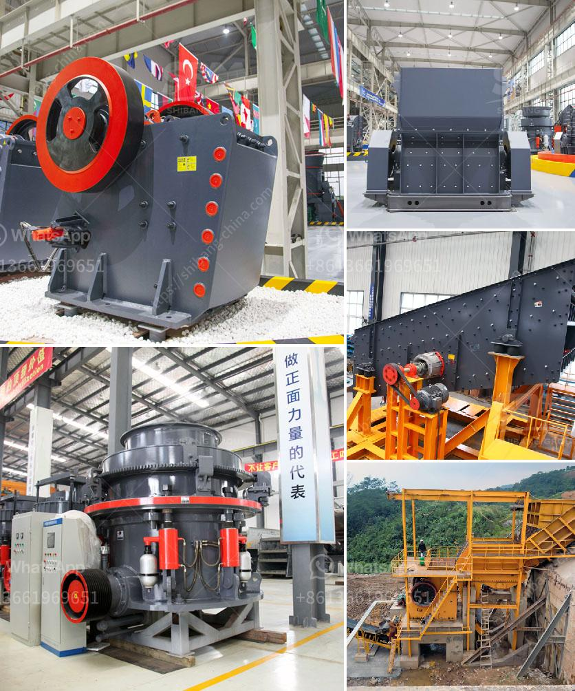

<h3>تكنولوجيا معالجة الطين الصيني</h3>
في السنوات الأخيرة، شهدت تكنولوجيا معالجة الطين الصيني تقدماً مذهلاً. يتمتع الطين الصيني بعدة فوائد وخصائص فريدة تجعله مادة قيمة في العديد من الصناعات. يعتبر صناعة السيراميك، الخزف، الأدوية الصينية التقليدية وصناعة البناء أمثلة جيدة للاستخدام المستدام والفعال للطين الصيني.

تتنوع طرق معالجة الطين الصيني وتصنيعه وفقًا للغرض المطلوب. لاستخراج الطين من المناجم، يمكن استخدام الطرق التقليدية التي تحتاج إلى العديد من الموارد والوقت. ومع ذلك، تم تطوير تقنيات حديثة تساهم في تحسين عمليات استخراج الطين بشكل فعال واقتصادي.

تشتمل معالجة الطين الصيني على العديد من الخطوات، بدءًا من تنقية الطين وإزالة الشوائب والأتربة المتواجدة فيه. ثم يتم خلط الطين بالماء وخلق مزيج متجانس، تليه عملية تجفيف للطين. بعد ذلك، يُعتبر الطين جاهزًا للاستخدام في صناعات مثل السيراميك والخزف.

في السنوات الأخيرة، تم تطوير تكنولوجيا جديدة لتعزيز جودة الطين الصيني وتحسين إنتاجه. تشمل هذه التقنيات استخدام الكمبيوتر والذكاء الاصطناعي للتحكم في عمليات إنتاج الطين. يتم رصد جميع مراحل الإنتاج والتحكم فيها بدقة عالية لضمان جودة المنتج النهائي.

تعتبر معالجة الطين الصيني بتلك التكنولوجيا المتقدمة بيئية واقتصادية. تقلل هذه التقنيات من انبعاثات الغازات الضارة وتوفر الطاقة والموارد. تعمل العديد من الشركات في الصين على تبني تلك التقنيات المستدامة للمساهمة في حماية البيئة وتحسين جودة المنتج.

بصفة عامة، تكنولوجيا معالجة الطين الصيني لها تأثير إيجابي على القطاع الصناعي الصيني. تساهم في تحسين جودة المنتجات وتقليل التكاليف. كما تعمل هذه التكنولوجيا على دعم الثقافة الصينية التقليدية والمحافظة على المواد الخام الطبيعية.

في الختام، يمكن القول إن تكنولوجيا معالجة الطين الصيني لها دور كبير في تطور الصناعات المختلفة في الصين. تعتبر هذه التقنيات بيئية ومستدامة وتحافظ على موراد الطين الطبيعية الثمينة. نظرًا للتحسين المستمر في هذا المجال، من المتوقع أن تبقى الصين رائدة في إنتاج واستخدام الطين الصيني للسنوات القادمة.
<h3>Contact us</h3><ul><li><strong>Whatsapp:&nbsp;<a href="https://wa.me/8613661969651">+8613661969651</a></strong></li><li><a href="https://swt.shibang-china.com/?git&amp;zhl&amp;تكنولوجيا معالجة الطين الصيني"><strong>Online Service(chat now)</strong></a></li></ul><h3>Related</h3><ul><li><a href='تكلفة وحدة طحن الأسمنت tpd كسارة.md'>تكلفة وحدة طحن الأسمنت tpd كسارة</a></li><li><a href='معدات فاصل المغناطيس للبيع.md'>معدات فاصل المغناطيس للبيع</a></li><li><a href='مطحنة طحن رايموند في باكستان.md'>مطحنة طحن رايموند في باكستان</a></li><li><a href='مصنع غسيل وفرز للتأجير في جنوب أفريقيا.md'>مصنع غسيل وفرز للتأجير في جنوب أفريقيا</a></li><li><a href='مصنع غسيل محمول للفحم.md'>مصنع غسيل محمول للفحم</a></li></ul>