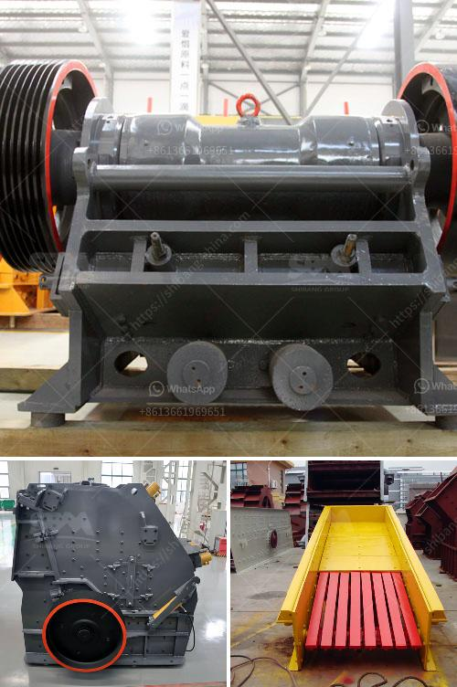

<h3>تكنولوجيا معالجة خام الباريت</h3>
تعتبر تكنولوجيا معالجة خام الباريت من التكنولوجيات الحديثة والمتقدمة المستخدمة في صناعة التعدين ومعالجة المعادن. يعد الباريت واحدًا من أهم المعادن التي يتم استخراجها وتجهيزها في صناعة النفط والغاز والصناعات الكيميائية والطبية.

تتألف عملية معالجة خام الباريت من عدة مراحل، وتبدأ بالتعدين والاستخراج، حيث يتم استخراج الخام من المناجم ونقلها إلى المحطات لمعالجتها. يتم غسل الخام وفصله عن الأتربة والشوائب الأخرى باستخدام الماء والأدوات المناسبة، ويتم تجفيف الخام بعد ذلك.

مرحلة التكسير والطحن هي المرحلة التالية في عملية معالجة خام الباريت. يتم تجهيز الخام بواسطة الكسارات والطواحين لتفتيته إلى أحجام صغيرة، والتي تسمح بفصل الباريت عن الشوائب الأخرى. يعد الباريت مادة غير قابلة للذوبان ، ولهذا السبب يتم طحنه إلى حبيبات صغيرة ليتمكن من الاندماج مع المواد الأخرى واستخدامه في العديد من التطبيقات.

يتم تقديم الباريت إلى مرحلة التركيز والفصل حيث يتم فصله عن المعادن الأخرى. واحدة من الطرق الشائعة لتحقيق ذلك هي استخدام ما يسمى بالتعويم، حيث يتم إضافة النفط أو المواد الكيميائية الأخرى إلى الباريت المطحون. تساعد هذه المواد على خفض الكثافة النوعية للباريت مقارنة بالشوائب الأخرى، مما يسمح بفصله عن المواد الغير مرغوب فيها.

في النهاية، يتم تجهيز الباريت للاستخدام في الصناعات المختلفة. يتم تصنيف الباريت وفقًا لحبيباته واستخداماته، مثل الباريت الطبي الذي يستخدم في العديد من التطبيقات الطبية، أو الباريت الصناعي الذي يستخدم في العديد من الصناعات مثل الطلاء والورنيش والبلاستيك.

بهذه الطريقة، تكنولوجيا معالجة خام الباريت تثبت أهميتها في توفير خام ذو جودة عالية يمكن استخدامه في الصناعات المختلفة. كما أن استخدام هذه التكنولوجيا يساهم في تحسين فعالية وكفاءة إنتاج الباريت وتقليل تأثيرها البيئي على البيئة من خلال استخدام عمليات تعدين ومعالجة مستدامة.
<h3>Contact us</h3><ul><li><strong>Whatsapp:&nbsp;<a href="https://wa.me/8613661969651">+8613661969651</a></strong></li><li><a href="https://swt.shibang-china.com/?git&amp;zhl&amp;تكنولوجيا معالجة خام الباريت"><strong>Online Service(chat now)</strong></a></li></ul><h3>Related</h3><ul><li><a href='كسارة فكية بمقدار 100 طن في الساعة.md'>كسارة فكية بمقدار 100 طن في الساعة</a></li><li><a href='تجهيزات تعدين الفحم للبيع في ألمانيا.md'>تجهيزات تعدين الفحم للبيع في ألمانيا</a></li><li><a href='كسارة الحجر بوزولانا للبيع.md'>كسارة الحجر بوزولانا للبيع</a></li><li><a href='معدات تعدين الرمال في ماليزيا.md'>معدات تعدين الرمال في ماليزيا</a></li><li><a href='مطحنة رايموند للبيع مستعملة.md'>مطحنة رايموند للبيع مستعملة</a></li></ul>