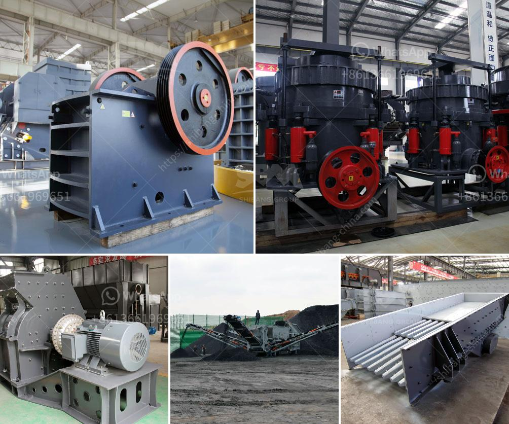

<h3>تم بناء مطحنة رايموند كسارة حجر في كينيا</h3>
أصبح قطاع تعدين الحجر في كينيا من أهم القطاعات الاقتصادية في السنوات الأخيرة، حيث تشهد البلاد طلبًا متزايدًا على البنية التحتية والمواد الخام. ولتلبية هذا الطلب، تم بناء مطحنة رايموند كسارة حجر في كينيا.

تتميز مطحنة رايموند بكونها جهازًا مستقلاً وقويًا لطحن الحجارة. تستخدم المطحنة رايموند مبدأ الطحن الدوراني، حيث يتم إدخال المواد الخام عبر فوهة التغذية، ثم يتم سحقها وطحنها بفعل دوران الطاحونة وانتقال الهواء عبرها. وتعد مطحنة رايموند مناسبة لطحن مواد مختلفة مثل الحجر الجيري والكوارتز والفحم وغيرها.

تواجه كينيا تحديات كبيرة في تعدين الحجر، فالمواقع غالبًا ما تكون خارج المناطق الحضرية وتفتقر إلى الكهرباء والبنية التحتية الملائمة. لذلك، تم بناء مطحنة رايموند كسارة حجر في موقع مناسب بشكل استراتيجي لتلبية احتياجات المناطق القريبة.

تعتبر مطحنة رايموند مطحنة متطورة وعالية الكفاءة بفضل تصميمها الفريد ونظامها الهيدروليكي المتقدم. تحتوي المطحنة على محرك كهربائي قوي يضمن تشغيل سلس وموثوقية عالية. وبفضل قوة الطحن العالية والدقة الناقصة للمطحنة، يتم إنتاج مسحوق حجر عالي الجودة يمكن استخدامه في العديد من الصناعات مثل صناعة الأسمنت والبناء والدهانات.

توفر مطحنة رايموند كسارة حجر في كينيا إمكانية تحسين إنتاج الحجر والتصنيع المحلي بأسعار تنافسية. كما توفر فرص عمل محلية وتعزز التنمية الاقتصادية في المنطقة. وتساهم مطحنة رايموند في تعزيز الاستدامة البيئية بفضل التكنولوجيا الحديثة المستخدمة في عمليات كسارة الحجر.

باختصار، تعد مطحنة رايموند كسارة حجر في كينيا إضافة هامة لقطاع التعدين في البلاد، حيث توفر فرص عمل وتعزز التنمية الاقتصادية المحلية. كما تساهم في تصنيع حجر عالي الجودة وتعزز الاستدامة البيئية.
<h3>Contact us</h3><ul><li><strong>Whatsapp:&nbsp;<a href="https://wa.me/8613661969651">+8613661969651</a></strong></li><li><a href="https://swt.shibang-china.com/?git&amp;zhl&amp;تم بناء مطحنة رايموند كسارة حجر في كينيا"><strong>Online Service(chat now)</strong></a></li></ul><h3>Related</h3><ul><li><a href='كسارات الفحم المتنقلة للإيجار.md'>كسارات الفحم المتنقلة للإيجار</a></li><li><a href='البحث عن شريك لكسارة الآلات.md'>البحث عن شريك لكسارة الآلات</a></li><li><a href='كيفية عمل كسارة الأسنان.md'>كيفية عمل كسارة الأسنان</a></li><li><a href='بيان طريقة لناقلات الحزام.md'>بيان طريقة لناقلات الحزام</a></li><li><a href='آلات صنع البودرة.md'>آلات صنع البودرة</a></li></ul>