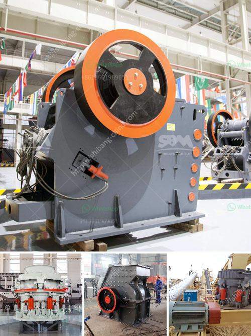

<h3>تمييز كسارة الصدم في سحق المواد الرطبة</h3>
تعتبر كسارة الصدم من الأدوات الهامة في عملية سحق المواد الرطبة. تعتبر هذه الكسارة مناسبة للخامات ذات الرطوبة العالية والقابلة للتشتت، مثل الفحم والطين والجبس والفوسفات والحجر الجيري والفلدسبار والتلك والبوكسايت.

تتكون كسارة الصدم من جسم رئيسي يحتوي على غرفة سحق ومجموعة من الشفرات الدوارة. يتم دفع المواد الرطبة إلى الداخل من خلال فتحة التغذية، حيث يتم ضربها بالشفرات الدوارة بقوة عالية. تتم تفتيت المواد الكبيرة إلى قطع صغيرة ومن ثم يتم دفعها خارجاً من فتحة التفريغ.

واحدة من المزايا الرئيسية لكسارة الصدم في سحق المواد الرطبة هي قدرتها على التعامل مع المواد ذات الرطوبة العالية، حتى 20٪ أو أكثر. وعندما يتعلق الأمر بالمواد الرطبة، فإن عملية السحق تصبح صعبة بسبب قابلية تكتل المواد. ولكن باستخدام كسارة الصدم، يتم ضرب وسحق المواد بشكل قوي، مما يسبب تفككها وتخفيض الرطوبة.

بالإضافة إلى ذلك، تتميز كسارة الصدم أيضًا بكفاءتها في استخلاص الماء من المواد الرطبة. فهي تتميز بتصميم خاص يسمح بتدفق الماء خلال الشفرات الدوارة والغرفة الداخلية، مما يساعد في إزالة أكبر قدر ممكن من الماء قبل خروج المواد المسحوقة.

يعد استخدام كسارة الصدم في سحق المواد الرطبة أمرًا مفيداً في الصناعات المختلفة مثل صناعة الأسمنت والبناء والتعدين. فهي تساهم في تحسين كفاءة العملية وتقليل التكاليف، وكذلك ضمان نوعية المنتج النهائي. وبفضل تقنية التمييز التي تستخدمها هذه الكسارة، يمكنها سحق المواد الرطبة بكفاءة وسرعة عالية، مما يعزز الإنتاجية ويحسن أداء العملية بشكل عام.

باختصار، يمكن القول أن كسارة الصدم في سحق المواد الرطبة هي أداة فعالة وفعالة في صناعة التعدين والبناء، حيث تساعد في تحقيق عملية سحق فعالة وتنقية المواد من الماء بشكل أكثر أماناً وكفاءة.
<h3>Contact us</h3><ul><li><strong>Whatsapp:&nbsp;<a href="https://wa.me/8613661969651">+8613661969651</a></strong></li><li><a href="https://swt.shibang-china.com/?git&amp;zhl&amp;تمييز كسارة الصدم في سحق المواد الرطبة"><strong>Online Service(chat now)</strong></a></li></ul><h3>Related</h3><ul><li><a href='كسارة الحجر في إندونيسيا.md'>كسارة الحجر في إندونيسيا</a></li><li><a href='شراء محطة غسيل الفحم في ألمانيا.md'>شراء محطة غسيل الفحم في ألمانيا</a></li><li><a href='اختلافات بين مطحنة الهامر ومطحنة الكرة.md'>اختلافات بين مطحنة الهامر ومطحنة الكرة</a></li><li><a href='كسارة الحجر في أوغندا.md'>كسارة الحجر في أوغندا</a></li><li><a href='سعر مصنع كسارة الحجر بسعة 200 طن في الساعة.md'>سعر مصنع كسارة الحجر بسعة 200 طن في الساعة</a></li></ul>