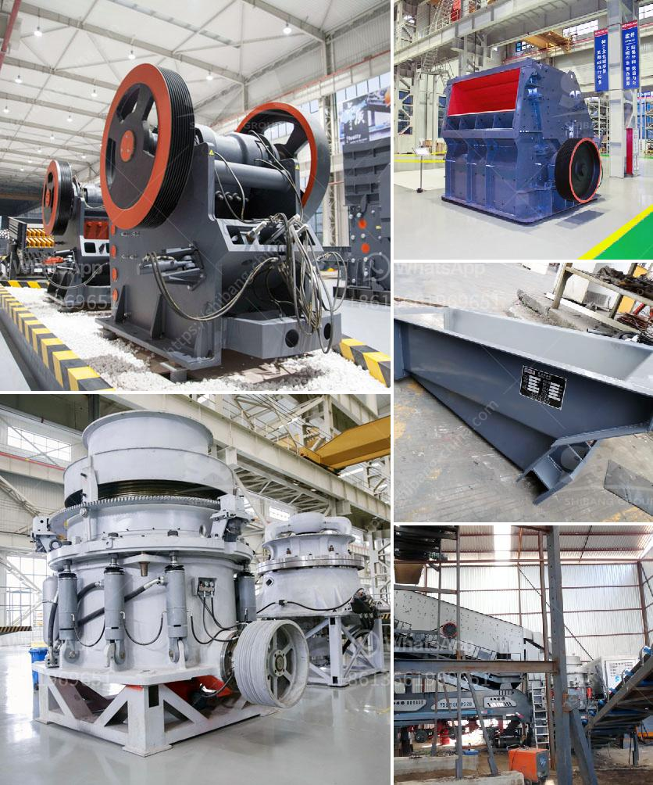

<h3>تنقية الجرافيت في معالجة المعادن</h3>
تعتبر عملية تنقية الجرافيت أمرًا مهمًا في صناعة المعادن. فالجرافيت هو أحد المواد المُستخدمة بكثرة في عدة صناعات مثل صناعة الأقلام والسبائك المعدنية والطلاء الكهربائي. تهدف عملية تنقية الجرافيت إلى تحويله من شكله الخام إلى شكله المستخدم في الصناعات النهائية.

تخضع عملية تنقية الجرافيت لخطوات متعددة. أولاً، يتم جمع الجرافيت من مناجمها وتكسيرها إلى قطع صغيرة لتسهيل المعالجة اللاحقة. ثم يتم غسلها للتخلص من الشوائب مثل الرمال والصخور باستخدام المواد الكيميائية والمياه. من ثم، يتم تركيز الجرافيت المنقى لفصل الحبيبات المفيدة عن الشوائب الأخرى.

بعد الانتهاء من إجراءات التركيز، يتم تجفيف الجرافيت المنقى ومن ثم تسليمها للعملاء. يجب أن يتم تخزين الجرافيت بشكل مناسب لضمان حفظ جودتها واستخدامها في المواد الخام بكفاءة. بعض الشركات تستخدم أيضًا تقنيات تفتيش إضافية للتأكد من جودة الجرافيت المنقاة والامتثال للمواصفات المطلوبة.

يعتبر تنقية الجرافيت من العمليات الهامة في صناعة المعادن، حيث يقدم الجرافيت النقي خصائص متميزة وفوائد عديدة. يتميز الجرافيت النقي بقدرته على التحمل للحرارة العالية والتوصيل الحراري الجيد. وهو أيضًا غير قابل للتآكل ويتمتع بقوة عالية. كما يمتاز بخصائص تزيد من قوة المواد النهائية التي تستخدم فيها الجرافيت، مما يترجم في تطبيقات مثل صناعة السيارات وصناعة الطيران.

بالاعتماد على تكنولوجيا المعالجة وعمليات التنقية، يمكن أن تكون عملية تنقية الجرافيت تكلفة مرتفعة بعض الشيء. لذلك، تهدف الشركات المُصنعة إلى تطوير واعتماد تقنيات عملية أكثر كفاءة واقتصادية. وبفضل التقدم التكنولوجي المستمر، يمكن الآن أن تتم عملية التنقية بشكل أكثر دقة وكفاءة مما يؤدي إلى توفير تكاليف الإنتاج وتحسين جودة المنتج النهائي.

لخلاصة القول، تنقية الجرافيت في معالجة المعادن لها أهمية كبيرة في صناعة المواد والمنتجات التي تستخدم فيها الجرافيت. ومن خلال تطبيق عمليات التنقية الفعالة، يمكن تحسين جودة المواد وخواصها المادية المُستخدمة في الصناعات العديدة. ومع استمرار التطور التكنولوجي، من المتوقع أن يزيد الاهتمام بتطوير تقنيات تنقية الجرافيت لتحسين كفاءة واقتصاد العملية.
<h3>Contact us</h3><ul><li><strong>Whatsapp:&nbsp;<a href="https://wa.me/8613661969651">+8613661969651</a></strong></li><li><a href="https://swt.shibang-china.com/?git&amp;zhl&amp;تنقية الجرافيت في معالجة المعادن"><strong>Online Service(chat now)</strong></a></li></ul><h3>Related</h3><ul><li><a href='معدات غسيل الذهب.md'>معدات غسيل الذهب</a></li><li><a href='خط إنتاج التلك.md'>خط إنتاج التلك</a></li><li><a href='مصنع سحق صغير بسعة 5 طن في الساعة.md'>مصنع سحق صغير بسعة 5 طن في الساعة</a></li><li><a href='فحص الشاشة التحجيم.md'>فحص الشاشة التحجيم</a></li><li><a href='خط إنتاج مسحوق الجبس منتجون في ألمانيا.md'>خط إنتاج مسحوق الجبس منتجون في ألمانيا</a></li></ul>