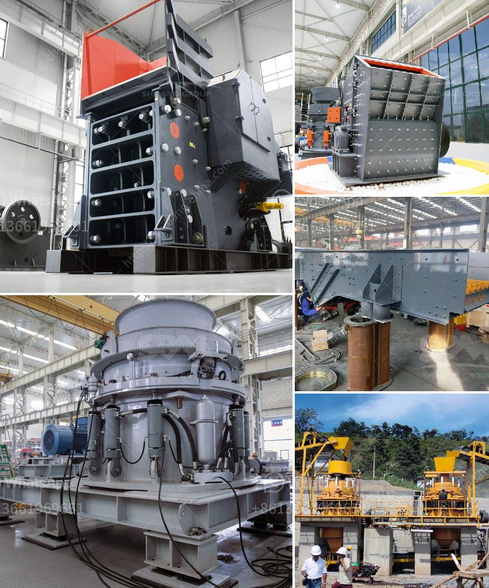

<h3>توازن المواد والطاقة لكسارة الفك</h3>
تُعد كسارة الفك أحد أهم الأجهزة المستخدمة في صناعة التكسير والتحطيم في مجال التعدين والبناء. تعمل الكسارة الفكية على تكسير المواد الخام من حجم كبير إلى أحجام أصغر قابلة للتعامل.

لضمان توازن المواد والطاقة في عملية التكسير بشكل فعال، تتطلب الكسّارة الفكية تصميمًا هندسيًا محكمًا وقوة تحمّل عالية قدر الإمكان. وهناك عدة عناصر يجب مراعاتها لتحقيق توازن المواد والطاقة لكسارة الفك:

1. تركيبة المواد: يجب استخدام مواد ذات قوة تحمل عالية وقابلة للمقاومة للتآكل لتجنب التلف المبكر للجزء المدمج والحفاظ على استقرار الكسارة. الصلب المقاوم للتآكل والصلب المنغنيزي يعتبران الخيارين الأكثر شيوعًا لهذا الغرض.

2. توازن الطاقة: يحتاج النظام الهيدروليكي لكسارة الفك إلى مصدر طاقة مستقر وقوي. يتم التحكم في نظام الهيدروليك من خلال مضخة الزيت والصمامات لتنظيم ضغط الزيت وتوزيعه بشكل صحيح. يتم ضبط نظام الهيدروليك ليكون سريعًا وموثوقًا لتحقيق توازن المواد والطاقة.

3. توازن الأداء: يجب أن تكون الكسارة الفكية مصممة للتحمل العالي وتستخدم في تطبيقات متنوعة مع تكييفها مع أحجام وأنواع مختلفة من المواد الخام. يجب أن تُصمم الكسارة لتتعامل مع مواد مختلفة من حيث القوة والصلابة وحجم التغذية.

4. صيانة الكسارة: ينبغي الاعتناء بصيانة الكسارة بشكل منتظم لضمان أداءها الأمثل. يشتمل ذلك على التحقق من تشحيم المحامل واستبدال الأجزاء التالفة وتنظيف وتفتيش قطع الغيار الأخرى.

في الختام، يعد توازن المواد والطاقة لكسارة الفك أمرًا حاسمًا للحفاظ على كفاءة التكسير وتحقيق الإنتاجية العالية. يجب أن تتوافر القدرة على التكيف مع متطلبات التحميل المختلفة وأنواع المواد الخام المختلفة. بتطبيق التصميم الهندسي الصحيح والصيانة الدورية، يمكن أن تعمل كسارة الفك بكفاءة واستدامة لفترة طويلة وتحقق الأداء المطلوب في عملية التكسير.
<h3>Contact us</h3><ul><li><strong>Whatsapp:&nbsp;<a href="https://wa.me/8613661969651">+8613661969651</a></strong></li><li><a href="https://swt.shibang-china.com/?git&amp;zhl&amp;توازن المواد والطاقة لكسارة الفك"><strong>Online Service(chat now)</strong></a></li></ul><h3>Related</h3><ul><li><a href='مطحنة الأسطوانة مطحنة السميكة.md'>مطحنة الأسطوانة مطحنة السميكة</a></li><li><a href='مصنع تكسير البوكسيت في الجزائر.md'>مصنع تكسير البوكسيت في الجزائر</a></li><li><a href='موردي آلات الأسمنت ووحدة الطحن.md'>موردي آلات الأسمنت ووحدة الطحن</a></li><li><a href='مصانع الكسارات الصينية.md'>مصانع الكسارات الصينية</a></li><li><a href='مصنعون لمطحنة الهامر في بيرو.md'>مصنعون لمطحنة الهامر في بيرو</a></li></ul>