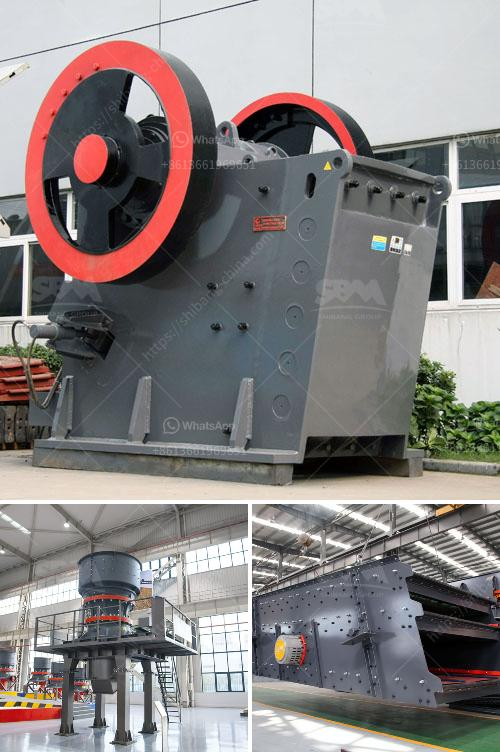

<h3>جر المحمول في</h3>
يُعد جر المحمول أو سحب الهاتف النقال أو الاستخدام المفرط للهواتف الذكية ظاهرة شائعة في العصر الحديث. فمع انتشار التكنولوجيا وتطورها بشكل سريع، أصبحت الهواتف المحمولة أداة ضرورية في حياتنا اليومية. ومع ذلك، فإن الاستخدام المفرط للهواتف النقالة يشكل تحديًا خطيرًا للبيئة والصحة العامة.

يعتبر جر المحمول مستدام بيئيا، نظراً للعديد من العوامل المرتبطة به. بدايةً، نحتاج إلى اتخاذ جميع مراحل تصنيع الهواتف النقالة في الاعتبار. تشير الإحصائيات إلى أن صناعة الهواتف الذكية تتسبب في انبعاثات ضخمة من ثاني أكسيد الكربون، كما يحتاج إنتاج كل جهاز إلى العديد من المواد الضارة بالبيئة مثل البلاستيك والمعادن النادرة. علاوة على ذلك، يوجد أيضًا تأثير غير مباشر، حيث يحتاج تشغيل الشبكات والمراكز البيانية التي تتيح لنا استخدام الهواتف المحمولة إلى كمية كبيرة من الكهرباء التي غالبًا تُنتج من مصادر غير متجددة.

بالإضافة إلى ذلك، فإن جر المحمول يؤثر على البيئة والصحة العامة من خلال تأثيراته الاجتماعية والنفسية. عندما يتسبب استخدام الهواتف الذكية في قلة التواصل الاجتماعي الحقيقي والاعتماد المفرط على التواصل الافتراضي، تتسبب في عزل الأفراد وارتفاع معدلات القلق والاكتئاب. بالإضافة إلى ذلك، فإن جر المحمول يشكل تهديدًا حقيقيًا للسلامة العامة، حيث يقوض التركيز أثناء القيادة أو المشي في الأماكن العامة، مما يزيد من حدوث الحوادث والصدمات.

ومع ذلك، يمكننا أن نتخذ بعض الإجراءات لمكافحة جر المحمول وتخفيف تأثيره البيئي. على سبيل المثال، يمكننا التقليل من انبعاثات الكربون من إنتاج الهواتف النقالة من خلال دعم الشركات التي تتبنى مبادئ الاستدامة والتصميم الأخضر. كما يجب أيضًا التشجيع على استخدام الهواتف المحمولة بشكل مسؤول وتجنب جر المحمول، وذلك من خلال تقديم حملات توعية وتثقيف للمستخدمين حول التأثيرات السلبية للاستخدام المفرط للهواتف النقالة. يمكن أن تشارك المجتمعات المحلية والمدارس والأسر في هذه المساعي لتشجيع الاستخدام المسؤول للتكنولوجيا.

باختصار، فإن جر المحمول يعد تحديًا بيئيًا حقيقيًا يتطلب تصحيحًا سريعًا. إن التغيير يبدأ من القلب، وعندما يساهم كل فرد في المجتمع في التوعية والمساهمة في الحد من جر المحمول، فسنستطيع أن نحقق تأثيرًا إيجابيًا على البيئة والصحة العامة.
<h3>Contact us</h3><ul><li><strong>Whatsapp:&nbsp;<a href="https://wa.me/8613661969651">+8613661969651</a></strong></li><li><a href="https://swt.shibang-china.com/?git&amp;zhl&amp;جر المحمول في"><strong>Online Service(chat now)</strong></a></li></ul><h3>Related</h3><ul><li><a href='مطحنة فحم رولر.md'>مطحنة فحم رولر</a></li><li><a href='كيفية بدء منجم المحاجر.md'>كيفية بدء منجم المحاجر</a></li><li><a href='محطة سحق ثابتة بسعة 200 طن في الساعة.md'>محطة سحق ثابتة بسعة 200 طن في الساعة</a></li><li><a href='خط إنتاج مسحوق الجبس بمقياس صغير.md'>خط إنتاج مسحوق الجبس بمقياس صغير</a></li><li><a href='مصنعي مطاحن الفحم في الهند.md'>مصنعي مطاحن الفحم في الهند</a></li></ul>